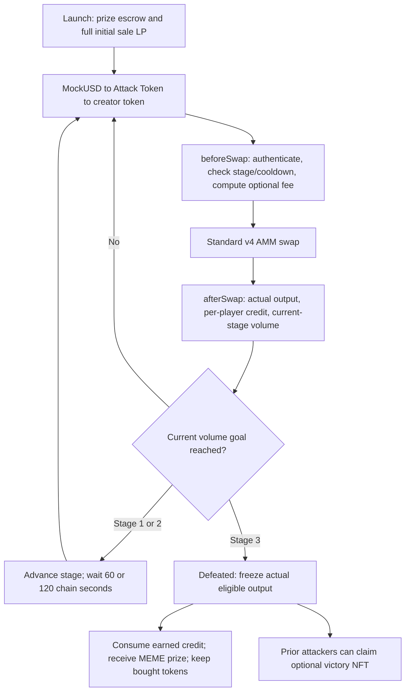
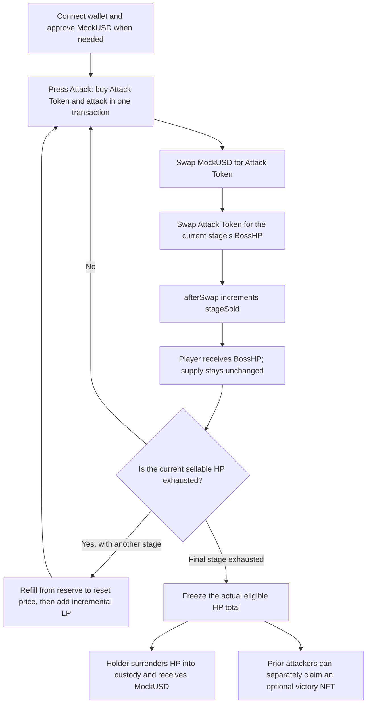
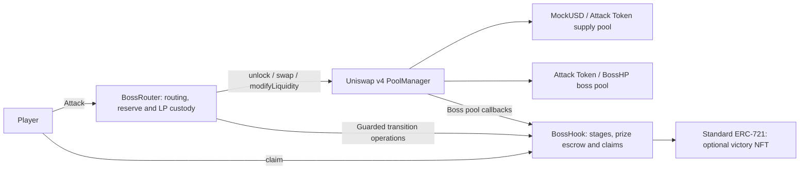
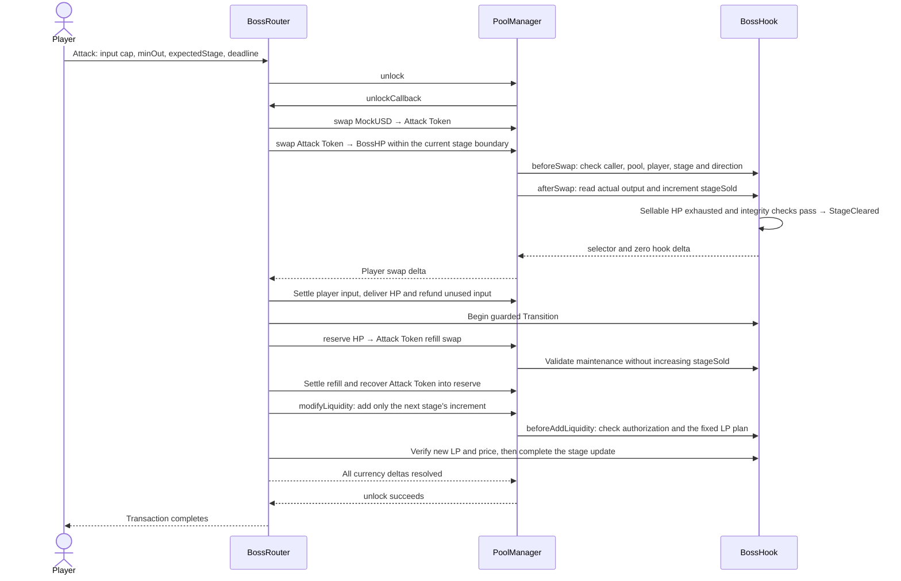

# Boss Pool contract and game flows

## Current Factory flow

This flow follows [PR #72](https://github.com/0xroylee/eth-global-2026-tokyo/pull/72), head `d0ad8d87ca5bab80c927e7412bd2a200a75549c5`. All sale liquidity is active at launch. Volume stages and cooldowns do not release tokens or reset AMM price. The public Base Sepolia demo retains its older contract rules. See the [callback sequence and design rationale](uniswap-v4-hooks.md) for authorization, optional mock-driven fees, LP isolation, and limitations.



Each purchase credits only its starting stage, including the defined base-unit tail exceptions. Failed rules or settlement revert both swaps and all credit. Mock fees affect cost without resetting price; owner-added LP changes depth without withdrawing the initial position or prize.

## Standalone BossHP diagrams

The retained diagrams below describe standalone BossHP rather than the current Factory. Buying BossHP deals damage, and players receive the tokens without burning them. Eligible BossHP carries transferable reward rights and is surrendered into permanent custody when claimed. Standalone reserve refills and incremental LP additions do not apply to the current Factory. These design diagrams alone do not establish deployment or successful E2E verification.

### Standalone player flow



Token transfers create no new damage but can transfer reward rights. Reserve HP, LP fees, and redeemed HP must stay outside redeemable circulation. A single player transaction affects at most one stage.

### Standalone contract responsibilities



Both pools are states inside PoolManager. BossHook attaches only to the Boss pool; the supply pool uses ordinary v4 behavior. BossRouter also handles stage transitions, so there is no separate StageManager. Tokens and NFTs reuse standard implementations.

### Standalone stage-clearing transaction



Clearing the final stage moves directly to `Defeated` without another refill. If any step fails, the entire attack, payment, HP delivery, and stage change revert together. Refills use reserve funds, never player refunds or prize escrow.

### Standalone rewards and custody

```mermaid
flowchart TD
    P["Player's transferable eligible HP"] -->|claim(q)| V["BossHook permanent claim custody"]
    W["Original MockUSD prize W"] -->|floor W × q / Q| Pay["Pay the claimant"]
    Q["Q freezes at victory: actual HP sold across all three stages"] --> Pay
    U["Unsold reserve and HP LP fees"] --> L["Keep under controlled custody while reward rights remain"]
```

`Q` is not the preminted `totalSupply`. The ratio `W/Q` stays fixed regardless of claim order. Claims must surrender tokens; reading a balance and setting `claimed[address]` is insufficient. NFT eligibility follows historical attack participation and remains separate from transferable reward rights.

[Technical specification](technical-spec.md) · [HP stage-clearance details](hp-lifecycle.md) · [Math and evidence scope](refill-math.md) · [Delivery ownership and issues](delivery-plan.md)
