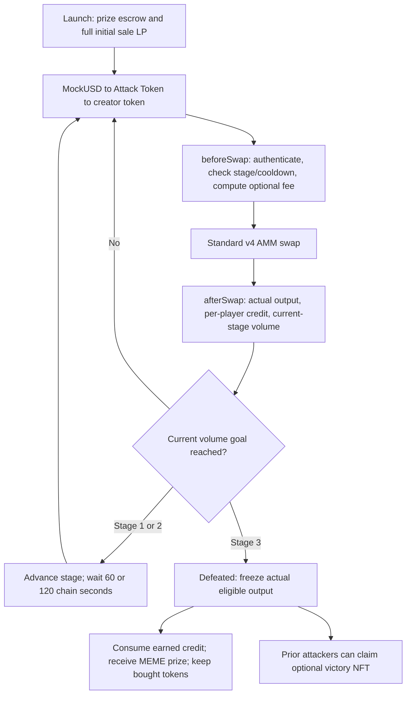
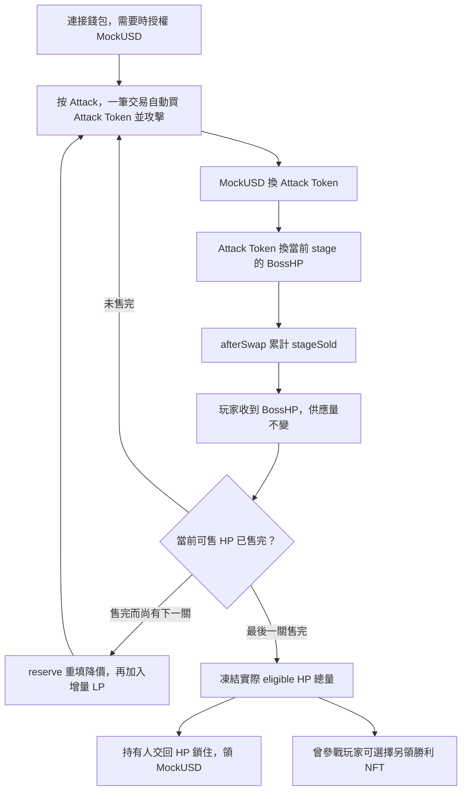
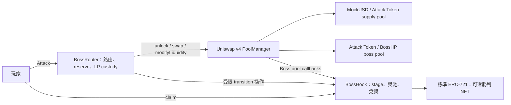
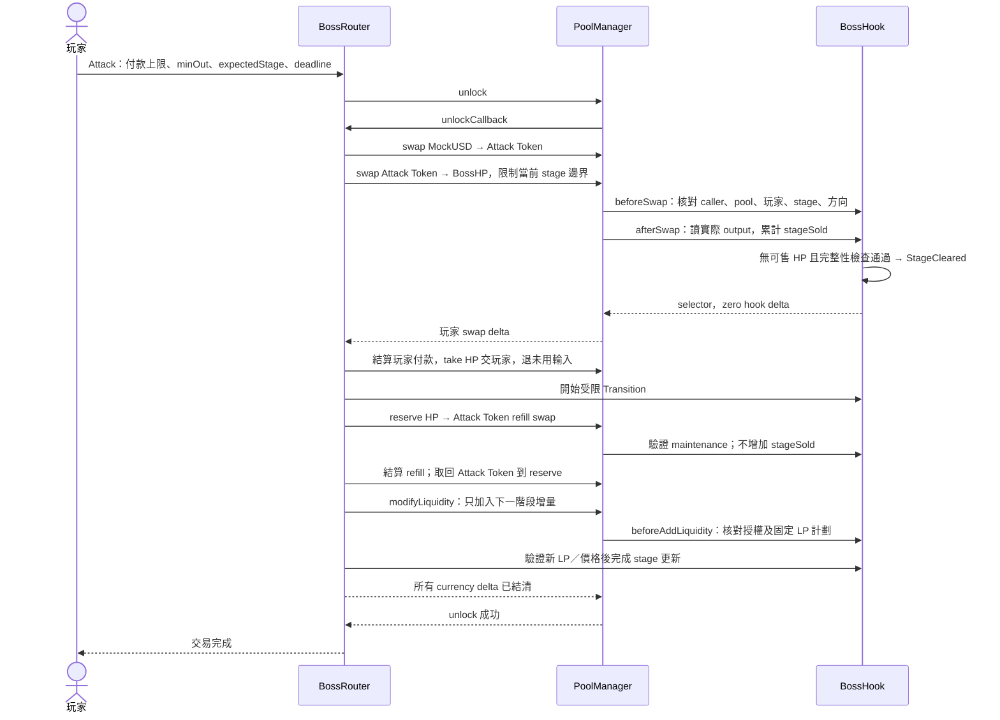

# Boss Pool 合約與遊戲流程

## Current Factory flow

This flow follows [PR #72](https://github.com/0xroylee/eth-global-2026-tokyo/pull/72), head `d0ad8d87ca5bab80c927e7412bd2a200a75549c5`. All sale liquidity is active at launch. Volume stages and cooldowns do not release tokens or reset AMM price. The public Base Sepolia demo retains its older contract rules. See the [callback sequence and design rationale](uniswap-v4-hooks.md) for authorization, optional mock-driven fees, LP isolation, and limitations.



Each purchase credits only its starting stage, including the defined base-unit tail exceptions. Failed rules or settlement revert both swaps and all credit. Mock fees affect cost without resetting price; owner-added LP changes depth without withdrawing the initial position or prize.

## Standalone BossHP diagrams

以下保留嘅圖描述 standalone BossHP，唔係新版 Factory：買入 BossHP 代表傷害，BossHP 交俾玩家而唔 burn。合資格 BossHP 代表可轉讓分獎權，claim 時交回永久鎖住。Standalone 嘅 reserve refill 同增量 LP 唔適用於新版 Factory。設計圖本身唔代表已部署或通過 E2E。

### Standalone 玩家流程



代幣轉帳唔造成新傷害，但可以轉移分獎權。Reserve、LP fee 同已兌獎 HP 唔可以混入可兌獎流通量。單一玩家交易最多影響一個 stage。

### Standalone 合約分工



兩個 pool 係 PoolManager 內嘅狀態。BossHook 只掛喺 Boss pool；supply pool 可用普通 v4 行為。BossRouter 同時負責轉階段，唔另建 StageManager。Token/NFT 重用標準實作。

### Standalone 一次清關交易



最後一關清完直接 Defeated，唔再 refill。任何步驟失敗，整筆攻擊、付款、HP 交付同 stage 變更一齊回滾。Refill 用 reserve，唔借玩家 refund 或獎池。

### Standalone 分獎與 custody

```mermaid
flowchart TD
    P["玩家可轉讓的 eligible HP"] -->|claim(q)| V["BossHook 永久 claim custody"]
    W["原始 MockUSD 獎池 W"] -->|floor W × q / Q| Pay["支付領獎人"]
    Q["打贏時凍結 Q = 三關實際售出 HP"] --> Pay
    U["未售出 reserve + HP LP fees"] --> L["仍有分獎權時保持受控，不可流入玩家領獎"]
```

Q 唔係預鑄 totalSupply；W/Q 唔會因先後領獎而改變。Claim 必須交回 token，唔可以只讀 balance 再記 claimed[address]。NFT 資格按歷史參戰記錄，與可轉讓分獎權分開。

[完整技術規格](technical-spec.md) · [HP 清關細節](hp-lifecycle.md) · [數學與證據範圍](refill-math.md) · [分工及 issues](delivery-plan.md)
