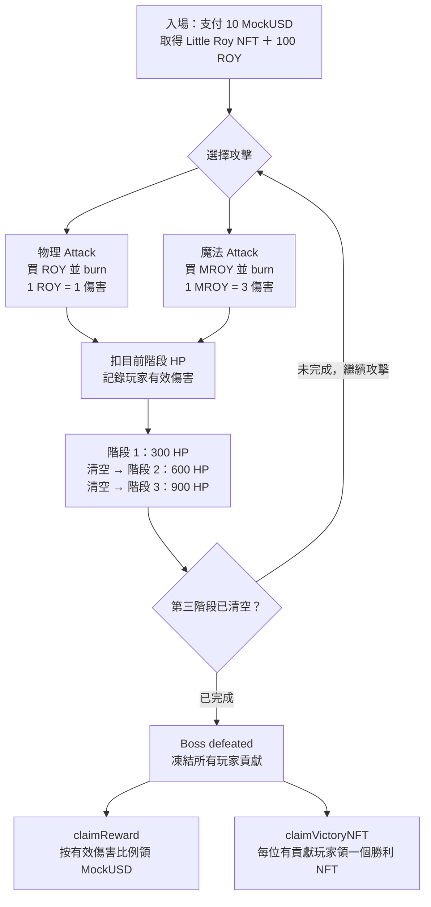
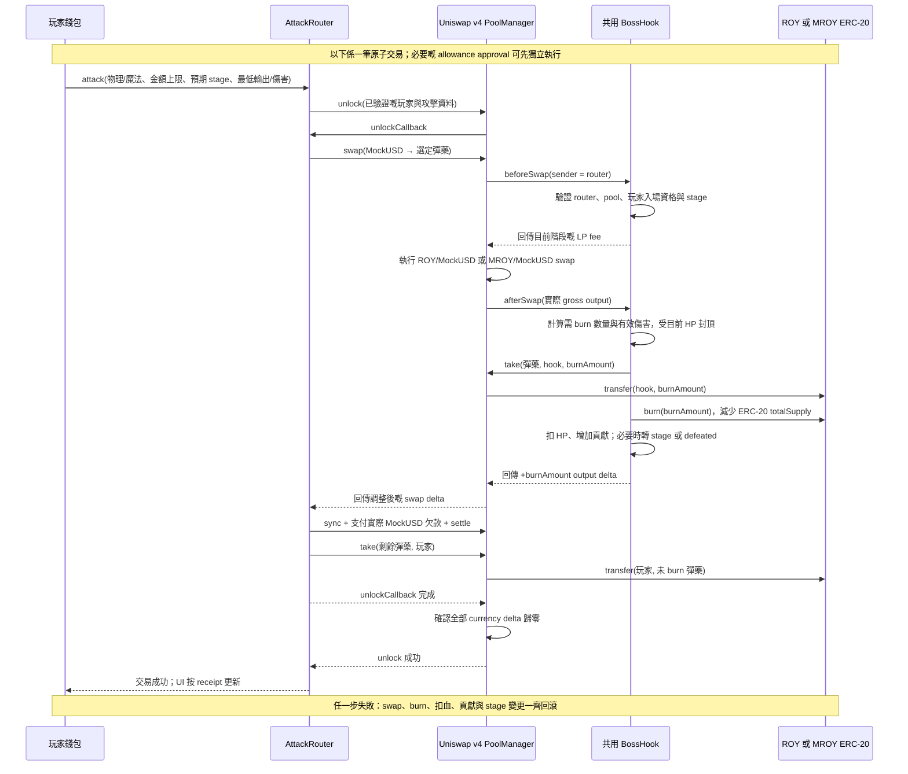
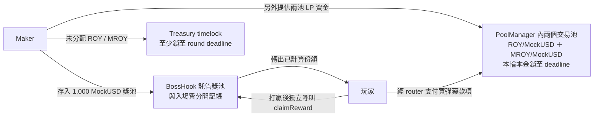

# Boss Pool 合約與遊戲流程

以下係目前規格嘅設計圖，未代表合約已部署。ROY / MROY 係暫定代幣名稱；入場費、starter allocation、獎池金額同階段費率係 demo 設定。

## 玩家點玩

- 每次 Attack 會自動買入並 burn。首次使用可能先需要一筆 approval。
- 一次攻擊最多清空當前階段，下一階段由完整 HP 開始。多買但未 burn 嘅彈藥留喺玩家錢包。
- 有效傷害係實際扣除嘅 HP。買賣量只展示，唔增加分獎權重。
- Starter 同剩餘彈藥可以持有或賣出。直接 burn 持有彈藥係可選後續功能，唔係核心 Attack 流程。

## 一筆 Attack 點樣執行

PoolManager 係同一個合約，內部管理兩個 pool 嘅狀態。每次攻擊只選其中一個池，兩池共用同一個 BossHook。

`+burnAmount` 係 hook 回傳俾 PoolManager 嘅結算數值，唔係 mint token。實際 burn 由 ROY/MROY ERC-20 執行，唔係 `PoolManager.burn`。

兩池嘅 `beforeSwap` 都讀取同一個 stage。建議 demo 費率係 0.30% → 0.60% → 1.00%。打穿階段嗰筆 swap 用舊費率，之後任何一個池嘅 swap 用新費率。

## 獎池同交易池係兩筆資金

每位玩家獎勵 = `floor(原始獎池 × 玩家有效傷害 / 全體有效傷害)`。

打完三階段，總有效傷害為 1,800。若你造成 450 傷害，你佔 25%，從 1,000 MockUSD 獎池領 250 MockUSD。勝利 NFT 係另一筆獨立 claim，每位有正貢獻嘅玩家可領一次。

如果到期仍未打贏，攻擊停止，maker 可按規格取回未頒發獎池；已付入場費同已 burn 彈藥唔會退還。獎池、入場款項、LP 資金各有獨立記帳規則。

初始代幣供應固定，本輪唔增發或按 stage 放新幣。Treasury timelock 與 LP 提款限制係兩種獨立控制，唔保證價格穩定。較深 LP 配額仍需通過真實 v4 場景模擬，詳見 [供應與流動性](economy.md)。

規則來源：[需求](requirements.md) · [技術規格](technical-spec.md)。
