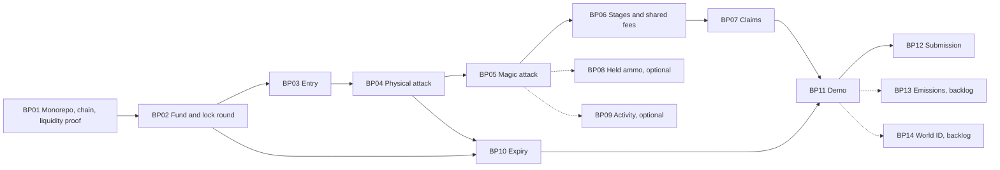

# Boss Pool delivery plan

Status: project implementation is not started. An isolated v4 mechanism proof exists, but the application and target-chain integration remain open. Estimates are person-hours. GitHub issues are the team's execution checklist.

## Delivery strategy

Follow the [agent instructions](../AGENTS.md): inspect existing solutions before custom implementation, verify through shared E2E/core checks, and use the specified Sol high / Luna xhigh model routing. These rules govern the work in the linked issues.

Use the [planned Bun monorepo](technical-spec.md#monorepo-and-ownership). BP01 establishes the workspace, shared ABI/manifest boundary, and a reusable local v4 liquidity/settlement scenario. Run that local proof before entry/NFT integration; BP04 still owns the full authenticated player flow. Verify actual swaps on the target chain before calling BP01 complete.

The [economy plan](economy.md) fixes supply and defers emissions, gradual vesting, and a backend service. Its deeper LP allocation is a candidate until real v4 results support deployment. BP02 adds treasury and LP restrictions to the funded round. Keep one complete user-visible journey per issue, with contract state, client behavior, and verification together.

One teammate owns contracts + backend. The other owns UI + interface + gaming. The frontend teammate can build against the specified state/events while contract work proceeds. Mock-backed UI is preparation; a P0 feature closes only after its real integration works.

## Work breakdown

Start with [the parent epic](https://github.com/0xroylee/eth-global-2026-tokyo/issues/1) or [the demo milestone](https://github.com/0xroylee/eth-global-2026-tokyo/milestone/1). All 14 work items are linked below and attached as native sub-issues. Their implementation blockers are also recorded as native GitHub dependencies.

| Key | Slice | Priority | Depends on | Lead | Estimate | Stories |
| --- | --- | --- | --- | --- | --- | --- |
| [BP01](https://github.com/0xroylee/eth-global-2026-tokyo/issues/2) | Bootstrap Bun monorepo and validate v4 liquidity | P0 | None | A | 3–5 h | US01 |
| [BP02](https://github.com/0xroylee/eth-global-2026-tokyo/issues/3) | Fund, lock, and display the three-stage boss round | P0 | [BP01](https://github.com/0xroylee/eth-global-2026-tokyo/issues/2) | A + B | 3–4 h | US02 |
| [BP03](https://github.com/0xroylee/eth-global-2026-tokyo/issues/4) | Enroll with Little Roy NFT and starter physical ammo | P0 | [BP02](https://github.com/0xroylee/eth-global-2026-tokyo/issues/3) | A + B | 2–3 h | US03 |
| [BP04](https://github.com/0xroylee/eth-global-2026-tokyo/issues/5) | Execute physical auto-buy-and-burn attacks | P0 | [BP03](https://github.com/0xroylee/eth-global-2026-tokyo/issues/4) | A + B | 3–5 h | US04 |
| [BP05](https://github.com/0xroylee/eth-global-2026-tokyo/issues/6) | Execute magic attacks with weighted contribution | P0 | [BP04](https://github.com/0xroylee/eth-global-2026-tokyo/issues/5) | A + B | 2–3 h | US05 |
| [BP06](https://github.com/0xroylee/eth-global-2026-tokyo/issues/7) | Present three stages and share dynamic fees across pools | P0 | [BP05](https://github.com/0xroylee/eth-global-2026-tokyo/issues/6) | B + A | 2–3 h | US06 |
| [BP07](https://github.com/0xroylee/eth-global-2026-tokyo/issues/8) | Claim proportional MockUSD and a victory NFT | P0 | [BP06](https://github.com/0xroylee/eth-global-2026-tokyo/issues/7) | A + B | 2–3 h | US07 |
| [BP08](https://github.com/0xroylee/eth-global-2026-tokyo/issues/9) | Spend starter and leftover ammo through a separate held-burn action | P1 | [BP05](https://github.com/0xroylee/eth-global-2026-tokyo/issues/6) | A + B | 1–2 h | US08 |
| [BP09](https://github.com/0xroylee/eth-global-2026-tokyo/issues/10) | Reconstruct shared activity and leaderboard | P1 | [BP05](https://github.com/0xroylee/eth-global-2026-tokyo/issues/6) | A + B | 2–3 h | US09 |
| [BP10](https://github.com/0xroylee/eth-global-2026-tokyo/issues/11) | Expire an unfinished round and refund its unawarded prize | P0 | BP02, BP04 | A + B | 1–2 h | US10 |
| [BP11](https://github.com/0xroylee/eth-global-2026-tokyo/issues/12) | Verify and rehearse the complete two-wallet testnet demo | P0 | BP07, BP10 | B + A | 2–3 h | US01–US07, US10 |
| [BP12](https://github.com/0xroylee/eth-global-2026-tokyo/issues/13) | Publish judge evidence and complete UF submission materials | P0 | [BP11](https://github.com/0xroylee/eth-global-2026-tokyo/issues/12) | B + A | 1–2 h | US11 |
| [BP13](https://github.com/0xroylee/eth-global-2026-tokyo/issues/14) | Evaluate emissions for a future round | P2 backlog | BP11 + approved emission policy | A | 2–4 h after decision | Optional |
| [BP14](https://github.com/0xroylee/eth-global-2026-tokyo/issues/15) | Add World ID at an agreed eligibility step | P2 backlog | BP11 + approved identity policy | A + B | 3–5 h after decision | Optional |

A = contracts + backend. B = UI + interface + gaming. Handles were not supplied, so issues stay unassigned.

BP08 and BP09 are optional. The core app still shows current-wallet balances, damage, claimable reward, and current stage with refresh recovery. Cutting the global leaderboard or inventory-burn button must not remove those core reads.

## Parallel work for two teammates

| Phase | Teammate A: contracts + backend | Teammate B: UI + interface + gaming | Handoff |
| --- | --- | --- | --- |
| Start | Bun workspace, shared package, RPC and reusable v4 scenario | Arena layout, physical/magic controls, original three-form assets | Shared view/event types and sample payloads |
| Entry | Fixed allocations, treasury/LP locks, entry, token/NFT permissions | Connect, allowance, enrollment, balances, error states | Entry ABI and successful receipt |
| Combat | Physical settlement and stage accounting, then magic | Attack quote, approval/signature/receipt UX, hit effects | Actual outputs and event ordering |
| Progress | Shared stage fees, expiry, claims | Full new HP bar per stage, victory and expired states | State snapshots and error decoding |
| Release | Testnet seed, accounting tests, attack/claim evidence | End-to-end browser test, recording, narration, feedback package | Frozen commit and reproducible demo |

B can start original assets and fixture UI immediately. A owns the shared ABI and deployment manifest, with B reviewing compatibility. Avoid competing contract edits during the settlement work. Each feature issue names the piece both teammates must integrate.

## Schedule and feasibility

The requested checkpoint is **26 September 2026, 09:00 coding / 10:00 live**. Timezone is unconfirmed. Japan is one hour ahead of Hong Kong. This is a requested demo checkpoint, not a verified event submission deadline.

P0 estimates total **21–33 person-hours**, including workspace setup, liquidity configuration, and the round locks. This remains an optimistic estimate for a team familiar with the stack and with usable RPC access. With two people, some UI work overlaps, but much of the contract path is sequential. A complete build from this empty repository in the 09:00–10:00 hour is not credible. Use that hour for integration and rehearsal after work tonight.

| Checkpoint | Work | Exit condition |
| --- | --- | --- |
| Tonight, first 30 min | Claim work, agree shared-package boundaries, ABI/event shapes, candidate liquidity settings, and two-role ownership | Both teammates share the same contract |
| Tonight, first 90 min | A timeboxes RPC and reuses the local v4 burn/liquidity fixture; B builds arena states and original assets | Local settlement proof works; testnet readiness has evidence or an explicit blocker |
| Tonight, next block | Fund and lock allocations, entry, physical attack, then magic and stage fees | Local two-wallet path works with real contracts |
| Tonight, final block | Claims, expiry/lock checks, testnet deploy from the simulated configuration, UI wiring | Both attack receipts and deployed addresses exist |
| Tomorrow, 09:00–09:30, timezone pending | Fix integration failures and execute the full journey | Core demo succeeds |
| Tomorrow, 09:30–10:00, timezone pending | Freeze, record fallback, rehearse, prepare evidence | Core E2E passes on the frozen commit, or a specific unresolved blocker is recorded |

If testnet readiness fails after 90 minutes, continue locally while A obtains a working provider or sponsor guidance. Keep BP01's remote acceptance open. Do not silently change chains.

Cut held-ammo convenience, global activity, emissions, World ID, rich sound, and extra animation first. Keep two real auto-buy attack types, weighted burn accounting, independent stage HP, shared stage fees, and token/NFT claims. A fixed-fee emergency build must say dynamic fees remain incomplete.

## Issue workflow

Use the parent epic and child issues below. Each issue includes owner roles, dependencies, acceptance criteria, test evidence, and exclusions. Priority labels distinguish core, optional, and backlog work.

`status:ready` means no unresolved prerequisite. `status:blocked` means final integration depends on another issue; fixture UI and tests can still be prepared. `status:backlog` means do not implement until its explicit product policy is approved.

Teammates claim by assigning themselves or commenting with owner and branch. GitHub handles are not guessed. Use `codex/` for branches created by Codex. Link PRs to the issue, and update dependent triage when prerequisite changes land.

Done means the observable user journey works and the PR includes the tested commit plus relevant tests, screenshot, or transaction evidence. A merged contract with an unwired UI does not close a feature slice. A closed issue is evidence only if its acceptance actually passed.

Reuse the same E2E journey and focused core checks across issues. An issue's list of failure cases does not require a separate test suite or one test for every bullet. Follow the [testing rules](agents/testing.md) when selecting verification.

## Sixty-second presentation

This is a story timing target, not a promise that all wallet prompts and receipts complete in sixty seconds.

| Time | Visible action | Evidence |
| --- | --- | --- |
| 0–10 s | Show funded boss, testnet label, NFT entry, and two attacks | Escrow and entry reads or an identified recorded transaction |
| 10–25 s | Execute a physical auto-buy-and-burn | Swap/burn receipt, HP, contribution, leftover balance |
| 25–40 s | Use magic and show all three stages | Multiplier 3, independent HP resets, confirmed stage events |
| 40–50 s | Final hit and contribution split | Final defeat and frozen weighted denominator |
| 50–60 s | Show token claim and victory NFT | Real wallet balances and receipts |

Stage budgets allow a fixture script to target roughly three hits per stage: 100 physical damage per hit in stage 1, 200 in stage 2, and 100 MROY for 300 damage in stage 3. AMM output changes, so derive input quotes and cap burns at runtime. Do not hardcode a constant token price into the attack.

Prepare wallets and approvals in advance. Keep an uncut two-wallet recording. A shortened live sequence may start from a prepared stage, but disclose earlier actions. Deploy a fresh arena for reset; do not add an admin HP override. No fake burn or fake claim is acceptable as protocol evidence.

## Submission evidence

Collect public code, a deliberate source-license choice, commit-pinned contract line links, the shared deployment manifest, fixed-supply allocation and unlock times, liquidity scenario results, attack receipts from both pools, claim receipts, focused test commands/results, a playable URL or reproducible run instructions, recorded fallback, completed FEEDBACK.md, and feedback-form confirmation.

Continuity eligibility remains unverified. The $6,000 figure is the standard-track total, not first prize. Sources and deployment limitations are in [source notes](sources.md).
