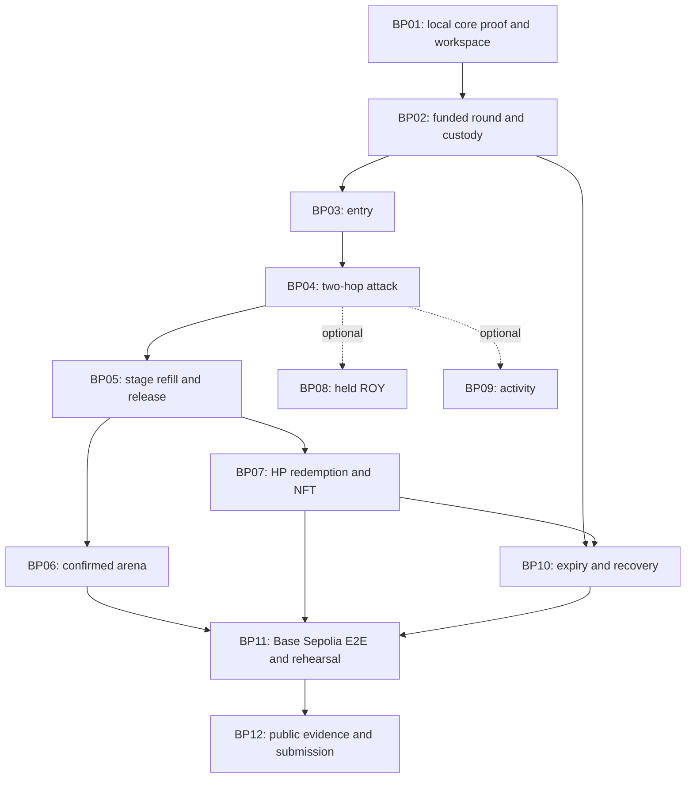

# Boss Pool delivery plan

Updated 26 September 2026. This is the implementation handoff for the current no-burn BossHP design. BP01 provides local contracts, the shared client, and a read-only web shell; see [recorded evidence](bp01-foundation.md). The full browser game, migration to the selected Next.js/Tailwind stack, and Base Sepolia deployment remain open. Earlier local burn prototypes are historical mechanism evidence.

## Outcome and scope

Two wallets enroll, use MockUSD to buy ROY and then BossHP, clear three boss stages, see two reserve-funded price resets, transfer eligible HP between wallets, and redeem HP for MockUSD. Historical participants can claim a separate victory NFT. The actual hook controls purchase counting and liquidity release.

The [requirements](requirements.md) own gameplay, [technical specification](technical-spec.md) owns contracts/interfaces/custody, [HP lifecycle](hp-lifecycle.md) owns clearing details, and [refill/reward math](refill-math.md) owns calculations. [CONTEXT.md](../CONTEXT.md) is the glossary.

Confirmed: one ROY attack currency, one ROY/BossHP battle pool, one MockUSD/ROY supply pool, no attack burn, stages 300/600/900, staged HP liquidity, rewards represented by BossHP, Base Sepolia, Next.js/TypeScript/Tailwind CSS, direct viem, Bun, and a small monorepo. Physical/magic, MROY, damage multipliers, dynamic fees and public BossHP sell-backs are outside the core.

Working claim default: eligible HP is transferable; claim atomically surrenders it into permanent custody and pays a fixed proportional reward, without burning. This is the model used by the current plan. A frozen-balance alternative was discussed but not selected. Do not silently combine the two.

## Ownership and repository

A owns contracts, backend/integration responsibilities, deployment, scripts and generated shared-chain exports. B owns UI, wallet interface, game presentation and browser rehearsal. GitHub handles remain unknown; issues stay unassigned until claimed.

Use the [Bun monorepo layout](technical-spec.md#monorepo-and-ownership):

- `contracts/`: Foundry, two core contracts, standard tokens/NFTs and the shared core scenario. A owns it.
- `packages/chain/`: generated ABI, public deployment manifest, viem actions/views and shared types. A owns contract-facing changes; B reviews consumption.
- `apps/web/`: Next.js App Router arena, Tailwind CSS UI, and direct viem wallet flows. B owns it; the existing Vite shell must be migrated.
- `scripts/`: seed, deploy, focused E2E and smoke commands. A owns them.

One root Bun lockfile. Start with direct viem access; no backend service, database, queue, Turbo or Nx. Reuse the official v4 starter/helpers and OpenZeppelin before custom code. Keep AGENTS.md short and use the existing scoped guides; do not turn it into another product spec.

Implementation model routing remains exact: **gpt-6-sol high** for contracts, custody, settlement and cross-layer changes; **gpt-6-luna xhigh** for bounded UI/wiring/docs after interfaces are clear. This is routing for future implementation, not permission to spawn unnecessary agents.

## Frontend build sequence

The [frontend architecture](technical-spec.md#frontend-architecture) owns the selected stack and client boundaries. Keep this work within the existing BP slices:

1. **BP02/BP06 preparation:** migrate the read-only shell to Next.js App Router in `apps/web`, add Tailwind through PostCSS, and preserve deployment validation and real round reads. Replace Vite entry/configuration, scripts, and TypeScript setup. Keep the root Bun workspace commands usable. Check typecheck, production build, and the missing-deployment/live-local browser states.
2. **BP03:** add the injected-wallet connection through viem, account/network handling, and enrollment approval/receipt flow. Start with prepared MetaMask test accounts for rehearsal.
3. **BP04:** agree the authenticated quote method in `packages/chain`, then implement input bounds, approval, simulation, attack, receipts, and stale-stage recovery.
4. **BP05/BP06:** build the three boss forms and responsive Tailwind arena, with confirmed stage changes, keyboard support, reduced motion, and refresh recovery.
5. **BP07/BP10/BP11:** add redemption, separate NFT claims, expiry, verified Base Sepolia configuration, and the existing two-wallet browser journey.

The stack decision does not mark the migration complete. Keep BP01's original Vite build evidence as historical evidence and record fresh Next.js verification when that implementation lands.

## Candidate demo configuration

| Parameter | Planning value | Gate before deployment |
| --- | --- | --- |
| Stage HP | 300 / 600 / 900 | Actual output and bounded dust in BP01 |
| Prize | 1,000 MockUSD, 6 decimals | Separate fully funded prize ledger |
| Entry | 10 MockUSD + 100 starter ROY, cap 100 | Starter funding and once-per-wallet enrollment |
| BossHP supply | 2,000, 18 decimals | Prove integer reserve sufficiency for permitted attacks |
| Battle fee | Fixed 0.30%, modeled protocol fee zero | Verify actual supported fees; reject unsupported configurations |
| Battle price | 1 to about 1.211659 ROY/HP each stage | Same-range plan, correct currency ordering and reset limits |
| Supply LP example | 50,000 ROY + 5,000 MockUSD | Full-range estimate must become actual v4 position amounts |
| ROY supply candidate | 100,000 = 50,000 supply LP + 10,000 starter reserve + 40,000 locked treasury | Reconcile actual deployed allocation and rounding; no initial paired ROY assumed for the HP-side battle range |
| Round deadline | Two hours after activation as a demo default | Fixed before activation; independent of event submission time |

The calculated battle budget is about 1,987.318762 ROY and 1,802.708124 HP of total reserve spending. About 1,800 HP ends in player circulation and 2.708124 in LP fees. First refill restores 300 HP then adds 300; second restores 600 then adds 300. Final stage performs no reset.

The 1,000-MockUSD prize versus about 217.58 MockUSD solo attack-plus-entry cost in the isolated supply example is a sponsor subsidy. The model does not establish fair participation, market stability, or Sybil resistance.

## Work breakdown

Keep the existing epic and 14 child issue identifiers. Rewrite their scopes rather than creating duplicate tickets. Each core slice includes its real client behavior and shared verification. [Epic](https://github.com/0xroylee/eth-global-2026-tokyo/issues/1) · [Demo milestone](https://github.com/0xroylee/eth-global-2026-tokyo/milestone/1).

| Issue | Verifiable slice | Priority | Blocked by | Lead | Planning effort |
| --- | --- | --- | --- | --- | --- |
| [BP01](https://github.com/0xroylee/eth-global-2026-tokyo/issues/2) | Prove the no-burn BossHP lifecycle and bootstrap the monorepo | P0 | None | A + B | 4–6 h |
| [BP02](https://github.com/0xroylee/eth-global-2026-tokyo/issues/3) | Fund and display a round with protected HP reserves and prize | P0 | [BP01](https://github.com/0xroylee/eth-global-2026-tokyo/issues/2) | A + B | 4–6 h |
| [BP03](https://github.com/0xroylee/eth-global-2026-tokyo/issues/4) | Enroll once and receive Little Roy NFT plus starter ROY | P0 | [BP02](https://github.com/0xroylee/eth-global-2026-tokyo/issues/3) | A + B | 2–3 h |
| [BP04](https://github.com/0xroylee/eth-global-2026-tokyo/issues/5) | Attack through MockUSD to ROY to BossHP without burning | P0 | [BP03](https://github.com/0xroylee/eth-global-2026-tokyo/issues/4) | A + B | 4–6 h |
| [BP05](https://github.com/0xroylee/eth-global-2026-tokyo/issues/6) | Clear stages and atomically refill the same BossHP pool | P0 | [BP04](https://github.com/0xroylee/eth-global-2026-tokyo/issues/5) | A + B | 4–7 h |
| [BP06](https://github.com/0xroylee/eth-global-2026-tokyo/issues/7) | Present three confirmed boss forms and recover arena state | P0 | [BP05](https://github.com/0xroylee/eth-global-2026-tokyo/issues/6) | B + A | 3–5 h |
| [BP07](https://github.com/0xroylee/eth-global-2026-tokyo/issues/8) | Redeem BossHP for MockUSD and claim a victory NFT | P0 | [BP05](https://github.com/0xroylee/eth-global-2026-tokyo/issues/6) | A + B | 4–7 h |
| [BP08](https://github.com/0xroylee/eth-global-2026-tokyo/issues/9) | Use held ROY to buy BossHP as an optional attack route | P1 | [BP04](https://github.com/0xroylee/eth-global-2026-tokyo/issues/5) | A + B | 1–2 h |
| [BP09](https://github.com/0xroylee/eth-global-2026-tokyo/issues/10) | Replay shared attacks and distinguish damage from reward holdings | P1 | [BP04](https://github.com/0xroylee/eth-global-2026-tokyo/issues/5) | A + B | 2–3 h |
| [BP10](https://github.com/0xroylee/eth-global-2026-tokyo/issues/11) | Expire unfinished rounds and preserve outstanding reward custody | P0 | [BP02](https://github.com/0xroylee/eth-global-2026-tokyo/issues/3), [BP07](https://github.com/0xroylee/eth-global-2026-tokyo/issues/8) | A + B | 2–3 h |
| [BP11](https://github.com/0xroylee/eth-global-2026-tokyo/issues/12) | Deploy and rehearse the real two-wallet Base Sepolia journey (original issue targets Robinhood) | P0 | [BP06](https://github.com/0xroylee/eth-global-2026-tokyo/issues/7), [BP07](https://github.com/0xroylee/eth-global-2026-tokyo/issues/8), [BP10](https://github.com/0xroylee/eth-global-2026-tokyo/issues/11) | A + B | 2–4 h |
| [BP12](https://github.com/0xroylee/eth-global-2026-tokyo/issues/13) | Publish current judge evidence and complete Uniswap feedback | P0 | [BP11](https://github.com/0xroylee/eth-global-2026-tokyo/issues/12) | A + B | 1–2 h |
| [BP13](https://github.com/0xroylee/eth-global-2026-tokyo/issues/14) | Evaluate emissions or vesting for a future round only | P2 | [BP11](https://github.com/0xroylee/eth-global-2026-tokyo/issues/12) | A + B | 2–4 h |
| [BP14](https://github.com/0xroylee/eth-global-2026-tokyo/issues/15) | Define a World ID eligibility policy before integrating it | P2 | [BP11](https://github.com/0xroylee/eth-global-2026-tokyo/issues/12) | A + B | 3–5 h |

Ten P0 slices total **30–49 person-hours** as an initial planning range. This is not elapsed time, excludes unresolved provider/deployment delays, and must be revised after BP01. Contract dependencies mean two people cannot simply halve that number. The earlier 09:00 coding / 10:00 live checkpoint lacks a confirmed timezone and date relevance; do not treat it as a delivery commitment.

BP08 and BP09 are optional. BP13 and BP14 require future product decisions. The core still includes wallet HP balance, current stage, reward preview and refresh recovery when the global activity screen is cut.

## Dependency graph

## Two-person execution sequence

| Checkpoint | A: contracts and integration | B: UI and gaming | Evidence to proceed |
| --- | --- | --- | --- |
| Start immediately | BP01: reuse core fixture, pin dependencies, establish workspace and chain probe | BP06 preparation: original three forms, arena states, wallet shell; agree shared types | Reproducible local core trace and shared shape draft |
| Fund and enter | BP02/BP03: custody, bounded setup, enrollment, generated ABI | Connect round/entry views, approval and receipt states | Both wallets enrolled against local contracts |
| First hit | BP04: real two-hop attack and ordinary HP delivery | Quote, signature, pending/failure/success feedback | Partial real attack, balances and stageSold agree |
| Progression | BP05: same-pool refill, next LP, defeat, atomic failure | BP06: confirmed transitions, refresh and reduced motion | All three stages and two resets pass the shared scenario |
| Rewards and terminal paths | BP07/BP10: transferable redemption, NFT, expiry, post-deadline custody | Claim approvals/results and expired/defeated screens | HP cannot be reused; prize and reserve balances reconcile |
| Release | BP11: verify Base Sepolia access and provenance, deploy, then run the same route | Testnet browser rehearsal and recording | Base Sepolia receipts, source commit, usable UI |
| Submit | Supply verified source/transaction links and implementation observations | BP12: pitch, public README, recording and feedback form | Public evidence plus form confirmation |

B's fixture work can start before its integration dependencies finish. It does not close an issue until the real route works. A publishes interface updates in the same change as contract changes; B does not maintain handwritten duplicate ABIs.

## Interface handoff

BP01 drafts these shapes; the compiled ABI becomes authoritative when contracts exist.

- Attack request: input cap, minimum ROY output, minimum HP output, expected stage and deadline. Player identity comes from the router caller.
- Round view: status, current stage, nominal stage capacity, remaining sellable HP, stageSold values, prize, deadline and frozen eligible supply after victory.
- Player view: enrollment, historical participation flag, token balances/allowances, victory-NFT claim flag and redeemable-HP reward preview.
- Events: AttackApplied with both hop amounts; StageCleared; StageStarted after successful refill/LP addition; BossDefeated with finalEligibleHP; HP redemption; enrollment; expiry/refund.
- Currency values: bigint in TypeScript and base units on-chain; decimal strings in serialized fixtures. Pool keys and addresses come only from verified manifests.
- Transaction states: disconnected, wrong chain, approval needed, simulation failure, signature pending, submitted, confirmed, reverted, replaced, and stale-stage requote. The frontend's transition animation is not authoritative state.

The current hook permission set is beforeInitialize, beforeSwap, afterSwap, beforeAddLiquidity and beforeRemoveLiquidity. Callback flags must match the mined address. The Boss pool alone uses the game hook. A controller refill is a maintenance operation and cannot increase stageSold or eligible supply.

## Shared verification and completion rules

Use **one reusable two-wallet core/E2E scenario**, extended as issues land:

1. Fund the prize, both pools and future reserves; enroll both wallets.
2. Perform a partial two-hop attack and verify delivered BossHP with unchanged total supply.
3. Finish each stage with a bounded final hit, verify no next-stage spill, two price resets, LP increments and reserve/player separation.
4. Freeze actual eligible HP at defeat. Transfer a portion from one wallet to the other, redeem eligible HP into permanent custody, and claim separate victory NFTs.
5. Assert total paid never exceeds originalPrize, redeemed HP never recirculates, and unissued/fee HP remains in controlled custody beyond the deadline while rights remain.

Reuse that fixture for a failed-transition rollback, the reproduced final-base-unit boundary, an unfinished-round expiry, and a concrete authentication/custody rejection if the journey cannot cover it. These are risk checks, not a requirement for a test per function. No broad fuzz matrix, snapshots, coverage target or custom simulator.

A slice closes only when its acceptance works through the real relevant contracts and client, with a tested commit and focused evidence. Passing older burn-based prototypes does not satisfy no-burn/token-redemption acceptance. Do not rerun unrelated tests after documentation-only changes.

BP01 is the local feasibility gate. Chain readiness is reported there but remains a separate **BP11 release gate**. Local development may continue; release cannot be called Base Sepolia-tested without target-chain receipts. Existing Robinhood receipts are historical and do not close this gate.

## Evidence and unresolved gates

| Status | Fact or assumption | Owner / next resolution |
| --- | --- | --- |
| Verified historical | A pinned real-v4 burn-based same-pool refill scenario passed one local test; integer dust and settlement were recorded | Superseded for current local behavior by [BP01 evidence](bp01-foundation.md) |
| Verified arithmetic | Finite-range clearing, refill costs and fixed-denominator redemption calculations reconcile | A verifies real no-burn delivery/redemption in BP01 and BP07 |
| Observed blocker | Robinhood's documented testnet RPC returned HTTP 403 from this environment on 26 September; Base Sepolia access is not yet verified | A verifies Base Sepolia endpoint access and provenance in BP11 |
| Verified local | BP01 records no-burn contracts, transferable redemption, the shared real-v4 scenario, and a read-only web shell | Reuse [BP01 evidence](bp01-foundation.md) until relevant implementation changes |
| Unverified | Complete browser game, Next.js/Tailwind migration, deployable production permissions, browser two-wallet E2E, and Base Sepolia deployment | P0 acceptance remains open |
| Working default | Transferable HP surrendered without burn; fixed fees; candidate funding amounts | Revisit only on a user decision or contrary execution evidence |
| Not supplied | Teammate handles, checkpoint timezone and a verified submission deadline | Leave issues unassigned; use relative checkpoints |

## Cut order and demo

Cut held-ROY convenience, global activity, dynamic fees, World ID, emissions/vesting, elaborate sound and extra animation first. Keep no-burn HP delivery, protected reward rights, stage gates, two-hop execution, basic entry/NFT rewards, and honest target-chain evidence.

Use prepared wallets and approvals. A 60–90 second demo can show entry, a partial attack, stage 1 → 2 → 3, defeat, current HP reward rights, redemption and the victory NFT. Accelerate presentation or use a disclosed prepared stage; do not fake contract effects or introduce an admin HP setter. Keep an uncut two-wallet recording as supporting evidence.

The submission owner must verify the current sponsor page and complete both FEEDBACK.md and the required feedback form. The standard UF track totals $6,000; it is not a guaranteed award. Continuity eligibility is separate.
