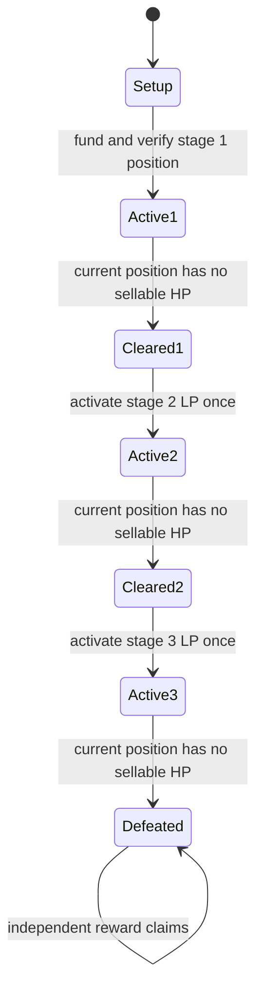

# Boss HP completion and stage activation

Status: current purchase-accounting design, 26 September 2026. Attacks do not burn tokens. Focus on one Attack Token / BossHP battle pool with three gated stages. Physical/magic routing remains deferred.

The accepted same-pool refill/reset model is documented in [Refill math](refill-math.md). A controller-only reverse swap during transition restores the lower price, then incremental liquidity funds the next stage. The BP01 shared fixture now verifies no-burn delivery, stages, custody and claims, with a targeted mirrored HP1 price/refill case. Historical burn results below remain separate from current evidence.

## Finite registered stage liquidity

Use existing v4 concentrated-liquidity math and finite single-sided BossHP positions. Only the current stage allocation is available to players. Keep future refills and LP increments in a prefunded reserve.

The nominal stage sizes remain 300, 600, and 900 HP. Each stage records its funded sellable capacity, registered positions, cumulative liquidity, tick bounds, start/end sqrt price, `stageSold`, and rounding residue. Validate a positive sellable amount before activating the stage.

Reuse the same range after each reset. Add a fresh incremental position to reach the next total capacity, accounting for HP already restored to earlier positions. Use Hook's immutable `[0,1920]` bounds for HP0 and `[-1920,0]` for HP1 so normalized Attack Token/HP prices agree. Calculate actual amounts with the pinned Uniswap libraries, including HP1 refill rounding across the -60 bitmap boundary.

A finite range can sell its HP inventory at a finite terminal price. The game's completion rule must not require PoolManager's shared token balance to become zero. [Uniswap range orders](https://developers.uniswap.org/docs/get-started/concepts/liquidity-providers/range-orders)

## Separate the HP view from reward accounting

- `remainingSellableHP` is the BossHP output still available from the stage's registered positions in the permitted direction, calculated from their liquidity, bounds, and current pool price using Uniswap math.
- `stageSold` sums actual BossHP output from authenticated player attacks in this stage.
- `finalEligibleHP` freezes the sum of `stageSold` at final defeat. Eligible player-held BossHP represents prize rights; events retain historical player damage.
- `roundingDust` records the bounded difference between funded capacity and `stageSold` after the positions have no remaining sellable inventory. It is not player damage or reward credit.

The nominal 300/600/900 values describe the intended game allocation. Do not require `stageSold == nominalStageHP` despite AMM rounding. Reward shares use actual frozen eligible supply, never a hardcoded 1,800 denominator or all minted tokens. Transferring eligible BossHP changes its reward holder in the worked transferable model, but changes no stage counters. The [reward calculation](refill-math.md#rewards-follow-eligible-bosshp) defines custody and claim assumptions.

## State machine



Cleared-to-next-stage activation runs inside the same attack transaction by default. Cleared is a guarded intermediate state, not permission for another attack to start early. Expiry remains a separate terminal path in the main specification.

## Hook responsibilities

`beforeSwap` verifies PoolManager, the canonical pool, the registered attack router, the active player, the expected stage, and the HP-buying direction. It restricts the swap's price limit to the current stage boundary. Player reverse swaps are disabled. Only the controller's bounded reserve-funded refill may reverse direction during guarded Transition.

`afterSwap` uses the actual positive BossHP output:

```text
verify authenticated request and output bounds
if authenticated controller refill:
    return zero hook delta without changing purchase counters
hpOut = actual BossHP output from the swap delta
if hpOut > 0:
    stageSold[stage] += hpOut
    preserve player participation evidence for victory NFT

remaining = remainingSellableHP(registeredStagePosition, currentPoolPrice)
if remaining == 0 and stageCompletionEvidenceIsValid():
    record bounded rounding residue without awarding it
    if final stage:
        status = Defeated
        finalEligibleHP = sum(stageSold)
        emit BossDefeated
    else:
        status = StageCleared
        emit StageCleared

return zero hook delta
```

This is conceptual pseudocode, not production Solidity. The router delivers the output to the player through ordinary settlement after the swap returns. There is no hook token custody, ERC-20 burn, or output-return-delta permission. Enforce the caller's minimum output/damage and maximum spend. A zero-output call never receives damage credit. It may complete an already exhausted stage only when all completion evidence is satisfied and the request permits zero damage; an arbitrary no-liquidity failure is not a victory.

## Completion evidence

Require all of the following, not just zero pool active liquidity:

1. The current stage was funded and activated successfully.
2. The registered stage position and immutable range match the plan; its liquidity has not been removed or changed unexpectedly.
3. The updated price is within the permitted monotonic execution path and the registered position has no remaining sellable BossHP. Reaching the configured terminal sqrt price is a normal way this occurs. Integer rounding may make the last sub-base-unit inventory unsellable just before that endpoint.
4. No undeployed, tradeable allocation remains for the current stage. Future-stage reserves are separate.
5. `stageSold` is positive, and funded/sold/residue accounting reconciles within an explicitly derived rounding bound. Freeze that bound from the pinned math and allowed operation shape; do not choose an arbitrary percentage of HP as a kill threshold.

LP liquidity units can remain nonzero after a position becomes entirely Attack Token. Pool active liquidity can be zero for unrelated reasons. Neither quantity alone is the boss's health.

Exclude external LP additions/removals and unauthorized swaps from the battle pool. Never infer current-stage inventory from BossHP.balanceOf(PoolManager): the singleton also holds other positions, fees, donations, and pools.

## Router/controller responsibilities

After the current PoolManager.swap returns, settle the player's debt and deliver its BossHP. If StageCleared, enter guarded Transition, reverse-swap prefunded BossHP to the lower price, and take recovered Attack Token into reserve custody. Add the incremental registered position, then set the next stage Active and emit StageActivated. No second player purchase occurs in this attack. Refill swaps earn no contribution.

Use the already open unlock. A supported PositionManager route is modifyLiquiditiesWithoutUnlock; do not call a second unlock-opening method. The actual implementation may use existing lower-level settlement helpers instead when smaller. [Upstream interface](https://github.com/Uniswap/v4-periphery/blob/9969eec44cfdf07e24b41de47f40276a58401976/src/interfaces/IPositionManager.sol)

Unused Attack Token remains with or is returned to the player. Stage LP funding comes from the reserve, never from an extra charge beyond the player's authorization. All actors' currency deltas must settle before unlock finishes.

If refilling or adding the next position fails, the clearing attack, output delivery, counters, and stage change all revert. Freeze and verify all stage funding before the round starts so this default does not create an unfunded transition. Final defeat performs no refill or LP addition and enables claims only after the transaction succeeds.

## Minimal proof

Adapt the existing real-v4 refill scenario with funded Attack Token wallets. Exercise a partial hit, a large final hit that cannot consume the next stage, all three stages, player output delivery, unchanged BossHP supply, per-stage residue, contribution totals, and unused-input handling. Within the shared scenario, check that transfers earn no additional contribution and that player sell-backs are rejected. Reuse its failed-next-stage-funding rollback check when adapting settlement.

## Historical burn-based proof result

The following evidence belongs to the earlier adjacent-range design with actual burns. It establishes the rounding issue and that baseline's behavior, not a passing test of the current no-burn/refill path.

A Sol-high scratch proof against v4-core commit `46c6834698c48bc4a463a86d8420f4eb1d7f3b75` completed one Foundry scenario: **1 passed, 0 failed**. It uses real v4 core with test tokens/controller, Solidity 0.8.26, a local Cancun EVM, BossHP as token0, and fixed 0.30% fees and ranges.

The scenario covers two wallets, a partial hit, all three stages, no same-attack stage spill, actual input debt, supply burn equal to contribution, and failed-next-stage-funding rollback. The normal completion path recorded one BossHP base unit of dust for each of the 300/600/900 nominal allocations.

It also reproduced an important boundary: after an input one base unit short of the amount calculated to reach the endpoint, remaining sellable HP was zero while sqrt price was still below the endpoint. Requiring exact endpoint equality left the old logic Active. The revised remaining-inventory check advanced the stage, funded the next BossHP-only position, and the following attack crossed the old range's tiny remainder successfully.

The proof measures and records dust; it does not establish a production dust bound for all ranges and attack sequences. Production authentication, LP controls, alternate token ordering/ranges, user slippage bounds, reward custody, and Robinhood deployment still need their focused implementation checks. The scratch code is not a production contract or part of the application scaffold.
