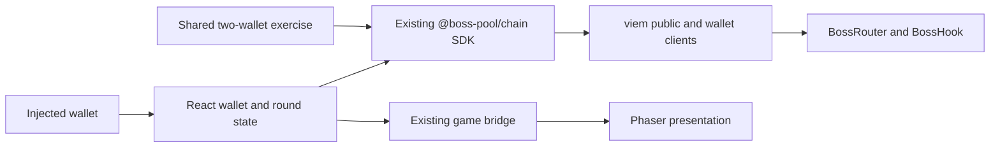

# Frontend contract SDK plan

Approved for implementation on 26 September 2026. This plan extends the existing private `@boss-pool/chain` workspace. The user accepted public pre-enrollment quotes and a router-native quote entry with a fresh testnet deployment. Use GPT-6 Luna at xhigh for implementation and GPT-6 Sol at high for independent review. The user later selected CLI testnet plus page testing for this delivery and will perform the real browser-wallet popup acceptance manually.

The SDK and player UI are implemented. The later chain-target change (`4cecdb3`) makes Base Sepolia `84532` the active testnet target. Robinhood `46630` support and receipts remain historical. The Base RPC is reachable, but there is no Boss Pool Base Sepolia manifest or deployment.

## Confirmed scope

The user selected these behaviors:

- Cover the player journey and the test-only MockUSD faucet. Keep deployment, round creation, and maker administration in CLI scripts.
- Show an attack quote before asking for attack-token allowance. A post-approval simulation alone does not meet this requirement.
- Use unlimited ERC-20 allowances by default to reduce repeated approval requests. Show the token and spender before requesting an approval. Skip approval when the existing allowance is sufficient.

Use the selected Next.js, React, TypeScript, Tailwind, Phaser, and direct-viem stack. Keep the SDK independent of React and Phaser. Do not add a second SDK package, publish to npm, add a backend signer, or introduce another wallet library for this work.

The supported attack is `MockUSD -> ROY -> BossHP`. There is no deployed held-ROY attack entry point. Existing test scripts and the [contract usage guide](contract-usage.md) remain the starting point.

## Accepted quote decisions

| Decision | Accepted behavior |
| --- | --- |
| Quote access | Public preview before wallet connection or enrollment. Check player readiness separately before Attack. |
| Quote implementation | Add a router-native quote entry, prove that it cannot persist game changes, and deploy a new testnet fixture. |

The historical Robinhood fixture is Defeated and redeemed. Preserve its receipts and do not reuse its manifest on Base Sepolia. Deploy a separate Base Sepolia fixture before running the full gameplay rehearsal. RPC storage overrides are not the shipping quote path.

## Existing code to reuse

- [`packages/chain/src/index.ts`](../packages/chain/src/index.ts) already exports generated ABIs, local deployment parsing, local verification, and round reads. Extend it instead of recreating those operations in the app.
- [`scripts/exercise-boss-pool.ts`](../scripts/exercise-boss-pool.ts) contains the proven enrollment, approval, attack simulation, receipt decoding, claim, and same-block snapshot sequence. Extract browser-safe functions, then make this script consume them.
- [`scripts/testnet-common.ts`](../scripts/testnet-common.ts) contains testnet identity and wiring checks. Separate those from fresh-fixture assertions. A valid deployment remains valid after stage 0, defeat, or expiry.
- [`apps/web/src/lib/useBossPool.ts`](../apps/web/src/lib/useBossPool.ts) owns selected-network reads, wallet state, pending writes, and receipt recovery. Keep one poller and one React owner of round state.
- [`apps/web/src/game/bridge.ts`](../apps/web/src/game/bridge.ts) already connects React and Phaser. Extend this bridge with confirmed game data instead of placing wallet or RPC calls inside scenes.

Do not import CLI scripts into the SDK. They contain Node filesystem calls, environment loading, private-key handling, and executable entry points.

The [historical testnet report](testnet-verification.md) records a Robinhood gameplay path. The [SDK verification report](sdk-verification.md) records the quote-capable SDK exercise and separates its 16-transaction gameplay run from the two-transaction NFT completion. Neither report is Base Sepolia deployment evidence.

## SDK and app responsibilities

The SDK accepts a public client, a verified deployment, and an optional wallet client for player writes. Public reads and previews work without a wallet. The app discovers the provider, requests accounts, switches networks, and owns React state. Private keys never enter browser imports.

Use chain `31337` for local Anvil and chain `84532` for Base Sepolia. The SDK retains chain `46630` for the historical Robinhood manifest. Keep RPC selection separate from deployment addresses. Public testnet manifests omit the RPC URL. No Base Sepolia manifest is present until a real, verified deployment occurs.

Verify chain ID, deployment evidence, deployed code, and immutable contract wiring when loading a deployment. Do not require an Active round, zero counters, an untouched prize, or a future deadline during ordinary verification. Recheck wallet chain and account before each write.

Keep token values as `bigint`: MockUSD has 6 decimals, ROY and BossHP have 18. Keep zero-based stage indices in SDK data. The app adds one for display. Expose current price as current price; the existing `bossInitialSqrtPriceX96` snapshot field currently reads mutable `lastSqrtPriceX96` and needs a clear name.

## Proposed player-facing operations

These operations are implemented in `@boss-pool/chain`; use the package README for runnable setup and API examples. Keep the generated ABI exports as the contract authority.

| Operation | Result needed by the frontend |
| --- | --- |
| `verifyDeployment` | Validated identities and chain context, independent of encounter progress |
| `readRound` | One-block status, stage, sold/capacity values, deadline, price, original prize, eligible HP, redeemed HP, and paid prize |
| `readPlayer` | Account, native gas balance, token balances, allowances, enrollment, attack participation, reward rights, and NFT eligibility |
| `quoteAttack` | Input cap, expected input spent, ROY bought/spent/refund, BossHP output, stage-clear prediction, stage, deployment identity, block, and expiry |
| `getApproval` | Correct token/spender, current allowance, and whether approval is needed for an action |
| `approve` | Unlimited approval to that action's verified spender, submitted hash, and confirmed receipt |
| `enroll` | Confirmed fee, starter ROY, and entry NFT result |
| `attack` | Normal authenticated simulation followed by submission and confirmed `AttackExecuted` plus transition events |
| `previewReward` | Exact integer payout only when `finalEligibleHP` is frozen after defeat |
| `claimReward` | Confirmed surrendered HP and paid MockUSD |
| `claimVictoryNFT` | Confirmed token ID and owner |
| `faucetMockUSD` | Test-token mint to the connected account on the configured local/testnet deployment |

Use one shared receipt decoder and receipt-wait helper. Preserve the submitted hash before waiting so the app can recover after refresh. Expose confirmed typed results and decoded contract errors instead of asking components to decode raw logs.

The approval map remains fixed: enrollment uses MockUSD to BossHook, Attack uses MockUSD to BossRouter, and redemption uses BossHP to BossHook. Unlimited approval does not remove the attack input cap or the HP amount selected for a claim. A new deployment has new spenders and therefore may need new approvals.

Player reward ownership and NFT eligibility are separate. A transferred-HP holder can redeem without having attacked or enrolled. An attacker who transferred all HP can still claim the victory NFT. SDK claim helpers must preserve both rules.

## Quote before approval

The existing `attackWithMockUSD` checks enrollment and transfers MockUSD before unlocking PoolManager. Ordinary full-router simulation therefore cannot quote for an unapproved player. It remains the final execution check after approvals.

The standard Uniswap V4Quoter is not a direct replacement. BossHook authenticates the configured Router, requires its stage price boundary, and supports partial consumption of intermediate ROY at that boundary. The inspected upstream helper uses different limits and rejects that partial-input condition. Reuse its [revert-and-catch quote pattern](https://github.com/Uniswap/v4-periphery/blob/9969eec44cfdf07e24b41de47f40276a58401976/src/lens/V4Quoter.sol), rather than copying its route assumptions.

First prove a router-native quote that executes the same two swaps and stage transition inside a call frame that always reverts. Reuse existing swap, range, fee, refill, and liquidity math. No separate TypeScript AMM calculation is needed.

The design must preserve these conditions:

- Every quote discards pool changes, token transfers, HP accounting, enrollment/attack flags, and stage transitions. Calling the quote method in a real transaction must not turn it into an unpaid attack.
- A quoted clear checks the existing reserve transition. Returning before that transition would hide a reserve failure.
- Router execution context returns to Idle on every path. Decode only the intended typed quote result. Propagate genuine failures and reject an unexpected successful callback.
- Keep manager, router, PoolId, fee, direction, stage, price-boundary, and position checks. Isolate the pre-enrollment eligibility exception to a quote context that cannot persist changes.
- Use a nonzero preview recipient that cannot accidentally add simulated player output to Router, Hook, or PoolManager reserves.
- A preview excludes player funding and allowance requirements. It cannot promise that a wallet is ready or that later execution will succeed.

This design is source-reasoned and needs a focused proof before its interface is frozen. The inspected periphery reference is pinned above; it is not currently installed. Check its license and compatibility before copying a helper.

RPC overrides are a possible fallback, not the accepted design. A read-only code-override probe returned the expected value on the official Robinhood `/rpc` endpoint. That probe does not prove a complete attack quote. Token allowance storage, optional balance/enrollment overrides, and provider support would still need validation. Viem documents that an [override simulation can succeed while the real transaction fails](https://viem.sh/docs/contract/simulateContract#stateoverride-optional).

## Transaction flow and stale results

The intended UI flow is `quote -> approve if needed -> validate again -> Attack -> receipt -> refresh`. Enrollment has its own approval and entry transaction. Wallet prompts remain visible to the player.

A quote includes deployment, chain, input cap, stage, quoted block, and validity time. Bind a public quote to the selected account when preparing execution. Changing the amount, deployment, account, chain, or stage invalidates execution preparation.

After approval, simulate the real Router path with normal state and the selected wallet. Preserve the minimum outputs the player accepted. If they no longer hold, return a requote result. Do not silently lower the accepted minimum outputs or carry an old quote into a new stage.

Proposed demo defaults are 1% output tolerance and a validity window capped by the round deadline. Treat these as client defaults, not contract guarantees. The existing CLI uses a five-minute requested deadline. Keep the SDK's final defaults explicit in its documentation.

Use viem's [receipt replacement detection](https://viem.sh/docs/actions/public/waitForTransactionReceipt) for repricing and cancellation. A replacement receipt counts as the requested action only after checking its sender, target/calldata, and expected events. A cancelled or different transaction must not trigger damage animation. A timeout is an unresolved transaction, not proof of failure; retain the hash and allow read-only receipt recovery. Do not resubmit writes automatically.

Filter decoded logs by the configured emitter before using [typed ABI event parsing](https://viem.sh/docs/contract/parseEventLogs). Broad errors such as `InvalidAttack` must not always be relabelled as a stale stage. Preserve the decoded error and use fresh reads to explain known causes.

React keeps one public round poller, refreshes after receipts, and clears stale player results after wallet changes. Keep the bounded same-block read retry for the reproduced Robinhood error. Game state comes from confirmed reads and receipts. Pending animation does not decrement HP. Use transaction hash and log index to avoid replaying the same confirmed effect twice.

## Delivery order for the two teammates

| Slice | Owner | Deliverable and acceptance |
| --- | --- | --- |
| 1. Prove preapproval quotes | A, reviewed with B | Prove public quote parity, no persistent effects, stage-cap refunds, and clearing behavior with the pinned v4 fixture. Update ABI and deploy a new fixture. Extends BP04, issue #5. |
| 2. Read one real round through the SDK | A, then B consumes | Add local/testnet configuration, state-independent deployment verification, one-block round/player reads, and browser-safe exports. Preserve public reads without wallet connection and completed/expired-round reads. Extends BP02 and BP06, issues #3 and #7. |
| 3. Enroll and attack through shared operations | A owns SDK; B owns wallet UI | Extract approvals, simulation, submission, and typed receipts. Ship quote-before-approval, unlimited allowance prompts, final authenticated simulation, and stale-stage requotes. Extends BP03/BP04, issues #4 and #5. |
| 4. Redeem HP and claim NFTs | A owns operations; B owns screens | Reuse frozen-denominator math, HP surrender, and independent NFT eligibility. Show actual payout from receipts. Extends BP07, issue #8. |
| 5. Use the SDK in the existing game and exercise | A owns CLI evidence; B owns React/Phaser | Replace duplicate polling, feed confirmed round/results across the existing bridge, and make the existing two-wallet script call the SDK on a new real testnet round. Verify the public page and disconnected-wallet states. Hand the browser-wallet popup checklist to the user. Extends BP06/BP11, issues #7 and #12. |

B can prepare wallet state and controlled UI components once result shapes are agreed. Contract quote implementation is the dependency for final attack wiring. Do not build a second fake SDK while waiting.

Keep shared operations under `packages/chain/src`, separating deployment/reads, player actions/quotes, and receipts/errors where the code needs it. Put generated ABIs under the existing generated directory. Add a short `packages/chain/AGENTS.md` only when implementation begins and directory-specific rules are needed. Keep product rules in this plan and the technical specification.

## Focused verification

Reuse the existing two-wallet scenario, replacing its transaction implementation with SDK calls. Preserve its balance, refund, stage, claim, and NFT assertions. Extend that same journey with a quote obtained before approval and compare it with actual execution when the pool state has not changed.

Add a focused contract regression only for the new quote trust boundary: a quote cannot persist an unpaid attack or swallow a real transition failure. Combine representative partial and clearing cases with existing fixtures. Do not add one test per SDK wrapper or a broad mock matrix.

Run the existing typecheck and production web build to catch browser imports of Node or signer code. Verify public quoting, network selection, canonical state display, and missing-wallet handling in the browser. Record allowance prompts, rejection, account/chain changes, and popup interactions as the user's manual acceptance checklist. Do not claim those wallet interactions were automated. Reuse viem for provider and receipt mechanics instead of rebuilding them.

The SDK milestone is complete when the frontend and CLI use the same player operations, a fresh testnet journey succeeds, and a teammate can follow the usage example without assembling ABIs or decoding logs inside components.
