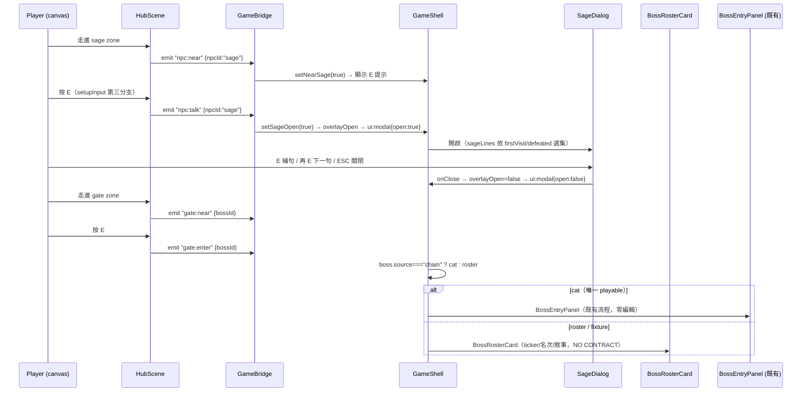
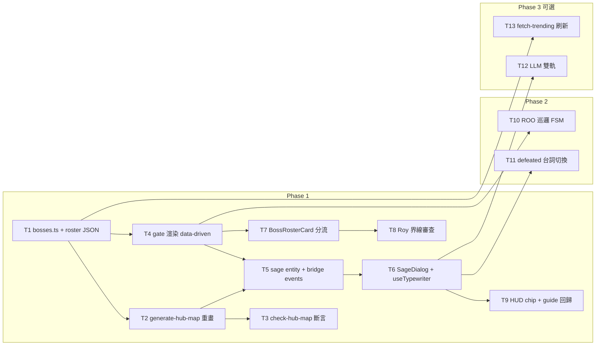

# 出生場景改版實作計畫：老智者 NPC × 10 Boss 呈現（Boss Roster Hub Plan）

- 分支：`docs/boss-roster-hub`｜品質模式：standard（threshold 85）｜PLAN Round 2/3
- 讀者：JK（frontend）、Roy（contracts 交界）、決策者｜交付物：實作計畫（交付物 2；研究報告＝交付物 1：`docs/superpowers/specs/2026-09-26-boss-roster-hub-research.md`）
- 上游輸入：研究報告（Round 1，§x.x 引用即指該報告）、`.edison/research/{a1,a2,b}`；源碼 file:line 由 architect 於 2026-09-26 實讀驗證（§8）
- 驗證紀律：「建議」＝設計建議非既有事實；「假設」＝未驗證前提；本文件只新增這一份計畫，不修改任何程式碼或其他文件

## 1. 目標與範圍

### 1.1 目標

把出生 hub 從「空曠草園 + 3 門神社」改版成「一位老智者 NPC + 10 隻 Launch Boost Boss 呈現」的 roster hub：

1. **老智者**站在出生點附近（位置固定，marker 落點，§4.3），首遇警告「前方有 10 隻 Boss」、之後隨進度更新台詞（研究 §3.1：Elderbug 骨架 + BotW 量化目標）。
2. 使用者原話「至少把頭 10 個都拿出來變成 Boss」→ 研究 §2.2 的 Top-10 snapshot 全數登場，加上現有 cat（可玩）與 macro-whale（fixture），共 **12 門**（D1）。
3. 3-gate 假設的硬編碼全面 data-driven 化（研究 §4.6 第 1、3、6、7 條；檔案級指引 §8.1）。

### 1.2 規格變更聲明（需 owner 批准）

| 現行文件 | 現行約束 | 本計畫取代方式 | 狀態 |
|---|---|---|---|
| `docs/superpowers/specs/2026-09-26-rpg-hub-art-direction-design.md:64` | Out of scope：「add new bosses」 | 新增 10 隻 Launch Boost roster Boss | **需批准** |
| 同上 `:32` | 「The three gate markers retain their current boss IDs」 | markers 擴為 12 門；`locked` fixture 移除 | **需批准** |
| `docs/superpowers/plans/2026-09-26-hub-completion-pass.md:20` | 「No … new bosses」 | 同上 | **需批准** |
| 同上 `:23` | 「No … NPC conversations」 | 新增老智者對話系統（§6） | **需批准** |
| 同上 `:21-22` | 「Do not edit `BossEntryPanel.tsx` or battle implementation」 | **維持不變**——非 cat 門改開新元件 `BossRosterCard`（D6、§5.4），完全不碰 partner 的 battle-entry 界線 | 不需批准（遵守） |

**假設**：§1.2 的批准動作由決策者完成；批准前不動 codebase。art-direction 其餘約束（40×30、16px、3× zoom、既有 bridge 名稱、crisp label）繼續遵守。

### 1.3 不做什麼（Out of scope）

- 不碰 battle 實作（`/mock-battle`、`BossActions`、攻擊路徑）、不碰合約邏輯與部署（`contracts/`、`packages/chain/`）
- 不編輯 `BossEntryPanel.tsx`（partner 界線，§1.2 末列）
- 不上線 live fetch（§9 Phase 3 只設計 dev-only refresh script）
- 不實作 LLM（§6.5 只寫設計）
- 不新增觸控（既定否決，研究 §4.6 第 12 條）
- 不造假進度或假資料（`apps/web/AGENTS.md` fixture 標示規則；非 cat 門一律誠實標 `NO CONTRACT`）

## 2. 決策記錄（Decision Log）

| # | 決策 | 考慮過的選項 | 理由 | 狀態 |
|---|---|---|---|---|
| D1 | Roster 組成 = cat + macro-whale + 10 Launch Boost = **12 門**；`locked` fixture 移除 | (a) 12 門；(b) 10 新 + cat = 11 門；(c) 10 門取代現有 fixture | 使用者「至少頭 10 個都拿出來」是加總語義；macro-whale 為已投資資產、與新名單同屬 no-contract fixture、零合約成本；12 = 1 playable + 1 fixture + 10 roster 的乾淨敘事 | 建議 |
| D2 | 呈現方式 = 混合：**11 定點 + 1 巡邏（ROO）** | 全定點／全漫遊／混合 | 研究 §3.2 FromSoftware 證據：純漫遊傷害可發現性；但 1 隻巡邏的活絡感 CP 值最高（研究 §3.4 55-entity 先例，效能零顧慮）。選 ROO：榜單敘事「沒人知道他是什麼」＝遊蕩者人設，老智者台詞「只有那隻不守規矩」直接化用 | 建議 |
| D3 | 老智者 = 純腳本對話（Phase 1）；LLM 雙軌為 Phase 3 可選 | 純腳本／LLM-only／雙軌 | demo 只有一次機會，腳本零網路風險；研究 §3.5 結論：LLM 必須腳本兜底。Phase 1 不實作 LLM | 建議 |
| D4 | 解鎖語義 = 10 隻全開（demo 友善）；`status` 三態 `active / no-contract / locked`；擊敗狀態僅 cat 可發生（唯一部署合約），roster 門顯示 `NO CONTRACT` chip | 全開／逐步解鎖（Demon's Souls 式） | hackathon demo 需 30 秒內逛完 12 門；逐步解鎖價值低於完整名單展示。真實進度只來自 cat 的 `round:state`（`bridge.ts:31-37`） | 建議 |
| D5 | 名單落點 = curated JSON（`src/game/boss-roster.json`）+ `bosses.ts` 組合成 `BossDefinition[]`；位置續留 hub.json markers（既定決策） | 全 TS／全 JSON／組合 | 研究 §2.3 建議 snapshot 為主；JSON import 有型別安全又整批可換（換檔即換榜） | 建議 |
| D6 | 非 cat 門的 E 互動 = 開新元件 `BossRosterCard`（展示 ticker/敘事/snapshot 資訊）；cat 續走 `BossEntryPanel` | 擴充 BossEntryPanel／新卡片 | 擴充會踩 partner 界線（`BossEntryPanel.tsx:35` `supported = boss.id === "cat"` 特判遍布全檔）；新卡片零侵入 | 建議（Roy 知會） |
| D7 | 地圖維持 40×30（640×480）；備案 44×32 | 維持／擴建 | 整數 zoom 3× 與 camera 行為不動（`HubScene.ts:9,12-16`）、`check-hub-map.ts` 尺寸常數不動、回歸面最小；12 門扇形提案見 §4.2 | 建議 |
| D8 | 名牌 = `TICKER`（大寫）第一行 + name 第二行；roster 門 caption 改 `LB #N · ROBINHOOD`，cat/macro-whale 維持 `BOSS POOL` | 只 ticker／只 name | demo 觀眾認 ticker 才有梗（研究 §2.3）；排名 chip 承載「Launch Boost 榜」來源感；複用既有 plate 結構（`HubScene.ts:302-325`） | 建議 |
| D9 | Portrait = Phase 1 code-drawn 盾牌 + ticker 字首（零資產）；Phase 2 換生成式 emblem 美術 | 真實 logo／生成 emblem／字首盾牌 | 真實 logo 授權風險高（§7.2）；字首盾牌是 locked 門鎖頭圖案的既有語彙延伸（`HubScene.ts:293-299`） | 建議 |
| D10 | 對話 UI = React modal（`SageDialog`），非 canvas 內對話框 | canvas 內／React modal | 既有 WelcomeDialog 全套 a11y dialog 模式 + `ui:modal` 輸入鎖已存在（`GameShell.tsx:49`、`HubScene.ts:188-199`）；canvas 內要另建文字排版與輸入鎖 | 建議 |

**Design Pattern 紀律（防過度設計聲明）**：本計畫不引入任何新設計模式或抽象。zone 感應、bridge event pair、crisp label、modal 模式皆為既有模式的**複製**（研究 §4.3）；不建 generic modal framework（呼應 completion-pass 既有決策）；巡邏只是單一 FSM 函式，不抽象化。

## 3. 畫面規格

### 3.1 出生點所見構圖（spawn 第一眼）

**Before（現況）**：spawn (20,25)（`generate-hub-map.ts:9`）石徑向南 jog 進中央 clearing；第一眼＝草地 + 花叢 + 遠方天際線 3 點（cat 西北、locked 正北、macro-whale 東北），近景空無一人。

**After（本計畫）**：spawn 不動；第一眼由近至遠三層——

1. 近景：**老智者**立於北 3–4 tile（石徑旁，marker 落點 §4.3），idle bob、名牌 `THE SAGE`、接近時 E 提示。
2. 中景：中央 clearing 北緣，**頂列 9 門神社一字排開的天際線**（9 色 portal glow 各自 accent 色）——扇形分布的第一印象（研究 §3.3：Nexus 式輻射 + 單一圓心導航）。
3. 遠景：西側樹籬間隙露出西列 2 門、東側露出東南 1 門。

```
BEFORE（向北看）                    AFTER（向北看）
  [cat]   [LOCKED]   [whale]      [HC][TAL][ROO][AGR][CAT][RBP][AEVA][MW][PONS]
       （空曠草園）                    ▓▓▓ central clearing 北緣 ▓▓▓
   ········                       ♂ THE SAGE（20,21, bob）
      ● spawn (20,25)                │ 石徑（既有 jog 保留）
                                   ● spawn (20,25)    西 [AD][MUSEBOOK] · 東南 [ROBIN]
```

### 3.2 12 門站點共用規格

- **神社造型沿用** `buildGates()`（`HubScene.ts:264-358`）：石座 + 雙柱 + 楣 + 拱頂矩形堆疊（:270-290）、portal glow 半徑 16（:292-295）。不升級、不新增造型（D9 零資產）。
- **accent 色 per-boss**：`BossDefinition.accent` 取代 `GATE_COLORS`（`HubScene.ts:24-28`），glow 顏色與名牌 plate 描邊沿用該色（現行 plate stroke 用 gate color，`HubScene.ts:323`）。
- **portrait 三種**：cat/macro-whale 維持既有 `makeCroppedTexture` 產物；roster 門 Phase 1 畫 code-drawn 盾牌 + ticker 首兩字母（參考 locked 門鎖頭語彙 `HubScene.ts:293-299`）；Phase 2 換 emblem 美術（§7.2）。
- **名牌**：第一行 `TICKER`（大寫，複用現行 `boss.name.toUpperCase()` 渲染，`HubScene.ts:303-311`）；第二行 caption：roster 門 `LB #N · ROBINHOOD`、cat/macro-whale `BOSS POOL`（D8）。
- **status chip**：roster 門名牌下方加 4px 小字 chip——`NO CONTRACT`（灰）／`LOCKED`（灰）；cat 保留既有 live stage label（`renderCatStageLabel` `HubScene.ts:534-556` 不動）。任何門不得顯示 Live/Ready 等非真實字樣（`apps/web/AGENTS.md` fixture 規則）。

### 3.3 老智者 NPC 視覺

- 位置：marker `sage`（§4.3）；sprite＝`npc-thesis-wizard.png` crop（§7.1）。
- 尺寸：targetHeight ≈ 30px（對齊 cat portrait 28px 語彙，`HubScene.ts:121-122`）。
- **idle bob**：y ±2px、900ms、`Sine.easeInOut`、yoyo；`prefers-reduced-motion` 時不 bob（`watchReducedMotion` `HubScene.ts:423-436` 既有機制）。
- 名牌：`THE SAGE`（crisp label，`resolution: ZOOM`、`LABEL_DEPTH`，同 `HubScene.ts:303-311` 語彙）。
- E 互動提示：GameShell 內新增 `SagePrompt`，復用 `GatePrompt` 樣式與顯示條件（`GameShell.tsx:139-141` 的 `showBossPrompt` 同款優先序）。

### 3.4 對話框 UI 規格（D10）

- **樣式**：React modal，結構複製 `WelcomeDialog`（`HubGuide.tsx:78-118`）：`role="dialog"`、`aria-modal`、backdrop `bg-ink/70`、focus 管理、ESC 關閉、關閉後 focus 回 canvas（`focusHubCanvas` 既有工具）。
- **內容**：eyebrow `SAGE · GARDEN`；title＝老智者名；打字機主文區（`aria-live="polite"` 只在**整句完成**時更新一次，避免逐字播報——現有 `StatusPanel` 已因 per-second aria-live 修過，本規格明定）；footer `E · NEXT` 與 `ESC · CLOSE`。
- **打字機**：新 hook `useTypewriter`（§6.3）：~28ms/字；句讀停頓（`,` `、` 200ms；`.` `！` `？` 400ms）；**兩段式跳過**——第一次 E/Enter/Space 補完整句、第二次進下一句（研究 §3.1 工具層約定）；`prefers-reduced-motion` 時直接全文顯示。
- **控制鎖定**：開啟期間 GameShell `overlayOpen` 含 sageOpen → `ui:modal {open:true}` 鎖場景輸入（`GameShell.tsx:49`、`HubScene.ts:188-199` 既有機制）；dialog 自行攔截 E/ESC，與 HubScene 的 `modalOpen` 互斥條件一致（`HubScene.ts:400`）。
- **可重複對話**：sage 常駐、無 once-per-browser；`boss-pool:sage-talked:v1` 只切換「首訪/回訪」台詞集（§5.4）。
- **進度感知台詞**：§6.4 示例 3 段。

### 3.5 HUD 調整建議

- 建議：header 徽章列新增 `12 CHALLENGERS` chip（data-driven `BOSSES.length`；放現有 `HUB · FIXTURE MAP` badge 旁，`GameShell.tsx:147-149`）。
- **不做**「剩餘 Boss 計數」：只有 cat 能真實擊敗，計數會淪為假進度；進度感由 sage 台詞承載（D4）。

## 4. 場景佈局設計

### 4.1 維持 40×30 的建議與理由（D7）

建議**維持** 40×30（640×480）。理由：① 整數 zoom 3× 與 camera 行為不動（`HubScene.ts:9,12-16`）；② `check-hub-map.ts:29-30` 的 `WIDTH/HEIGHT` 常數與 map 尺寸斷言不動，回歸面最小；③ 12 門扇形在 40×30 可行（§4.2 座標提案）；④ art-direction 尺寸約束繼續成立。

**備案（contingency，不預設）**：若實作時 BFS/動線驗證顯示太擠，擴 44×32（704×512）——只改兩個 script 的 `WIDTH/HEIGHT` 常數 + 重新 reserve。記錄備查。

### 4.2 扇形分佈：座標級提案

gate 矩形維持 3×2 tile（GATE 48×32，`HubScene.ts:17`）。頂列 9 門每 4 格一門（3 寬 + 1 空隙），兩門之間的 torch 由 generator 既有邏輯寫入同一空隙 tile（`generate-hub-map.ts:199-207`，寫同值、無衝突）：

| gate id | col,row | 區位 | 備註 |
|---|---|---|---|
| hoodcats | (3,2) | 頂列西端 | |
| talis | (7,2) | 頂列 | 原 cat 位 (7,4) 上移 |
| roo | (11,2) | 頂列 | 巡邏者；門保留為「家」 |
| agrippa | (15,2) | 頂列 | |
| cat | (19,2) | 頂列正北 | spawn 正北視野、唯一可玩門 |
| robinpepe | (23,2) | 頂列 | |
| aeva | (27,2) | 頂列 | |
| macro-whale | (31,2) | 頂列東段 | |
| pons | (35,2) | 頂列東端 | |
| ad | (4,10) | 西列上 | |
| musebook | (4,18) | 西列下 | |
| robin | (35,18) | 東南 | 東路 exit (38,12-14) 保留 |

其他座標決策：

- **SPAWN 不動** (20,25)；**SAGE** marker (20,21)（spawn 北 4 tile、石徑旁）；中央 clearing（cols 15-25, rows 10-20，`generate-hub-map.ts:53-56`）保留。
- **POND 移位**：原 (4,9,6,6)（`generate-hub-map.ts:100-101`）移到左下 (2,24,6,6)——cols 2-7、rows 24-29（含外緣 row 29 阻斷，外圈全封斷言仍成立）；原 pond 區還原草皮，供 spawn→西側動線。
- **東路 future route 保留**：cols 33-38、rows 12-14（`generate-hub-map.ts:69-72`）；robin(35,18) approach（rows 20-23）不衝突。
- **ROO 巡邏路徑（Phase 2）**：手挑 waypoint＝roo 門前石徑段 cols 11-13、rows 6-14（不進任何 gate approach rect；§8.2）。
- **動線重畫**：中央 clearing 北緣 → 頂列每門各留 3 寬石徑直下（`reserveRoute` 每門一筆）；spawn→clearing 既有 jog 石徑保留（`generate-hub-map.ts:59-61`）；西列兩門接 clearing 西緣。
- **裝飾規則沿用**：每門兩側 torch（既有 for-GATES 邏輯）、approach 4 行 clear（`generate-hub-map.ts:94-97`）、lantern/tree cluster 座標重挑避開新 reserve（:163-167）。

### 4.3 產生與驗證流程（hub.json markers 擴充規格）

- `generate-hub-map.ts` 修改：`GATES` 改 12 筆（:10-14）；新增 `SAGE` point marker；pond 移位；route/reserve/cluster 重畫。
- `check-hub-map.ts` 修改：`gates.length` 3→12（:68）；bossIds 清單（:72）改為 `import { BOSSES } from "../src/game/bosses"` 後做**集合相等**斷言（generator 已有 import TS 先例：`generate-hub-map.ts:3` import `hubTiles`）；新增「恰一個 sage point marker」斷言；pond 位置斷言由既有 water-interior 邏輯自然覆蓋（:136-153）。
- **markers 規格**：`sage` point object `{name:"sage", point:true, x, y}`；gate object 維持 `{name:"gate", properties:[{name:"bossId", value}]}` 對位（現行格式，`hub.json` 實讀確認）。
- 執行：`bun run map:build` → `bun run map:check`（`apps/web/package.json:8-9`）。

## 5. 資料模型設計

### 5.1 `BossDefinition` 擴充（`apps/web/src/game/bosses.ts`）

```ts
export type BossId = string;                    // 放寬自 "cat" | "macro-whale" | "locked"（bosses.ts:2）
export type BossStatus = "active" | "no-contract" | "locked";

export type BossDefinition = {
  id: string;
  name: string;
  ticker: string;                              // 新增：名牌第一行（D8）
  tagline: string;
  /** Portrait image under /public/images. Empty when there is no portrait. */
  portrait: string;
  /** 新增：crop 規格移出 HubScene 硬編碼；null 表示無 portrait 可裁（畫字首盾牌）。 */
  crop: { x: number; y: number; w: number; h: number; targetHeight: number } | null;
  /** 取代 locked: boolean（研究 §4.6 第 4 條：三態需求）。 */
  status: BossStatus;
  /** 新增：gate glow / plate 描邊色，取代 GATE_COLORS 窮舉。 */
  accent: string;                              // hex，如 "#f5b04a"
  /** 新增：資料源區分。source:"chain"=有合約語義（僅 cat）；"venue"=展示型。 */
  source: "chain" | "venue";
  /** 新增：僅 roster 門有。 */
  rosterMeta?: {
    rank: number;        // Launch Boost 榜名次（研究 §2.2）
    chain: string;       // "Robinhood"
    category: string;    // 敘事一句話（如 "Meme / Pepe × Robin Hood"）
    snapshot: string;    // "GeckoTerminal trending · 2026-09-26"
  };
};
```

- `locked` → `status` 遷移觸點：`hubGuide.ts:22` `isUnlocked` 改判 `status !== "locked"`；`HubScene.ts` gate 渲染 `boss.locked` 三處（:293、:299、:303-304）與 `chooseHintGate`（:633）；`BossEntryPanel.tsx:88` eyebrow 的 `boss.locked` 分支（該檔仍不編輯——cat/macro-whale 的 status 值設定需保持 `BossEntryPanel` 現有分支不變，即 cat=`active`、macro-whale=`no-contract`，eyebrow 邏輯由 partner 後續自行對齊）。
- `BossId` 放寬為 `string` 的影響：`isBossId`（`bosses.ts:38-40`）改為 string 驗證；bridge payloads（`bridge.ts:17-21`）、`GameShell` state、`hubGuide` 型別隨之；`GATE_COLORS: Record<BossId, number>`（`HubScene.ts:24-28`）**刪除**，改讀 `boss.accent`。

### 5.2 Roster 資料檔規格（`apps/web/src/game/boss-roster.json`，新檔）

curated snapshot（D5）：10 筆、頂層附 `snapshotDate` 與 `source` 註記；欄位是 `BossDefinition.rosterMeta` 的子集 + 顯示欄位：

```json
{
  "snapshotDate": "2026-09-26",
  "source": "GeckoTerminal /networks/robinhood/trending_pools",
  "bosses": [
    { "id": "talis", "ticker": "TALIS", "name": "Talis",
      "tagline": "Tokenized stock market on Uniswap.", "rank": 1, "category": "DeFi",
      "accent": "#c8a1ff" },
    { "id": "roo", "ticker": "ROO", "name": "Roo",
      "tagline": "No one knows what it is. It does not stay put.", "rank": 2, "category": "Meme",
      "accent": "#ff9d6b" }
  ]
}
```

- `bosses.ts` 組合成 `BOSSES = [...CORE_BOSSES(cat, macro-whale), ...ROSTER.map(toDefinition)]`；`toDefinition` 補 `crop: null`、`portrait: ""`、`status: "no-contract"`、`source: "venue"`、`rosterMeta`。
- 換榜＝換 JSON（整批替換成本，研究 §2.3 第 4 點）；TS import JSON 由 Next.js/tsconfig 原生支援。

### 5.3 hub.json markers 的 gate 物件規格

- gate object 維持 `{name:"gate", properties:[{name:"bossId", type:"string", value}]}`（現行格式實讀確認）；**bossId 必須與 `BOSSES` 一一對位**，由 `check-hub-map.ts` 集合相等斷言把關（§4.3）。
- 新增 `sage` point object（§4.3）。
- 位置不寫 TS 是既定決策（art-direction spec:34；研究 §4.4）。

### 5.4 解鎖狀態儲存與 demo fixture 策略

| key | 用途 | 寫入時機 | 預設 |
|---|---|---|---|
| `boss-pool:sage-talked:v1` | sage 首訪/回訪台詞切換 | 第一次關閉 SageDialog | 空＝首訪 |
| `boss-pool:defeated:v1` | cat 真實擊敗標記（Phase 2 台詞） | 收 `round:state` 且 `status===3`（DEFEATED，`HubScene.ts:554` 既有語義） | 空 |

- demo fixture 策略：**不預設任何假進度**；台詞的「擊敗」分支只由 cat 真實狀態驅動。
- 既有 `boss-pool:hub-guide:v1`（`hubGuide.ts:4`）不動；guide 在 12 門全 unlocked 下行為需回歸（§11）。

## 6. 老智者 NPC 與對話系統技術設計

### 6.1 HubScene 新增 NPC entity（對照 gate zone 模式）

- 讀 marker：`create()` 內 `map.findObject(HUB_LAYERS.markers, o => o.name === "sage")`（同 `spawn` 讀法，`HubScene.ts:143-146`）。
- sprite：`makeCroppedTexture(this, "npc-sage", "portrait-master-sage", crop, 30)`（§7.1）+ `this.add.image(x, y, "npc-sage")`；`setDepth(y)` y-sort（同 player/atmosphere 慣例）。
- **靜態 body**：`this.physics.add.existing(sage, true)` 的 body 讓玩家不能穿過（NPC 擋路＝引導，Pokemon 關都老人先例）；body 尺寸 12×8 對齊玩家 collider 語彙（`HubScene.ts:389`）。
- **idle bob**：`this.tweens.add({targets: sage, y: y ± 2, duration: 900, yoyo: true, repeat: -1, ease: "Sine.easeInOut"})`；`reduceMotion` 時不啟動（§3.3）。
- **zone**：`new Phaser.Geom.Rectangle(x - 10, y - 8, 28, 28)` 包住 NPC 下半；`updateSageProximity()` 併入 `update()`（`HubScene.ts:252-256`），進出變化時 emit `npc:near`——完整複製 `updateGateProximity` 的 Contains 模式（`HubScene.ts:707-719`）。
- **E 攔截第三分支**：`setupInput()`（`HubScene.ts:394-420`）優先序 `nearGate → nearSage → nearRegion`，sage 在 spawn 北側、zone 不與任何 gate zone 重疊（座標 §4.2 保證）。

### 6.2 新 bridge event pair（`apps/web/src/game/bridge.ts`）

```ts
export type GameEvents = {
  // ...既有事件不變
  /** Player walked into / out of the sage's talk zone. */
  "npc:near": { npcId: "sage" | null };
  /** Player pressed interact while inside the sage's zone. */
  "npc:talk": { npcId: "sage" };
};
```

- 命名對齊 `gate:near` / `gate:enter` 慣例（`bridge.ts:15-19`）；不新增 command（`ui:modal` 既有，`bridge.ts:27-29`）。

### 6.3 對話 UI 元件

- 新檔 `apps/web/src/components/SageDialog.tsx`：結構複製 `WelcomeDialog`（§3.4）；props `{ lines: string[]; onClose: () => void }`；關閉回呼負責 `setSageOpen(false)`。
- 新檔 `apps/web/src/lib/useTypewriter.ts`：`useTypewriter(text: string)` 回 `{ shown, done }`；§3.4 的速度/句讀/兩段式跳過規格；`matchMedia("(prefers-reduced-motion: reduce)")` 直接 `done=true`。
- GameShell 接線：state `nearSage` / `sageOpen`；`bridge.on("npc:near")` → `setNearSage`；`bridge.on("npc:talk")` → `setSageOpen(true)`（同 `gate:enter` 接法 `GameShell.tsx:36`）；`overlayOpen` 加入 `sageOpen`（`GameShell.tsx:42`）；`SagePrompt` 顯示條件接在 `showBossPrompt` 之後（`GameShell.tsx:139-141` 同款優先序）。

### 6.4 台詞資料結構與示例

- 新檔 `apps/web/src/lib/sageLines.ts`：`type SageState = { firstVisit: boolean; defeated: boolean }`；`function sageLines(state: SageState): string[]`（純函式，同 `transitionGuide` 純 reducer 慣例）。台詞長度 ≤ 3 句/輪，每句 ≤ 60 字。
- 3 段示例（首訪 / 回訪未擊敗 / cat 已擊敗）：

> 首訪：「年輕人，歡迎來到 Boss Pool 花園。前方有 **10 位**從 Robinhood 來的挑戰者，他們會奪走每個人的好夢。」
> 「沿著石路向上，一座神社就是一位 Boss。只有 Roy 已經甦醒——先去找祂練手吧。」

> 回訪（未擊敗）：「還是那 10 位。名單會變，就像城裡的流言。記住那隻叫 ROO 的——只有牠不守規矩，會在路上遊蕩。」

> cat 已擊敗（DEFEATED）：「你擊敗了 Roy。剩下的 9 位還在等他們的合約降臨。名單之後還會換，改天再來看看吧。」

- 首訪/回訪由 `boss-pool:sage-talked:v1`（§5.4）判定；「已擊敗」由 `useBossPool` 的 `round.status` 真實值判定——**不寫死**。

### 6.5 LLM 雙軌（Phase 3 可選，只寫設計不實作）

- calling pattern：Next.js route handler 代理（`apps/web/src/app/api/sage/route.ts`），API key 只在 server 端；前端 `fetch("/api/sage", {method:"POST", body:{history, defeated}})`。
- system prompt 注入 hard-code 事實：10 位 Boss 的 ticker/名次/來源鏈/snapshot 日期（研究 §3.5 可信度陷阱）；temperature 低；max tokens ≤ 120。
- **fallback**：`AbortSignal.timeout(4s)` 或非 200 → 回傳 `sageLines(state)` 腳本（D3 的雙軌核心）；UI 不顯示「AI 中」字樣，只顯示台詞。
- 明確不做：其餘 10 隻 Boss 不接 LLM（研究 §3.5 結論）。

## 7. 資產清單與取得策略

### 7.1 老智者 sprite：`npc-thesis-wizard.png`

- 實測尺寸 1186×1327（`file` 實證）；紫袍法師、符合老智者人設（研究 §4.4）。
- **授權未確認**：該檔**無伴隨 `.txt` 記錄**（對照 `player-compact-walk-master.txt` 生成 prompt 慣例）。驗證 actions：
  1. 向資產作者確認來源與授權，補一份 `npc-thesis-wizard.txt`（同 `player-compact-walk-master.txt` 格式）。
  2. 若授權不明 → 備案：以 `player-you-master.png`（1254×1254，實測）或 code-drawn 圖形替代；**demo 前完成**。
- crop 規格：`makeCroppedTexture`（`textures.ts:7-42`）沿用，targetHeight ≈ 30；crop 框以「上半身 + 袍角」為準，實作時於瀏覽器調 1–2 次定稿。

### 7.2 10 隻 Boss portrait：來源策略選項（D9）

| 選項 | 優點 | 風險 | demo 建議 |
|---|---|---|---|
| (a) 真實項目 logo | 認得出來、最「真」 | 商標/版權風險、各專案圖檔品質參差、榜單漂移後失效 | **不建議**（除非逐家取得書面同意，hackathon 不可行） |
| (b) 生成式 AI 統一風格頭像（emblem） | 風格統一、可控、無商標風險 | 生成 pipeline 時間、與既有 pixel 語彙不合的風險 | Phase 2 可選（需附生成 prompt `.txt`，同 §7.1 慣例） |
| (c) code-drawn 盾牌 + ticker 字首 | 零資產、零風險、立即可用 | 視覺樸素 | **Phase 1 採用** |

- 採用 (c) 的盾牌＝延伸 locked 門的鎖頭圖案語彙（`HubScene.ts:293-299`）：圓角盾形 + accent 描邊 + ticker 首兩字母（crisp、`resolution: ZOOM`）。
- (b) 的驗收規則：emblem **不是 logo 重繪**（避免商標暗示），以「敘事象徵」定位（如 ROO＝問號袋鼠剪影）；檔名 `boss-roster-{id}-emblem.png` 進 `public/images/`，game-ready crop 產物照舊由 runtime 管線裁出。

### 7.3 Tileset 是否新增元素

- **建議：不新增**。gate 神社、名牌、chip 全是程式碼畫的（`HubScene.ts:264-358`），sage 是 sprite；無 tile 需求。
- 若要新增（Phase 2 擊敗雕像等）：atlas 256×128 需改尺寸、`hubTiles.ts` 常數與 `check-hub-map.ts:40-44` 的 tileset 斷言全要同步——**GID 合約「未用格位保持透明」**（現有 128 tile 未滿額）可以不加 tile 改以 code-drawn 呈現。本計畫一律不新增 tile。

## 8. 技術設計（檔案級修改指引）

> 本節 file:line 由 architect 於 2026-09-26 實讀源碼驗證。修改清單假設 §1.2 已批准。

### 8.1 data-driven 化清單（3-gate 假設的所有硬編碼點）

| # | 現況（file:line） | 改成 |
|---|---|---|
| 1 | `bosses.ts:2` `BossId` union 3 值 | `type BossId = string`；`BOSSES` 12 筆；`BossDefinition` 新欄位（§5.1） |
| 2 | `bosses.ts:13-33` 3 筆含 `locked` | `CORE_BOSSES`（cat=`active`、macro-whale=`no-contract`）+ `boss-roster.json` 映射（§5.2） |
| 3 | `HubScene.ts:24-28` `GATE_COLORS` Record 窮舉 | 刪除；`buildGates` 讀 `boss.accent`（Phaser `Display.Color.HexStringToColor`） |
| 4 | `HubScene.ts:121-122` crop 硬編碼 2 組 | `for (const boss of BOSSES) if (boss.crop && boss.portrait) makeCroppedTexture(this, \`portrait-${boss.id}\`, \`portrait-master-${boss.id}\`, boss.crop, boss.crop.targetHeight)` |
| 5 | `HubScene.ts:264-358` `buildGates` 的 `locked` 分支與名牌 | status 三態渲染 + ticker 名牌 + `LB #N` caption + status chip；`portrait === ""` 時畫字首盾牌（§7.2c） |
| 6 | `HubScene.ts:326-333` cat-only stage label | cat 分支保留（唯一 live）；roster/macro-whale 加靜態 status chip；`renderCatStageLabel`（:534-556）不動 |
| 7 | `hubGuide.ts:22` `isUnlocked` 用 `findBoss(id).locked` | `status !== "locked"` |
| 8 | `HubScene.ts:632-648` `chooseHintGate` 對 unlocked 取最近 | 邏輯不變（12 門皆 unlocked 時取最近，仍正確）；僅型別隨 `BossId=string` 調整 |
| 9 | `check-hub-map.ts:68` 3 gate、`:72` bossIds 清單 | 12 gate + `import { BOSSES }` 集合相等（§4.3） |
| 10 | `generate-hub-map.ts:10-14` `GATES` 3 筆 | 12 筆 + sage marker + pond/route/cluster 重畫（§4.2） |
| 11 | `GameShell.tsx:36-38` gate 事件接線 | 新增 `npc:near`/`npc:talk` 接線與 `SageDialog`/`SagePrompt` 渲染（§6.3）；`overlayOpen` 加 `sageOpen` |

### 8.2 巡邏狀態機規格（Phase 2；ROO 一隻）

- **不做 pathfinding**（研究 §3.4：瓶頸是 AI/尋路不是繪製）。FSM：`idle(1–4s 隨機) → pick(waypoint 依序或隨機) → bezier(tween, 20px/s, 控制點=中點垂直偏移 ±12) → idle`。
- waypoint 清單＝§4.2 的 roo 石徑段 tile 中心（cols 11-13、rows 6-14），手挑、排除任何 gate approach rect（含自己門前的 5×4）。
- **碰撞**：巡邏者加 static arcade body？——**不需要**：waypoint 全在 `reserveRoute` 石徑上（generator 保證 walkable）；與玩家無交互（走過即分離，無 push）。唯一約束：不進 gate approach 區與不與 sage zone 重疊。
- **與 gate 的互斥**：巡邏路徑不觸碰 12 門的 approach rect 集合（`Gate.zone`）；FSM 選點時用 `Phaser.Geom.Rectangle.Contains` 過濾（既有工具）。
- `reduceMotion`：不移動（停在門前，僅保留 glow）。
- 呈現：gate 門面保留（「家」的語義，D2）；巡邏 sprite 用 roo 的 emblem/盾牌小圖或直接 ghost 圓形（Phase 2 定稿）。

### 8.3 效能備註

- 沿用既有架構即可（研究 §3.4）：12 門一次性建構在 `create()`、1 隻巡邏 tween 由 Phaser 管理、無 per-frame allocation、無 object pool 需求（門為常駐物件不 create/destroy）。
- 動畫幀注意：crop 圖共 3 張 master（cat/whale/sage）已載入，roster 門無圖載入（字首盾牌 code-drawn）——啟動載入量不增反減。

## 9. 分期計畫

### Phase 1 — MVP：老智者 + 12 門 + data-driven（本次交付核心）

內容：§5 資料模型、§4 地圖重畫、§8.1 data-driven、sage entity + 對話、`BossRosterCard`、HUD chip。
**可 demo 成果**：spawn 第一眼見老智者；E 對話（打字機、兩段式跳過、重複可開）；頂列 9 門天際線 + 西 2 東 1；逐門 E 開 roster card（ticker/名次/敘事）；cat 門 battle entry 不回歸。

### Phase 2 — 進度感

內容：ROO 巡邏（§8.2）、cat DEFEATED 後 sage 台詞切換（§6.4）、status chip 微調、（可選）emblem 美術。
**可 demo 成果**：ROO 在石徑上遊蕩；老智者指路台詞「只有那隻不守規矩」；擊敗 cat 後台詞更新。

### Phase 3 — 可選加分

內容：LLM 雙軌（§6.5，含 `/api/sage` route + 腳本兜底）；`scripts/fetch-trending.ts`（GeckoTerminal 刷新 `boss-roster.json` 供開發期使用，demo 一律跑快照，研究 §2.3）。
**可 demo 成果**：老智者自由回答（世界觀事實不亂編）；榜單換批只需一鍵。

## 10. 任務拆解表

估時以「天」為單位（hackathon 節奏，半日＝0.5）；粒度＝工程師可直接開工。

| task-id | 描述 | 涉及檔案 | 依賴 | 估時 | 負責 |
|---|---|---|---|---|---|
| T1 | `BossDefinition` 擴充 + `boss-roster.json` + `BOSSES` 組合 | `bosses.ts`、新 `boss-roster.json` | — | 0.25d | JK |
| T2 | 地圖重畫：GATES 12 筆、sage marker、pond 移位、route/cluster 重挑 | `scripts/generate-hub-map.ts` | T1（bossId 命名） | 0.5d | JK |
| T3 | checker：12 gate + bossIds 集合相等 + sage 斷言 | `scripts/check-hub-map.ts` | T2 | 0.25d | JK |
| T4 | gate 渲染 data-driven：accent/status/ticker/rank chip/字首盾牌；crop 迴圈 | `src/game/HubScene.ts` | T1、T2 | 0.5d | JK |
| T5 | sage entity：marker 讀取、crop、static body、bob、zone、E 第三分支 + bridge events | `HubScene.ts`、`bridge.ts` | T2、T4 | 0.5d | JK |
| T6 | `SageDialog` + `useTypewriter` + `sageLines` + GameShell 接線（overlay、prompt 優先序） | 新 `SageDialog.tsx`、`useTypewriter.ts`、`sageLines.ts`、`GameShell.tsx` | T5 | 0.5d | JK |
| T7 | `BossRosterCard`：非 cat 門 E 分流（gate:enter 依 boss.source/status 分流） | 新 `BossRosterCard.tsx`、`GameShell.tsx` | T1、T4 | 0.25d | JK |
| T8 | battle-entry 界線審查：確認 T7 分流不影響 cat 流程、`BossEntryPanel` 零編輯 | 無檔（review） | T7 | 0.25d | Roy |
| T9 | HUD chip `12 CHALLENGERS` + guide 回歸檢查（`chooseHintGate` 12 門行為） | `GameShell.tsx`、`hubGuide.ts`（僅若必要） | T4、T5 | 0.25d | JK |
| T10 | Phase 2：ROO 巡邏 FSM（waypoint + bezier + 互斥過濾） | `HubScene.ts`（或新 `rosterPatrol.ts`） | T4 | 0.5d | JK |
| T11 | Phase 2：cat DEFEATED → sage 台詞切換 + defeated 標記 | `sageLines.ts`、`GameShell.tsx` | T6 | 0.25d | JK |
| T12 | Phase 3（可選）：LLM 雙軌 `/api/sage` + 腳本兜底 | 新 `app/api/sage/route.ts`、`SageDialog.tsx` | T6 | 0.5–1d | JK |
| T13 | Phase 3（可選）：`scripts/fetch-trending.ts` 刷新 snapshot | 新 script | T1 | 0.25d | 任何人 |

- **Phase 1 小計 ≈ 3.25d**（含 Roy 0.25d）；Phase 2 ≈ 0.75d；Phase 3 ≈ 0.75–1.25d。
- 依賴鏈：T1→{T2→T3, T4}→T5→{T6, T9}→T7→T8；T10/T11 在 Phase 1 後並行；T12/T13 皆可獨立啟動。

## 11. 風險與未決問題

| # | 風險/未決 | 嚴重度 | 緩解 |
|---|---|---|---|
| R1 | **規格變更需批准**（art-direction :64、completion-pass :20/:23） | High | §1.2 表單化呈報；批准前不動 codebase；本計畫含備案範圍縮減（只做 10 門不碰 guide） |
| R2 | **BossEntryPanel partner 界線**（`BossEntryPanel.tsx:35,113,148-149` 特判） | High | D6：新 `BossRosterCard` 繞開；T8 由 Roy 驗證 cat 流程不回歸；`BossEntryPanel` 零編輯寫入 DoD |
| R3 | **資產授權**：`npc-thesis-wizard.png` 無 txt、roster portrait 版權 | High | §7.1 actions 列表；Phase 1 字首盾牌零資產；demo 前完成授權確認，未過用備案圖 |
| R4 | 名單漂移：榜單日拋、demo 前名單過時 | Med | snapshot 換檔即換（D5）；老智者台詞自帶 snapshot 日期（研究 §2.3 第 3 點）；T13 一鍵刷新 |
| R5 | 地圖回歸：`check-hub-map` BFS 可達性、外圈全封、pond 移位 | Med | T3 集合相等斷言 + BFS 自動驗證 12 門可達；`map:check` 納入 DoD；備案 44×32（§4.1） |
| R6 | 無觸控決策：對話/門互動在行動端不可用 | Med（既定） | 既定否決不推翻；本版僅桌面 demo；記錄為已知限制 |
| R7 | battle 進場金鏈接線：cat 門移動後 gate:enter→BossEntryPanel 鏈路 | Med | T8 Roy 驗證；cat 門在頂列正北、zone 半徑不變（`HubScene.ts:351`）；`mock-battle` 鏈路不動 |
| R8 | guide 回歸：`chooseHintGate` 在 12 unlocked 門下箭頭跳動、find 步文案「a boss pool」 | Low–Med | T9 檢查；行為（取最近）不變，僅驗文案仍通順 |
| R9 | crop 像素品質：sprite 降採樣模糊（`textures.ts` 兩段式已緩解） | Low | 沿用既有管線；瀏覽器實測調 crop 1–2 次 |
| R10 | 未決：10 隻最終選角（研究 §5 待答 ⑤：敘事型 vs 熱度型） | Low | 用 snapshot Top-10 原班（§2.2）；換批成本＝改 JSON |

## 12. 驗收標準（DoD）

JK 實作完成後，依序驗證：

1. `bun run typecheck`、`bun run web:build` 全綠（`apps/web/AGENTS.md` Verification）。
2. `bun run map:build` → `bun run map:check`（12 gate 集合相等 + BFS 可達 + 外圈全封）。
3. 瀏覽器實測清單（desktop）：
   - spawn 第一眼構圖：sage 在畫面內、頂列天際線可見 ≥5 門（§3.1）；
   - sage：接近出 E 提示、對話打字機（補句/下一句兩段式）、ESC 關閉、重複可開、首訪/回訪台詞正確、`reduce-motion` 全文直出且無 bob；
   - 12 門：名牌 TICKER + caption（roster＝`LB #N · ROBINHOOD`）、字首盾牌、status chip 正確、無 Live/Ready 字樣；
   - 每門 E：roster 門開 `BossRosterCard`；cat 門開 `BossEntryPanel` 且 BOSS ACTIONS 按鈕（`GameShell.tsx:157-165`）不回歸；`/mock-battle` 不回歸；
   - guide：welcome→move→find→inspect→done 流程在 12 門下走完；REPLAY GUIDE 正常；
   - region-exit：東路 `NEXT REGION` 提示仍正常；HUD `12 CHALLENGERS` chip 顯示；
   - console 無新增錯誤（既有 Anvil `ERR_CONNECTION_REFUSED` 與 Next preload warnings 為已知既有，repo memory 記錄）。
4. `git diff` 確認 `BossEntryPanel.tsx` 零變更（R2 的硬性驗證）。

## 13. Mermaid 圖

### 13.1 系統互動 sequence（player → sage → dialog → gate → battle entry）



### 13.2 實作分期 / 依賴 flowchart




