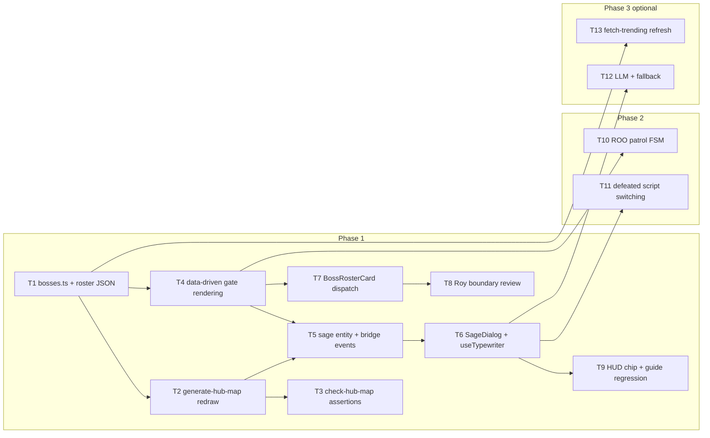

# Spawn-hub implementation plan: sage NPC and ten Bosses

> Added 2026-09-27: implementation progress and adjustment records are in §14.

- Documentation branch: `docs/boss-roster-hub`; implementation branch: `feat/boss-roster-hub`. Quality mode standard, threshold 85; PLAN Round 2/3.
- Audience: JK for frontend, Roy for contract boundaries, and decision-makers. Deliverable two is this plan; deliverable one is `docs/superpowers/specs/2026-09-26-boss-roster-hub-research.md`.
- Inputs: Round 1 research, referenced by its section numbers, and `.edison/research/{a1,a2,b}`. The architect inspected source references on 2026-09-26; see §8.
- Recommendations are proposals, assumptions are unverified premises. The original planning task adds this document only, without changing code or other files.

## 1. Goals and scope

### 1.1 Goal

Replace the open grass garden with three shrine gates with a roster hub containing a sage and ten Launch Boost Bosses:

1. Place the sage near spawn at a fixed marker, §4.3. First dialogue warns that ten Bosses await; later dialogue responds to progress, combining Elderbug guidance and BotW measurable goals.
2. The user's request to make at least the top ten entries into Bosses means all ten snapshot entries plus the existing playable cat and macro-whale fixture: twelve gates, D1.
3. Remove hardcoded three-gate assumptions using data-driven configuration; research §4.6 items 1/3/6/7 and §8.1 list the affected files.

### 1.2 Specification changes requiring owner approval

| Existing document | Existing constraint | Replacement | Status |
| --- | --- | --- | --- |
| Art-direction design, line 64 | New Bosses out of scope | Ten Launch Boost roster Bosses | Approval required |
| Same document, line 32 | Three gate markers retain current IDs | Twelve markers; remove the locked placeholder ID, retaining the deprecated locked boolean in Phase 1 per §5.1 | Approval required |
| Completion-pass plan, line 19 | No new Bosses | Same roster expansion | Approval required |
| Same plan, line 23 | No NPC conversations | Sage dialogue, §6 | Approval required |
| Same plan, line 20 | Do not edit BossEntryPanel or battle implementation | Preserve this boundary; non-cat gates use a new BossRosterCard, D6/§5.4 | Compliant, no additional approval |

These refer to `docs/superpowers/specs/2026-09-26-rpg-hub-art-direction-design.md` and `docs/superpowers/plans/2026-09-26-hub-completion-pass.md`. Assumption: decision-makers approve §1.2 before implementation. Other constraints remain: 40×30 tiles, 16 px tiles, 3× zoom, existing bridge names, and crisp labels.

### 1.3 Out of scope

- Battle implementation, `/mock-battle`, BossActions, attacks, contract logic, and deployment under contracts/packages/chain.
- Edits to partner-owned BossEntryPanel.
- Live fetching; Phase 3 designs only a development refresh script.
- LLM implementation; §6.5 is design only.
- Touch controls, previously rejected in research §4.6 item twelve.
- Fabricated progress or data. Non-cat gates disclose NO CONTRACT under web-agent fixture rules.

## 2. Decision log

| # | Decision | Alternatives | Reason | Status |
| --- | --- | --- | --- | --- |
| D1 | Cat + macro-whale + ten roster entries = twelve gates; remove locked placeholder, retain deprecated locked boolean in Phase 1 | Twelve; ten plus cat = eleven; replace fixtures with ten | The user requested at least ten additional Bosses. Reuse invested whale art without contract cost: one playable, one fixture, ten roster entries. | Recommended |
| D2 | Eleven fixed gates and one ROO patrol | Fixed, roaming, mixed | FromSoftware precedent favors discoverability. One patrol adds motion at low cost; research's 55-entity example removes performance concerns. ROO's unknown identity fits a wanderer, with sage copy about the one rule-breaker. | Recommended |
| D3 | Scripted sage in Phase 1; optional LLM plus fallback in Phase 3 | Script, LLM-only, hybrid | One demo opportunity; scripts avoid network failure. Research requires fallback for any LLM. | Recommended |
| D4 | All ten roster gates open; active/no-contract/locked statuses; only deployed cat can be defeated | All open, progressive unlocking | Let viewers inspect twelve gates within thirty seconds. Roster chips disclose NO CONTRACT; only cat round:state supplies real progress. | Recommended |
| D5 | Curated `src/game/boss-roster.json` combined by bosses.ts into definitions; positions remain markers | TypeScript, JSON, combined | Typed imports and easy snapshot replacement; research favors snapshots. | Recommended |
| D6 | Non-cat E opens new BossRosterCard with ticker, narrative, snapshot; cat keeps BossEntryPanel | Extend entry panel, separate card | Avoid widespread partner-owned supported=cat logic at line 35. | Recommended; notify Roy |
| D7 | Keep 40×30, with 44×32 contingency | Keep size, expand | Preserve integer zoom, camera, checker dimensions, and reduce regression scope. Coordinates in §4.2. | Recommended |
| D8 | Uppercase ticker first, name second; roster caption LB #N · ROBINHOOD, core caption BOSS POOL | Ticker only, name only | Recognizable tickers and rank signal roster provenance; reuse plate structure at HubScene 301–336. | Recommended |
| D9 | Phase 1 code-drawn shield and ticker initials; optional generated emblems later | Real logos, generated emblems, initials | Logo rights and quality risks; initials extend the existing lock graphic at HubScene 292–296. | Recommended |
| D10 | React SageDialog modal | Canvas dialogue, React modal | Reuse WelcomeDialog accessibility and ui:modal input locking instead of rebuilding layout/input controls. | Recommended |

No new design-pattern abstraction is needed. Copy existing zone, bridge, crisp-label, and modal patterns; add no generic modal framework. Patrol is one FSM function.

## 3. Screen specification

### 3.1 First view from spawn

Before: spawn (20, 25) follows a southward jog into the clearing. Grass, flowers, and three distant gates are visible: cat northwest, locked north, whale northeast; nobody stands nearby.

After: retain spawn and create three depth layers:

1. Sage at (18, 21), northwest of spawn and one tile west of the path, with eastward interaction coverage, idle bob, and THE SAGE label.
2. Nine shrine gates along the clearing's northern edge, each with its accent glow, creating a radial-roster skyline.
3. Two western gates visible through hedges and one southeastern gate.

```text
BEFORE, facing north             AFTER, facing north
  [cat] [LOCKED] [whale]         [HC][TAL][ROO][AGR][CAT][RBP][AEVA][MW][PONS]
       Open grass garden            Northern clearing edge
                                  THE SAGE (18,21, bob)
      Spawn (20,25)                 Existing jogged stone path
                                  Spawn (20,25); west AD/MUSEBOOK; southeast ROBIN
```

### 3.2 Shared gate specification

- Keep buildGates' stone base, columns, lintel, rectangular arch, and radius-16 portal glow, HubScene 264–358/281–290. No new facade assets in Phase 1.
- BossDefinition.accent replaces GATE_COLORS at 24–28 and drives glow and plate outline, including line 336.
- Cat/whale keep cropped portraits. Roster gates draw shields with the ticker's first two letters, extending the lock graphic. Phase 2 may use §7.2 emblems.
- Nameplate uses uppercase TICKER through existing line 302–308 rendering. Roster caption is LB #N · ROBINHOOD; core caption remains BOSS POOL.
- Roster gates add a gray 4 px NO CONTRACT chip. LOCKED is reserved for Phase 2; all twelve gates are unlocked in Phase 1. Preserve cat's real stage label at 534–556. Never label fixtures Live or Ready.

### 3.3 Sage visual

- Position from sage marker; crop npc-thesis-wizard per §7.1.
- Target height about 30 px, matching 28 px gate portraits.
- Bob ±2 px over 900 ms with Sine.easeInOut and yoyo; disable under reduced motion through existing watchReducedMotion at 422–435.
- THE SAGE uses resolution ZOOM and LABEL_DEPTH.
- Add SagePrompt to GameShell using GatePrompt styling and visibility priority from 126–127.

### 3.4 Dialogue UI

- Copy WelcomeDialog at HubGuide 48–111: dialog role, aria-modal, bg-ink/70 backdrop, focus handling, Escape close, and focusHubCanvas on close.
- Eyebrow SAGE · GARDEN, sage title, typewriter body, E · NEXT and ESC · CLOSE footer. Update polite live-region text once per completed sentence, never per character; this follows the earlier per-second StatusPanel announcement fix.
- useTypewriter reveals a character about every 28 ms, pauses 200 ms at commas and 400 ms at sentence-ending punctuation. First E/Enter/Space completes the line; second advances. Reduced motion shows full text immediately.
- Include sageOpen in overlayOpen, sending ui:modal{open:true}. Dialogue handles E/Escape while HubScene's modalOpen guard blocks scene input.
- Dialogue is repeatable. boss-pool:sage-talked:v1 selects first/returning visits only.
- §6.4 gives progress-sensitive examples.

### 3.5 HUD

Add a data-driven 12 CHALLENGERS chip from BOSSES.length beside HUB · FIXTURE MAP at GameShell 146–148. Do not add a remaining-Boss HUD counter: only cat has real defeat state, so a total counter would imply false progress. Dialogue carries the progress context.

## 4. Scene layout

### 4.1 Keep 40×30

Preserve the 640×480 world to retain zoom/camera behavior, checker WIDTH/HEIGHT and map assertions, and approved art-direction dimensions. §4.2 fits twelve gates.

Contingency only: if BFS or movement validation shows crowding, use 44×32, 704×512, update WIDTH/HEIGHT in both scripts, and rebuild reserved areas. Record that decision.

### 4.2 Radial gate coordinates

Each gate remains 3×2 tiles, 48×32 px. Nine top gates are spaced every four tiles, leaving one shared gap for neighboring torches. Existing generator 201–207 checks collision before writing; the first torch blocks the gap and the second skips it instead of overwriting.

| Gate ID | Column,row | Region | Note |
| --- | --- | --- | --- |
| hoodcats | 3, 2 | Top west | |
| talis | 7, 2 | Top | Moves above original cat 7, 4 |
| roo | 11, 2 | Top | Patrol's gate remains home |
| agrippa | 15, 2 | Top | |
| cat | 19, 2 | Top north | Directly north of spawn; only playable gate |
| robinpepe | 23, 2 | Top | |
| aeva | 27, 2 | Top | |
| macro-whale | 31, 2 | Top east | |
| pons | 35, 2 | Top east end | |
| ad | 4, 10 | Upper west | |
| musebook | 4, 18 | Lower west | |
| robin | 35, 18 | Southeast | Preserve east exit 38, 12–14 |

- Spawn stays 20, 25. Sage 18, 21 stands west of the cols 19–21/rows 20–23 path without blocking it; its eastward interaction zone covers the middle path. Preserve clearing cols 15–25/rows 10–20.
- Move pond from 4, 20, 6, 6 to 2, 24, 6, 6, occupying cols 2–7/rows 24–29. Row29 remains blocked, preserving outer closure. Restore former pond grass for the western route.
- Remove old pond fenceH(2, 18, 10,[11, 11]) at generator 188. Pond banks and outer reserves preserve the garden boundary.
- Keep east route cols 33–38/rows 12–14. Robin's approach at rows 20–23 does not overlap.
- Phase 2 ROO waypoints use cols 11–13/rows 8–14, below its approach cols 10–14/rows 4–7 and outside every gate approach.
- Reserve a three-tile-wide stone route from each northern gate to the clearing; retain spawn's jogged path and connect western gates to the clearing's west edge.
- Keep torches, four clear approach rows, and lantern/tree clusters, repositioning clusters around new reserves.

### 4.3 Generator and checker

- Generator replaces three GATES with twelve, adds sage point at tile18, 21 center px296, 344 plus reserve(18, 21), relocates pond, removes old fence, and redraws routes/reserves/clusters.
- Checker changes count 3→12 and imports BOSSES for set equality, following the generator's existing TS import. Assert exactly one sage point. Existing water-interior checks at 132–156 cover the moved pond.
- Sage marker is `{name:"sage", point:true, x, y}`. Gates retain `{name:"gate", properties:[{name:"bossId", value}]}`.
- Run map:build then map:check, apps/web/package.json 10–11.

## 5. Data model

### 5.1 BossDefinition extension

```ts
export type BossId = string; // Previously "cat" | "macro-whale" | "locked", bosses.ts:2
export type BossStatus = "active" | "no-contract" | "locked";

export type BossDefinition = {
  id: string;
  name: string;
  ticker: string; // New: first nameplate line, D8
  tagline: string;
  /** Portrait image under /public/images. Empty when there is no portrait. */
  portrait: string;
  /** New: crop metadata moved from HubScene; null draws an initials shield. */
  crop: { x: number; y: number; w: number; h: number; targetHeight: number } | null;
  /** Three-state source, research §4.6 item four. */
  status: BossStatus;
  /** @deprecated Phase 1 compatibility for BossEntryPanel eyebrow at line 71.
   * Sync with status === "locked"; remove in Phase 2 after partner alignment. */
  locked: boolean;
  /** New: glow/plate outline color, replacing GATE_COLORS enumeration. */
  accent: string; // Hex, for example "#f5b04a"
  /** New: "chain" has contract semantics, cat only; "venue" is presentation. */
  source: "chain" | "venue";
  /** New: roster gates only. */
  rosterMeta?: {
    rank: number; // Snapshot rank, research §2.2
    chain: string; // "Robinhood"
    category: string; // One-line narrative, such as "Meme / Pepe × Robin Hood"
    snapshot: string; // "GeckoTerminal trending · 2026-09-26"
  };
};
```

- Retain locked as deprecated compatibility, synchronized from status. All twelve Phase 1 gates produce false. Migrate hubGuide isUnlocked at 22, HubScene rendering at 289/292/301 and chooseHintGate at 633. BossEntryPanel at 71 remains untouched: cat active and whale no-contract both produce false, preserving BOSS GATE/FIXTURE ONLY and never selecting GATE LOCKED. §12 item four verifies zero diff. Remove locked after partner alignment in Phase 2.
- Widen BossId to string; adapt isBossId at bosses43–45, bridge payloads10–12, GameShell state, and guide types. Delete GATE_COLORS: Record<BossId,number> and read accent instead.

### 5.2 Roster snapshot file

Add `apps/web/src/game/boss-roster.json` with ten curated entries, top-level snapshotDate/source, presentation fields, and a subset of rosterMeta:

```json
{
  "snapshotDate": "2026-09-26",
  "source": "GeckoTerminal /networks/robinhood/trending_pools",
  "bosses": [
    { "id": "talis", "ticker": "TALIS", "name": "Talis",
      "tagline": "Tokenized stock market on Uniswap.", "rank": 1, "category": "DeFi",
      "accent": "#c8a1ff" },
    { "id": "roo", "ticker": "ROO", "name": "Roo",
      "tagline": "No one knows what it is. It does not stay put.", "rank": 2, "category": "Meme",
      "accent": "#ff9d6b" }
  ]
}
```

- Combine core cat/whale and ROSTER.map(toDefinition). Fill crop:null, portrait:"", status:no-contract, synchronized locked:false, source:venue, and rosterMeta.
- Replacing JSON replaces the roster batch. Next.js/tsconfig natively support typed JSON imports.

### 5.3 Gate markers

Keep `{name:"gate", properties:[{name:"bossId", type:"string", value}]}`. Boss IDs match BOSSES one-to-one, enforced by checker set equality. Add the sage point from §4.3. Keep positions in markers rather than TypeScript, as approved by art-direction line 34 and research §4.4.

### 5.4 Stored state and fixtures

| Key | Purpose | Write time | Default |
| --- | --- | --- | --- |
| boss-pool:sage-talked:v1 | First/returning dialogue | First SageDialog close | Empty means first visit |
| boss-pool:defeated:v1 | Real cat defeat for Phase 2 dialogue | round:state status===3, DEFEATED, matching HubScene 553 | Empty |

No fabricated progress defaults. Defeat dialogue uses cat's real state only. Preserve hub-guide:v1 at hubGuide4; regression-check its behavior with twelve unlocked gates.

## 6. Sage entity and dialogue

### 6.1 NPC entity in HubScene

- Find the sage marker in create with `map.findObject(HUB_LAYERS.markers, o => o.name === "sage")`, following spawn handling at 144–147.
- Crop with `makeCroppedTexture(this, "npc-sage", "portrait-master-sage", crop, 30)`, create an image, and setDepth(y) for y-sorting.
- Add a static arcade body through physics.add.existing(sage,true), size12×8 matching player collider at 390. Players cannot walk through it, following the Kanto Old Man guide precedent.
- Bob ±2 px, duration900, yoyo, repeat-1, Sine.easeInOut; do not start under reduceMotion.
- Use `Rectangle(x - 10, y - 8, 28, 28)` around its lower half. updateSageProximity joins update at 255; emit npc:near on changes using the gate Contains pattern at 707–720.
- Add a third setupInput interaction branch with nearGate→nearSage→nearRegion priority. §4.2 ensures zones do not overlap.

### 6.2 Bridge events

Add to `apps/web/src/game/bridge.ts`, retaining existing events:

```ts
export type GameEvents = {
  // Existing events remain unchanged.
  /** Player walked into / out of the sage's talk zone. */
  "npc:near": { npcId: "sage" | null };
  /** Player pressed interact while inside the sage's zone. */
  "npc:talk": { npcId: "sage" };
};
```

Match gate:near/gate:enter naming at 10–12. Add no command; ui:modal already exists at 29.

### 6.3 Dialogue components

- New `apps/web/src/components/SageDialog.tsx` copies WelcomeDialog, receives lines:string[] and onClose, which sets sageOpen false.
- New `apps/web/src/lib/useTypewriter.ts` returns shown/done for text:string, implementing §3.4 timing, punctuation, and two-step skipping. Reduced motion sets done=true immediately.
- GameShell adds nearSage/sageOpen state, subscriptions to npc:near/npc:talk, sageOpen to overlayOpen at 32, and SagePrompt after showBossPrompt at 126–127.

### 6.4 Script structure and examples

Add `apps/web/src/lib/sageLines.ts` with SageState firstVisit/defeated and a pure sageLines function returning string[]. Each exchange has at most three sentences, each at most sixty characters in the original script limit.

Translated examples:

> First visit: "Welcome to the Boss Pool garden, young traveler. Ten challengers from Robinhood await ahead, ready to steal everyone's pleasant dreams."
> "Follow the stone path north. Each shrine holds a Boss. Only Roy has awakened; seek him first for practice."

> Returning before defeat: "The same ten await. Rosters change like rumors in town. Remember ROO: the one who breaks the rules and wanders the road."

> Cat defeated: "You defeated Roy. Eleven others still await their contracts. The roster may change again; return another day."

Twelve gates minus one real defeat gives eleven, including whale and ten roster entries. This script constant does not introduce the fabricated HUD remaining counter prohibited by §3.5. First/return visits use sage-talked:v1; defeated uses actual useBossPool round.status, not a hardcoded result.

### 6.5 Optional LLM with scripted fallback

Phase 3 design only:

- Server route `apps/web/src/app/api/sage/route.ts` proxies requests and retains the API key server-side. Frontend posts history/defeated to /api/sage.
- Inject fixed ten-Boss tickers, ranks, source chain, and snapshot date. Use low temperature and at most120 tokens.
- AbortSignal.timeout(4s) or non-200 returns sageLines(state). Show dialogue only, without an AI-loading label.
- Do not connect the ten Bosses to LLMs.

## 7. Assets

### 7.1 Sage sprite

npc-thesis-wizard.png is1186×1327, verified with file, and shows a purple-robed wizard. Licensing was unverified and no accompanying txt existed.

1. Confirm source/license with the author and add npc-thesis-wizard.txt following player-compact-walk-master.txt.
2. If unresolved before demo, use verified1254×1254 player-you-master.png or code-drawn art.

Reuse makeCroppedTexture at textures7–41, target height about 30, cropping upper body and robe hem. Adjust in the browser once or twice.

### 7.2 Roster portraits

| Option | Benefit | Risk | Demo choice |
| --- | --- | --- | --- |
| Real project logos | Recognizable, authentic | Trademark/copyright, inconsistent quality, ranking drift | Avoid without individual written permission, impractical for hackathon |
| Generated consistent emblems | Controlled style without copying trademarks | Generation time and pixel-style mismatch | Optional Phase 2, with prompt txt |
| Code-drawn shield and ticker initials | Immediate, no new assets | Plain appearance | Phase 1 choice |

Shields extend the existing lock graphic: rounded shield, accent outline, first two ticker letters, resolutionZOOM. Generated emblems symbolize narratives rather than redraw logos, such as ROO's question-mark kangaroo silhouette. Store boss-roster-{id}-emblem.png under public/images; runtime still crops game-ready versions.

### 7.3 Tileset

Add no tiles. Gates, labels, and chips are code-drawn, and sage is a sprite. Additional Phase 2 statues would require synchronized atlas dimensions, hubTiles constants, and checker 40–44 assertions. Preserve transparent unused GID slots in the128-tile atlas; use code-drawn presentation instead.

## 8. File-level technical changes

Source references were inspected2026-09-26. This list assumes §1.2 approval.

### 8.1 Remove three-gate assumptions

| # | Existing location | Change |
| --- | --- | --- |
| 1 | bosses.ts:2, three-value BossId | String ID, twelve BOSSES, new fields from§5.1 |
| 2 | bosses.ts:13-35, including locked placeholder | Core cat active/whale no-contract with locked compatibility, plus JSON roster |
| 3 | HubScene:24-28 GATE_COLORS | Delete enumeration; parse boss.accent with Display.Color.HexStringToColor |
| 4 | HubScene:121-122 hardcoded crops | Iterate BOSSES; crop only entries with crop and portrait, using portrait-${boss.id}/portrait-master-${boss.id} and targetHeight |
| 5 | HubScene:264-358 buildGates | Three statuses, ticker, LB #N caption, status chip, and initials shield when portrait is empty |
| 6 | HubScene:337-344 cat stage label | Retain live cat branch and renderCatStageLabel534–556; add static roster/whale chips |
| 7 | hubGuide:22 isUnlocked | status !== locked |
| 8 | HubScene:632-648 chooseHintGate | Keep nearest-unlocked logic; adjust types for string IDs |
| 9 | checker:68/72 count and IDs | Twelve gates and BOSSES set equality |
| 10 | generator:10-14 GATES | Twelve gates, reserved sage marker, moved pond, removed fence, redrawn routes/clusters |
| 11 | GameShell:36-38 subscriptions | npc events, SageDialog/SagePrompt rendering, sageOpen in overlayOpen |

### 8.2 Phase 2 ROO patrol FSM

- No pathfinding. States: idle for random1–4s → pick a sequential/random waypoint → Bezier tween20 px/s with midpoint perpendicular offset±12 → idle.
- Waypoint tile centers occupy cols 11–13/rows 8–14, below ROO's cols 10–14/rows 4–7 approach. Exclude every gate approach, including its own5×4 rectangle.
- No static arcade body is needed: routes are reserved walkable paths, with no player pushing. Avoid gate approaches and sage zone.
- Filter waypoint choices with Rectangle.Contains against all Gate.zone rectangles.
- Reduced motion stays at the gate with glow only.
- Keep its gate as home. Choose small emblem/shield sprite or ghost circle in Phase 2.

### 8.3 Performance

Twelve gates are created once, one patrol tween is managed by Phaser, and no per-frame allocation or object pool is needed for persistent gates. Crop masters are cat, whale, sage; code-drawn roster shields need no images, so startup image load does not increase and may decrease.

## 9. Phases

### Phase 1: sage, twelve gates, and data-driven MVP

Implement §5 data, §4 map, §8.1 rendering, sage entity/dialogue, BossRosterCard, and HUD chip. Demo shows the sage immediately, repeatable E/typewriter/two-step dialogue, nine northern/two western/one eastern gates, roster cards with tickers/ranks/narratives, and unchanged cat battle entry.

### Phase 2: progress cues

ROO patrol, cat-defeat dialogue, refined status chips, and optional emblems. Demo shows a road wanderer, the sage's rule-breaker hint, and changed dialogue after real cat defeat.

### Phase 3: optional additions

LLM plus /api/sage/script fallback and scripts/fetch-trending.ts for development snapshot refresh. Demos still use snapshots. The sage can answer freely without inventing world facts, and developers replace the roster with one refresh action.

## 10. Tasks

Estimates are hackathon days; half a day is0.5. Tasks are ready for engineering execution.

| ID | Description | Files | Dependencies | Estimate | Owner |
| --- | --- | --- | --- | --- | --- |
| T1 | Extend BossDefinition, add roster JSON, combine BOSSES | bosses.ts, new boss-roster.json | None | 0.25 d | JK |
| T2 | Twelve-gate map, sage marker, pond relocation/fence removal, routes/clusters | scripts/generate-hub-map.ts | T1 IDs | 0.5 d | JK |
| T3 | Twelve-gate set equality and sage assertions | scripts/check-hub-map.ts | T2 | 0.25 d | JK |
| T4 | Data-driven accent/status/ticker/rank/initial shields and crop loop | src/game/HubScene.ts | T1,T2 | 0.5 d | JK |
| T5 | Sage marker/crop/body/bob/zone, third E branch, bridge events | HubScene.ts, bridge.ts | T2,T4 | 0.5 d | JK |
| T6 | SageDialog, useTypewriter, sageLines, GameShell overlay/prompt wiring | New component/hooks/scripts and GameShell.tsx | T5 | 0.5 d | JK |
| T7 | BossRosterCard and source/status-based non-cat dispatch | New card, GameShell.tsx | T1,T4 | 0.25 d | JK |
| T8 | Partner-boundary review; preserve cat flow and zero entry-panel edits | Review only | T7 | 0.25 d | Roy |
| T9 | 12 CHALLENGERS HUD and twelve-gate guide regression | GameShell.tsx, hubGuide.ts only if needed | T4,T5 | 0.25 d | JK |
| T10 | Phase 2 ROO FSM, waypoints, Bezier, exclusion filtering | HubScene.ts or new rosterPatrol.ts | T4 | 0.5 d | JK |
| T11 | Phase 2 cat defeat marker and sage dialogue | sageLines.ts, GameShell.tsx | T6 | 0.25 d | JK |
| T12 | Optional Phase 3 LLM route and script fallback | New app/api/sage/route.ts, SageDialog.tsx | T6 | 0.5–1 d | JK |
| T13 | Optional Phase 3 snapshot refresh | New scripts/fetch-trending.ts | T1 | 0.25 d | Anyone |

Phase 1 totals about 3.25 d, including Roy's0.25 d; Phase 2 about 0.75 d; Phase 3 about 0.75–1.25 d. Dependencies: T1→{T2→T3,T4}→T5→{T6,T9}→T7→T8. T10/T11 can run in parallel after Phase 1; T12/T13 can start independently.

## 11. Risks and open questions

| ID | Risk | Severity | Mitigation |
| --- | --- | --- | --- |
| R1 | Approved specifications exclude the new scope | High | Present §1.2 before code changes; fallback reduces scope to ten gates without guide changes |
| R2 | Partner-owned BossEntryPanel special cases 35/113/151 | High | Separate card, Roy T8 review, and zero-diff DoD |
| R3 | Wizard lacks license txt; portrait rights | High | §7.1 verification, initials shields in Phase 1, fallback art before demo |
| R4 | Fast-changing roster may age before demo | Medium | Replace snapshots, disclose date in dialogue, optional T13 refresh |
| R5 | BFS reachability, outer closure, pond regression | Medium | Set equality and BFS for twelve gates; map:check in DoD;44×32 contingency |
| R6 | No-touch decision prevents mobile interactions | Medium, accepted | Preserve decision; desktop demo and documented limit |
| R7 | Moving cat may break gate:enter→entry-panel integration | Medium | Roy T8; keep zone size at HubScene 351 and mock-battle route |
| R8 | Twelve unlocked gates may alter arrow/copy clarity | Low–medium | T9; retain nearest-gate behavior and check "a boss pool" copy |
| R9 | Sprite downsampling/crop quality | Low | Reuse two-pass pipeline and adjust crop once or twice in browser |
| R10 | Narrative versus trending final roster | Low | Start with research top-ten snapshot; swapping JSON replaces the batch |

## 12. Definition of done

After JK's implementation:

1. Typecheck and production build pass under apps/web/AGENTS.md.
2. map:build then map:check verify twelve IDs, BFS reachability, and closed boundaries.
3. Desktop browser checks:
   - Sage visible at spawn, at least five northern gates in view.
   - Sage proximity prompt, typewriter, two-step skipping, Escape close, repeat visits, correct first/return scripts; reduced motion shows full text without bob.
   - Twelve ticker/caption plates, initials shields, correct status chips, and no false Live/Ready labels.
   - E opens roster cards for roster gates and BossEntryPanel for cat; preserve BOSS ACTIONS at GameShell 152–160 and /mock-battle.
   - Full welcome→move→find→inspect→done guide and REPLAY GUIDE with twelve gates.
   - NEXT REGION east prompt and 12 CHALLENGERS chip remain.
   - No new console errors; existing Anvil ERR_CONNECTION_REFUSED and Next preload warnings were recorded environment limitations.
4. Confirm zero BossEntryPanel diff, the required R2 boundary check.

## 13. Mermaid diagrams

### 13.1 Interaction sequence

```mermaid
sequenceDiagram
    participant P as Player (canvas)
    participant HS as HubScene
    participant B as GameBridge
    participant GS as GameShell
    participant SD as SageDialog
    participant RC as BossRosterCard
    participant BE as BossEntryPanel (existing)

    P->>HS: Enter sage zone
    HS->>B: emit "npc:near" {npcId:"sage"}
    B->>GS: setNearSage(true), show E prompt
    P->>HS: Press E, third setupInput branch
    HS->>B: emit "npc:talk" {npcId:"sage"}
    B->>GS: setSageOpen(true), overlayOpen, ui:modal{open:true}
    GS->>SD: Open script selected by firstVisit/defeated
    P->>SD: E completes line; next E advances; Escape closes
    SD->>GS: onClose, overlayOpen=false, ui:modal{open:false}
    P->>HS: Enter gate zone
    HS->>B: emit "gate:near" {bossId}
    P->>HS: Press E
    HS->>B: emit "gate:enter" {bossId}
    GS->>GS: boss.source==="chain" ? cat : roster
    alt cat, the only playable Boss
        GS->>BE: Existing flow, no edits
    else roster / fixture
        GS->>RC: Ticker, rank, narrative, NO CONTRACT
    end
```

### 13.2 Phases and dependencies



## 14. Progress and adjustment record, 2026-09-27

- Recorded branch feat/boss-roster-hub, HEAD d8458bc, main merge-base 0b6739 d;55 commits, 13 documentation and 42 implementation/fixes.
- This appended historical record does not change §1–§13 decisions. §10 defines tasks and §9 phases. Every short hash was checked against git log for existence and message.
- Phases1/2 and T1–T11 plus necessary unplanned T14 were complete. T15–T17's Base roster, English copy, and interaction fixes were also complete. Main was integrated and PR conflicts resolved in §14.4. Only optional T12/T13 remained unopened.

### 14.1 Original tasks and added T14

Status: complete or not started.

| Task | Status | Short commits | Notes |
| --- | --- | --- | --- |
| T1 | Complete | `4d9b0ab`, `efa01ac`, `64ab330` | Roster JSON, definitions, accent palette |
| T2 | Complete | `b5a95ee`, `d0ff1fb` | Twelve-gate map and clusters |
| T3 | Complete | `eb7fdc5` | Set equality and sage assertions |
| T4 | Complete | `e11a448`, `fceed6b`, `c9cc047`, `beeefe1` | Data-driven accents/portraits, ticker/chips, shields. beeefe1 fixes canvas font token parsing: ctx.font could not parse var(--font-dm-mono), scaling labels1.94× and overlapping plates. NEXT REGION/cat stage text returned to declared size. |
| T5 | Complete | `979d234`, `421ce0a` | Sage and bridge, npc:talk |
| T6 | Complete | `77f12b6`, `3b62aa4`, `108e740`, `d5273aa`, `cc5d8b1` | Typewriter, scripts, dialog, wiring, caret |
| T7 | Complete | `bcb7a8b`, `3546c34`, `7ca7d4e` | Card and dispatch; last commit switches to source===chain and removes dead fields |
| T8 | Complete | Review only | Smith/QA verified zero entry-panel diff and unchanged cat eyebrow |
| T9 | Complete | `083f3c6` | HUD and guide regression |
| T10 | Complete | `961e447` | Four-waypoint ROO FSM, modal pause, reduced-motion stop |
| T11 | Complete | `d259776`, `fb2e235` | Defeat storage and pinned status constants |
| T12 | Not started | None | Optional Phase 3 LLM/fallback |
| T13 | Not started | None | Optional Phase 3 refresh |
| T14 | Complete | `28d9698`, `fc5895b` | Required unplanned rewrite of old guide tests for Phase 1 contract and sageLines tests |

Recorded 2026-09-26 gates: smith92/100 REPAIRABLE, then F1 focus escape/F2 dispatch/F3 locked guard/F5 payload fixes in `2cc4404`, `7ca7d4e`, `0cce847`, `266adee`, `d898d74`. The final commit covers F12 geometry across13 full-width routes, including the18, 8 stuck point. Re-review95/100 PASS; QA12/12 GO.

Housekeeping `f8d450b` adds .playwright-mcp to .gitignore and belongs to no task.

### 14.2 Completed vNext adjustments, T15–T17

- T15 English: `3e6b1e7` and `3770f92` translate three sage scripts with ASCII punctuation; visible game text contains no CJK.
- T16 Base: `0b49ec6`, `3282404`, `2a67628`, `535d032` select AERO/BRETT/SOL/VVV/TIBBIR/MORPHO/AVNT/BNKR/DRB/B3 from GeckoTerminal Base trending dated2026-09-26. Captions become LB #N · BASE, eyebrow LAUNCH BOOST · BASE, chain Base. Roamer becomes sol, Solana (Bridged). Network menus use46630 · HISTORICAL/Historical Testnet (46630); factual technical history in BossActions/RoundStatePanel/manifest remains.
- T17 interactions: `91669bc`, `b0f5e14`, `32fb5ad`, `d8458bc` fix four causes: overly broad domControlFocused blocking, including WelcomeDialog's final focus on SOUND; unclickable span prompts; no roamer interaction, adding22 px radius; and inert ESC · CLOSE span. HUD no longer freezes movement, E/Enter/click work, roamers are challengeable, and keyboard accessibility remains.
- Final recorded review:96/100 PASS, F3/F4 fixes `e0ceb30`…`a7d1bb3`, then96/100 PASS again. Four checks passed, with34 tests at that time; browser6/6. Later Loop4 records90/100 PASS and QA10/10 GO.

### 14.3 Owner follow-up

1. Keep LAUNCH BOOST branding for Base or rename it; only chain name changed so far.
2. Resolve different meanings of HUD12 CHALLENGERS and dialogue10 challengers: twelve gates versus ten roster entries.
3. Decide whether optional T12/T13 starts.
4. Resolve wizard asset licensing.
5. Cat has three names: Pool Unis in bosses.ts, pinned by battle.test.ts; ticker ROY; Roy in two sage lines. To align, change ticker, two script lines, and corresponding assertions.
6. Use a keyed Base RPC before demo; public sepolia.base.org429 limits persisted despite CHAIN · LIVE.
7. Row27 east-west corridor has only about 8 px clearance and foot/body sticking; map owner to address.
8. Cosmetic partner-file HP display shows299.999999999999999999 /300, W-01.
9. Entry-panel interactions after wallet connection were covered by the source fix but not local E2E without a wallet; manually verify before demo.

### 14.4 PR conflict resolution and main integration

- Owner's PR reported five conflicting files. Main advanced after 0b6739 d through PRs 34–56: hook battles, BoostPad, Factory, Blacksmith, Robinhood removal, Pool Unis, and keyboard fixes. Diff 0b6739 d→ca9f606 records138 files,+25, 742/−1, 510. Merge evidence counted55 commits; later rev-list counted62.
- Merge `cf2189f`, parents `a7d1bb3` and `ca9f606`, brought origin/main into this branch. Fifteen hunks across five files: GameShell 9, HubScene 2, bosses2, useBossPool1, HubGuide1. Preserve both intents; MERGE_MSG unchanged.
  - HubScene ui:modal combines main's guarded keyboard toggle, roamer hold/release, and resetKeyboardState.
  - Labels combine main anchors with labelFontFamily token parsing.
  - GameShell combines confirmedBattleAttack/selectDefaultEncounter/wallet.busy/isHubEncounter/AttackOrigin.hookAddress with sage events, prompts, and HUD.
  - Bosses retain Pool Unis plus roster and ROY. useBossPool uses main's Robinhood removal; HubGuide retains canvas refocus.
  - All four checks passed, 57 tests across11 files.
- `278e08c` moves card focus to dialog root, matching SageDialog; `4cad0ff` moves interact handling after all guards and prevents default for handled Enter/Space. This resolves immediate-close defects in roster cards, route notices, and entry panels; positive controls confirmed the fixes mattered.
- Smith90/100 PASS with no loss in bidirectional comparison; useBossPool's final blob equals main. QA10/10 GO covers cat/route/sage movement, all four trigger keys, three surviving main pages, and no Robinhood network option.
- Evidence: docs/evidence/2026-09-27-main-merge-and-focus-fix.json; the older hub-interaction-fix record is marked supersededBy.
- Result at record time: branch included all main changes and was expected to merge without conflict after push.
