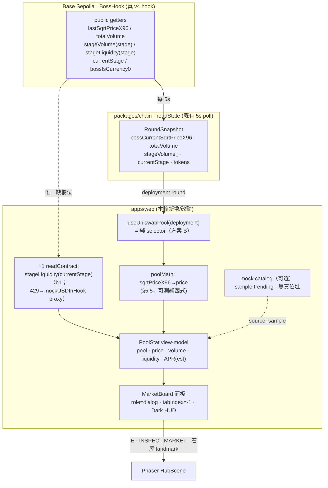

# 地圖地標實作計畫：Explorer 連結修復 × Boss 探索箭頭修復 × Uniswap v4 池資料地標（Map Landmarks Plan）

- 分支：`feat/map-uniswap-landmarks`（已含 World Channel）｜品質模式：standard（threshold 85）｜Depth L2（MVP，file-level，小 Mermaid）｜PLAN Round 1
- `model_used`：**Claude Opus 4.8**（全程單一模型，未切換）
- 上游輸入：DISCOVER 報告 `.edison/research/map-landmarks-discovery.md`；本計畫的每一條 file:line 由 architect 於 2026-09-27 **實讀驗證**（快照/證據狀態 = NONE | LOCATOR-ONLY，無快取，全部讀實檔）
- 交付物：本計畫文件（唯一寫入）。**READ-ONLY except this doc** —— 不改任何程式碼或其他文件
- 驗證紀律：「建議」＝設計建議非既有事實；「假設」＝未驗證前提。DISCOVER 的 file:line 已逐條覆核並在 §2 標注「✅ 已驗證」或「⚠️ 修正」

---

## 1. 目標與範圍

三部交付物，全部落在 `apps/web/`（Part A 另加 `packages/chain` 的一行 additive 修復）：

| Part | 主題 | 一句話 | 規模 |
| --- | --- | --- | --- |
| **A** | Explorer-link fix | `defineChain` 補上 base-sepolia 的 `blockExplorers` → World Channel 與 Battle log 的鏈上列自動長出 BaseScan 連結 | 極小（1 行 + 測試） |
| **B** | Boss 探索箭頭修復 | 導引判別式 `!== "locked"`（死值）改為 `=== "active"` → `find` 步驟可達、箭頭指向唯一可挑戰的 live 門 | 小（2 檔 + 測試改寫） |
| **C** | Uniswap v4 池資料地標 | 新增「市集/資料屋」landmark，面板展示遊戲自有 Boss Pool 的鏈上即時資料（real）＋可選 sample 看板（mock），完全鏡像 World Channel real+mock 模式 | 中（MVP headline） |

### 1.1 約束（Cross-cutting，不可違反）

1. `contracts/` Solidity **零 diff**。
2. `packages/chain/` **只允許 Part A 的 `blockExplorers` additive 修復**，其餘一律不動（含 `readState`/`RoundSnapshot`）。
3. Part C 的資料讀取一律在 **`apps/web`**，不進 `packages/chain`。
4. 配合既有 game style；L2 MVP —— **本輪不接 subgraph / 不用 Graph API key**；trending 看板若做則為 mock。
5. 遵守 repo 慣例：commit `feat(web)/fix(web)/test(web)/docs:`，**不 push、不 amend、不 rebase**；prettier 無 config、無 husky hook → **不要 reformat**（實測 HEAD 的 `HubScene.ts` 本身就 fail 預設 `prettier --check`）。

### 1.2 明確不做（Out of Scope，防範圍蔓延）

- ❌ v4 官方 subgraph / StateView / Graph API key（外部依賴，MVP 略過；見 §7 可行性）。
- ❌ 真 mainnet trending pools 的 TVL/volume/APR（需 USD 定價 + 限流；mock 取代）。
- ❌ 新增任何圖片資產（landmark 全用 Phaser primitive 繪製）。
- ❌ 把 landmark 塞進 `BossId`/roster 型別（它是獨立 marker kind，見 §5.3）。
- ❌ 動 `BossEntryPanel.tsx`（partner 界線）。

---

## 2. 程式庫現狀（Codebase Baseline，全部實讀驗證）

> 標注格式：**✅ 已驗證** = DISCOVER 宣稱與實檔一致；**⚠️ 修正/補充** = 與 DISCOVER 有出入或 DISCOVER 未提到的關鍵事實。

### 2.1 Part A 相關

- ✅ [packages/chain/src/deployment.ts](packages/chain/src/deployment.ts#L15) `import { baseSepolia } from "viem/chains";` 早已存在。
- ✅ `createPublicClientForNetwork()` 的 `defineChain` 目前只 spread `contracts`：`...(isBaseSepolia ? { contracts: baseSepolia.contracts } : {})`（[deployment.ts](packages/chain/src/deployment.ts#L249)）→ `blockExplorers === undefined`。
- ✅ 下游共用此洞：[useWorldChannel.ts](apps/web/src/lib/useWorldChannel.ts#L56) `ctx.explorer = publicClient.chain?.blockExplorers?.default.url`；[BattleActivityLog.tsx](apps/web/src/components/battle/BattleActivityLog.tsx#L20) `const explorer = publicClient.chain?.blockExplorers?.default.url;` —— **完全相同的一行**。
- ✅ [worldChannel.ts](apps/web/src/lib/worldChannel.ts#L64) `toWorldEvent` 僅在 `ctx.explorer` 存在時填 `explorerUrl`；[WorldChannel.tsx](apps/web/src/components/WorldChannel.tsx#L80) `WorldRow` 僅在 `chain && event.explorerUrl` 才渲染 `<a ... rel="noreferrer">`。→ Part A 一補，兩處免費長出連結。
- ✅ `bossPoolHookAbi` 由 [abi.ts](packages/chain/src/generated/abi.ts#L595) export，deployment.ts 已 import。

### 2.2 Part B 相關

- ✅ [hubGuide.ts](apps/web/src/lib/hubGuide.ts#L22) `isUnlocked()` = `bossId !== null && findBoss(bossId).status !== "locked"`。
- ✅ [HubScene.ts](apps/web/src/game/HubScene.ts#L1085) `chooseHintGate()` 過濾 = `this.gates.filter((gate) => gate.boss.status !== "locked")`。
- ✅ [bosses.ts](apps/web/src/game/bosses.ts#L8) `BossStatus = "active" | "no-contract" | "locked"`；註解「`locked` stays a data state until a gate uses it」→ **從未被任何 gate 使用**。實際資料：cat = `"active"`（[bosses.ts](apps/web/src/game/bosses.ts#L99)）、macro-whale = `"no-contract"`（[bosses.ts](apps/web/src/game/bosses.ts#L111)）、`toDefinition()` roster 全 `"no-contract"`（[bosses.ts](apps/web/src/game/bosses.ts#L127)）。
- ✅ FSM（[hubGuide.ts](apps/web/src/lib/hubGuide.ts#L27) `transitionGuide`）：`moved` → `isUnlocked(nearBoss) ? inspect : find`；`near` → `find && isUnlocked ? inspect`／`inspect && !isUnlocked ? find`。因 `isUnlocked` 對每個門皆真 → 接近任何門即跳 `inspect`，`find` 幾乎不可達。
- ✅ 場景端：[HubScene.ts](apps/web/src/game/HubScene.ts#L1060) `updateGuideHint` `const show = this.guideStep === "find" && !this.modalOpen;`；[HubScene.ts](apps/web/src/game/HubScene.ts#L289) `guide:step` handler `if (step !== "find") this.hintArrow?.setVisible(false);`。
- ⚠️ **DISCOVER 未點名的關鍵測試 blast radius**：[hubGuide.test.ts](apps/web/src/lib/hubGuide.test.ts) 有 **兩個測試直接編碼舊（bug）語意**，改 `=== "active"` 後**會紅**：
  1. `accepts the macro whale as a discovery target`（[hubGuide.test.ts](apps/web/src/lib/hubGuide.test.ts#L22)）—— macro-whale 是 `no-contract`，新語意下 `near` 不再 `find→inspect`，`opened` 不再 `done`。
  2. `walks every gate from near to opened`（[hubGuide.test.ts](apps/web/src/lib/hubGuide.test.ts#L39)）—— 對全部 12 門斷言 `near → inspect`，新語意下 11 個 no-contract 門會 fail。
  → **這兩個測試必須改寫（非可選）**，見 §6.2。`ships no locked gate in phase one`（L34）與 cat happy-path（L8）維持綠。
- ⚠️ **次要疑點（列為 2 分鐘瀏覽器覆核，非本輪程式修改）**：[GameShell.tsx](apps/web/src/components/GameShell.tsx#L44) `overlayOpen = gameDialogOpen || sageOpen || Boolean(arena.wallet.busy)`；`gameDialogOpen` 含 `actionsOpen`。若 wallet `busy` 或 actions 面板開著 → `ui:modal {open:true}` → `modalOpen` 恆真 → `updateGuideHint` 的 `!modalOpen` 為 false → 箭頭與移動同時被壓制（[HubScene.ts](apps/web/src/game/HubScene.ts#L936) `updateMovement` 亦看 `modalOpen`）。此路徑同時擋移動、較易察覺，優先度低於判別式坍塌。

### 2.3 Part C 相關（含 DISCOVER 未發現的重大簡化）

- ✅ **BossHook public getters 全部確認**（signature 逐一實讀 [abi.ts](packages/chain/src/generated/abi.ts#L595)）：
  - `lastSqrtPriceX96()` → `uint160`（無 input，[abi.ts](packages/chain/src/generated/abi.ts#L1409)）
  - `totalVolume()` → `uint256`（無 input，[abi.ts](packages/chain/src/generated/abi.ts#L1904)）
  - `currentStage()` → `uint8`（無 input，[abi.ts](packages/chain/src/generated/abi.ts#L1298)）
  - `stageVolume(uint8 stage)` → `uint256`（**mapping getter，需 stage 參數**，[abi.ts](packages/chain/src/generated/abi.ts#L1853)）
  - `stageLiquidity(uint8 stage)` → `uint128`（**mapping getter，需 stage 參數**，[abi.ts](packages/chain/src/generated/abi.ts#L1758)）
  - `bossIsCurrency0()` → `bool`（[abi.ts](packages/chain/src/generated/abi.ts#L1161)）
  - ⚠️ **DISCOVER 漏講**：`stageVolume`/`stageLiquidity` 是 **mapping**，getter 帶 `uint8 stage` 參數；要讀「當前 stage」的值必須先讀 `currentStage()`。
- ⚠️ **重大簡化（DISCOVER 未發現，改變 Part C 的資料路線）**：SDK 的 `readState`/`RoundSnapshot`（[reads.ts](packages/chain/src/reads.ts#L13)）**已經在每 5 秒輪詢**大部分 getter，並經 [useBossPool.ts](apps/web/src/lib/useBossPool.ts) 暴露成 `deployment.round`：
  - `bossCurrentSqrtPriceX96`（= `lastSqrtPriceX96`，即現價，[reads.ts](packages/chain/src/reads.ts#L146)）
  - `totalVolume` + `stageVolume: [v0,v1,v2]`（**僅 `encounterMode === "factory"` 時有值**，standalone = `0n`，[reads.ts](packages/chain/src/reads.ts#L156)）
  - `currentStage`、`hpToken`/`rewardToken`（含 `decimals`/`symbol`）、`bossHPCurrency0`（= `bossIsCurrency0` 值）、`bossSqrtLowerX96`/`bossSqrtUpperX96`、`stageEndSqrtPriceX96`、`mockUSDInHook`。
  - ❗ **唯一不在 snapshot 的欄位是 `stageLiquidity`**。
  - → 結論：Part C 的 price/volume/tokens **免費**取自既有 snapshot（不需新增輪詢），只有 liquidity 要另尋來源。見 §5.4 的資料路線抉擇。
- ✅ **無 sqrtPrice→price 轉換 helper**：[format.ts](apps/web/src/lib/format.ts) 只有 `displayAmount`/`displayEstimate`/`roundStatusLabel`；跨 `packages/chain/src` + `apps/web/src` grep `sqrtPrice`/`Q96` = 空。→ Part C 需自寫數學，見 §5.5。
- ✅ **ROY / MockUSD decimals**：`MockUSD.sol`/`RoyToken.sol` **未 override `decimals()`**（grep 空）→ OZ ERC20 預設 **18 decimals**。formatter 仍以 decimals 為參數（從 token metadata 取），保持可測。
- ✅ **World Channel real+mock 是 Part C 的鏡像藍本**：[worldChannel.ts](apps/web/src/lib/worldChannel.ts#L34) `WorldChannelSource = "chain" | "mock"`；`WorldChannelMode = "blended" | "blended-degraded" | "mock-only"`；`selectMode()`（[worldChannel.ts](apps/web/src/lib/worldChannel.ts#L103)）；`MOCK_HANDLES`/`MOCK_CATALOG` 的**完整性邊界**（mock 列絕不用真 0x 位址、絕不冒充可驗證身份）。

### 2.4 地圖 marker × 場景互動三段式（sage/region 成熟 pattern）

- ✅ **Marker authoring**（[generate-hub-map.ts](apps/web/scripts/generate-hub-map.ts)）：markers objectgroup 含 `spawn`(point)、12 個 `gate`(rect)、`sage`(point)、`region-exit`(rect + `exitId`/`status` properties)。地圖 40×30、TILE=16、確定性座標。新增 marker 需 (1) 在 objectgroup 加物件、(2) `reserve()` 其 footprint、(3) `nextobjectid` 遞增。
- ✅ **Marker validation**（[check-hub-map.ts](apps/web/scripts/check-hub-map.ts)）：按 name filter 斷言 `spawn=1`/`gate=12`（對齊 `BOSSES`）/`sage=1`/`region-exit=1`，並 BFS 檢查 spawn→各 gate approach + region-exit approach 可達。**目前不斷言物件總數** → 新 `market` marker 不會踩既有斷言，但**慣例要求每種 marker 都被驗證** → 需補 market 的 count + 可達性斷言。
- ✅ **場景 region 三段式**：`buildRegionExit(map)`（[HubScene.ts](apps/web/src/game/HubScene.ts#L1110)）讀 marker→建 `regionZone`→畫牌；`region:near` 於進出 zone emit（[HubScene.ts](apps/web/src/game/HubScene.ts#L1152)）；`region:inspect` 於互動鍵 emit（[HubScene.ts](apps/web/src/game/HubScene.ts#L715)）。sage 同構（`buildSage` [HubScene.ts](apps/web/src/game/HubScene.ts#L648)、`npc:near` [HubScene.ts](apps/web/src/game/HubScene.ts#L1186)）。
- ✅ **石屋繪製詞彙** `drawGateHouse`（[HubScene.ts](apps/web/src/game/HubScene.ts#L532)）：shadow ellipse + base rect + 兩根 pillar rect + lintel rect + roof polygon —— **全 Phaser primitive，零資產**。Part C 的 `buildMarket` 可複用同套 primitive 畫小石屋。
- ✅ **互動鍵 flash-close 家族**（repo memory `eth-global-hub-interact-key.md` + 實讀 [HubScene.ts](apps/web/src/game/HubScene.ts#L705)）：`const opensPanel = this.nearGate || this.nearSage || this.nearRegion; if (activatesFocusedControl && opensPanel) event.preventDefault();`（`activatesFocusedControl` = Space/Enter）。**Part C 必須把 `this.nearMarket` 加進 `opensPanel`**，否則 Space/Enter 開 market 面板會在同一顆 keydown 的 default action 下 4ms 閃關。

### 2.5 面板 pattern（BossRosterCard root-focus 慣例）

- ✅ [BossRosterCard.tsx](apps/web/src/components/BossRosterCard.tsx#L33)：mount 時 `dialogRef.current?.focus({ preventScroll: true })` —— **focus 對話框 root（`tabIndex={-1}`）而非任何控制項**（這是 load-bearing 的 flash-close 修復，見檔內註解 + repo memory REPAIR R2/R3）。ESC → `preventDefault + stopPropagation + onClose`；Tab trap 以 root 為外緣（`event.shiftKey && (active === first || active === root)`）；cleanup → `focusHubCanvas()`。
- ✅ Dark HUD tokens（[globals.css](apps/web/src/app/globals.css#L10)）：`--color-ink #080b14`、`--color-panel #111627`、`--color-fog`、`--color-muted`、`--color-dim`、`--color-faint`、`--color-accent`、`--color-live #4fdaa5`、`--color-live-soft`、`--color-danger`；`.eyebrow`/`.hairline`/`.world-row`/`.panel-enter`（[globals.css](apps/web/src/app/globals.css#L204)）utilities；`--ease-out-strong`。→ Part C 面板**全部複用**，`panel-enter` 現成，**幾乎不需新 CSS**。

---

## 3. Part A — Explorer-link fix

### 3.1 精確最小 diff（additive，一行）

`packages/chain/src/deployment.ts`，`createPublicClientForNetwork()` 的 `defineChain` 區塊（[deployment.ts](packages/chain/src/deployment.ts#L249)）：

```diff
   const chain = defineChain({
     id: chainId,
     name: network,
     nativeCurrency: { name: "Ether", symbol: "ETH", decimals: 18 },
     rpcUrls: { default: { http: [rpcUrl] } },
-    ...(isBaseSepolia ? { contracts: baseSepolia.contracts } : {}),
+    ...(isBaseSepolia ? { contracts: baseSepolia.contracts, blockExplorers: baseSepolia.blockExplorers } : {}),
   });
```

- **DRY**：直接 spread 既有 import 的 `baseSepolia.blockExplorers`（= `{ default: { name: "Basescan", url: "https://sepolia.basescan.org", apiUrl: "https://api-sepolia.basescan.org/api" } }`），與現行 `contracts` 寫法一致 —— **不 hardcode**。
- **local (31337) / robinhood (46630)**：條件式只對 base-sepolia 生效 → `blockExplorers` 保持 `undefined`（anvil / Robinhood 沒有 BaseScan 式瀏覽器，**不捏造**）。
- 若堅持不引 `baseSepolia`（不建議，因已 import）：替代 literal = `{ default: { name: "BaseScan", url: "https://sepolia.basescan.org" } }`。

### 3.2 下游自動連動（無需額外改動）

`publicClient.chain.blockExplorers.default.url` → `useWorldChannel` `ctx.explorer` → `toWorldEvent` 填 `explorerUrl` → `WorldRow` 渲染 `<a href={explorerUrl} target="_blank" rel="noreferrer">`；`BattleActivityLog` 因同一行**一併免費修好**。

### 3.3 驗收 / 回歸

- `bun run typecheck` / `bun run web:build` / `bun test` 綠。
- 瀏覽器覆核：選 Base Sepolia（`CHAIN · LIVE`），World Channel 有一條 `source==="chain"` 的 real 列時，該列可點且連到 `https://sepolia.basescan.org/tx/<hash>`；mock 列**仍無**連結（`rel="noreferrer"` 已在既有元件）。

---

## 4. Part B — Boss 探索箭頭修復

### 4.1 根因（確認）

`isUnlocked()`（[hubGuide.ts:22](apps/web/src/lib/hubGuide.ts#L22)）與 `chooseHintGate()` 過濾（[HubScene.ts:1085](apps/web/src/game/HubScene.ts#L1085)）都以 `status !== "locked"` 為判別式，但 **Hidden Boss 改版後沒有任何 gate 是 `"locked"`** → 判別式對每個門皆真 → (1) FSM 一接近任何門就跳 `inspect`，`find` 幾乎不可達；(2) 箭頭把 12 門全當候選，指向幾何最近門（常是無合約 Hidden Boss），而非唯一可挑戰的 live 門（cat / Pool Unis）。此為 Hidden Boss 資料模型改版遺留的 latent 不匹配（跨 merge 逐字保留，非 merge diff 造成）。

### 4.2 **Part B 判別式決定（精確）**

> **決定：兩處判別式從 `status !== "locked"` 改為 `status === "active"`。**

理由：`status` 是**正典的可用性欄位**；`source === "chain"` 今日等價（僅 cat 是 chain）但語意較間接。改後：

- `isUnlocked()` 只有 `status === "active"` 才算「可挑戰」→ 玩家在 Hidden 門群中 FSM **維持 `find`**，只在走到 live 門才翻 `inspect`。
- `chooseHintGate()` 只把 `status === "active"` 當候選 → 箭頭**只指向唯一 live 門**（Pool Unis）。

精確改動：

```diff
// apps/web/src/lib/hubGuide.ts:22
-function isUnlocked(bossId: BossId | null): bossId is BossId {
-  return bossId !== null && findBoss(bossId).status !== "locked";
-}
+function isUnlocked(bossId: BossId | null): bossId is BossId {
+  return bossId !== null && findBoss(bossId).status === "active";
+}
```

```diff
// apps/web/src/game/HubScene.ts:1085 (chooseHintGate)
-    const unlocked = this.gates.filter((gate) => gate.boss.status !== "locked");
+    const unlocked = this.gates.filter((gate) => gate.boss.status === "active");
```

> **命名附註**：`isUnlocked` 之名在新語意下略窄（實為「可挑戰 / live」），本輪**不改名**以縮小 diff；若審查要求，改名 `isChallengeable` 為可選 low。

### 4.3 FSM 全流程（修復後，確認 `find` 可達、箭頭指 active 門）

```
welcome --start--> move --moved--> (isUnlocked(nearBoss)==active? inspect : find)
find --near(active 門)--> inspect --near(離開/靠近非 active)--> find
inspect --opened(同一 active 門)--> done --dismiss--> hidden
```

- 玩家出生後多半 `nearBoss` 為 Hidden 門或 null → `moved` 進 `find` → 箭頭顯示、指向 active 門 → 走到 Pool Unis → `inspect` → 開門 → `done`。**箭頭恢復作用且指對門**。

### 4.4 次要疑點的 2 分鐘瀏覽器覆核（排除 merge 的 modal 壓制）

載入 hub、wallet idle、無面板開啟，移動後確認：(a) 箭頭出現且指向 active 門；(b) 移動正常。若箭頭/移動被壓制，檢查 `overlayOpen`（wallet.busy / actionsOpen）是否誤為真（§2.2 ⚠️）。此覆核與 Part C 面板的 modal-gating 同源，可一併做。

### 4.5 測試覆蓋

見 §6.2（**必須改寫 2 個既有測試 + 新增 active-only pin**）。

---

## 5. Part C — Uniswap v4 池資料地標（headline）

### 5.1 使用者三問的直接答案（詳見 §7 可行性）

- **v4 有沒有 API？** 有三條官方路徑（subgraph / StateView / on-chain），但都偏「通用池分析」，需 API key 或 per-chain 位址。
- **roy 那邊有沒有？** **有，而且更好**：`BossHook` 就是真 v4 hook，把自有池/回合狀態全存鏈上且 `public` → viem + `bossPoolHookAbi` 直讀，**免 subgraph、免 StateView、免 API key**。
- **難嗎？** 顯示**遊戲自有 Boss Pool** = **Easy**；顯示**通用 trending pools 真資料** = Medium–Hard（本輪 mock 取代）。

### 5.2 資料策略（鏡像 World Channel real+mock）

| 層 | 內容 | 來源 | 完整性規則 |
| --- | --- | --- | --- |
| **Real** | 自有 Boss Pool：現價、累計/當前 stage volume、liquidity/TVL | 鏈上 getter（見 §5.4） | 真實、on-brand、已部署 |
| **Mock（可選）** | 小型 sample「trending pools」看板 | 靜態 catalog | **NO 真位址、NO 假 USD TVL、明標 SAMPLE/AMBIENT** —— 鏡像 `worldChannel.ts` 的 mock 邊界 |

Graceful degradation（鏡像 `selectMode`）：not live / RPC 429 → 顯示可得資料（最後已知現價 + ambient 看板），**永不空白/崩潰**。

### 5.3 型別界線（landmark ≠ BossId）

market 是**獨立 marker kind**，**不進** `BossId`/`bosses.ts`/`boss-roster.json`/roster 型別 → `check-hub-map.ts` 的「12 gates 對齊 BOSSES」斷言、`bosses.ts` 型別**零影響**。

### 5.4 資料讀取路線抉擇（≥2 方案 trade-off）

| 方案 | 做法 | 成本 | 429 風險 | 評 |
| --- | --- | --- | --- | --- |
| **A（DISCOVER 原案）** | 新 hook 自開 5s 輪詢，raw `readContract` 讀 4 個 getter | 重複 app 已做的 RPC、更多程式、更多失敗面 | **加倍**（demo 已知痛點） | 次選 |
| **B（建議）** | `useUniswapPool(deployment)` 為 `deployment.round`（既有 5s snapshot）之**純 selector**，price/volume/tokens 免費取用；**只有 `stageLiquidity` 另讀** | 最小新程式、最小新 RPC | 幾乎不增 | ✅ 選此 |

> **決定（Part C 資料路線）：採方案 B。** `useUniswapPool(deployment: DeploymentState)` 鏡像 `useWorldChannel(deployment)` 的消費模式 —— 從 `deployment.kind === "live"` 的 `round` 取 `bossCurrentSqrtPriceX96` / `totalVolume` / `stageVolume[currentStage]` / `currentStage` / `hpToken`,`rewardToken` / `bossHPCurrency0`；**唯一缺的 `stageLiquidity`** 以下述其一補（優先 b1，b2 為 429 fallback）：
>
> - **b1**：在**新 apps/web hook** 內做**一次**輕量 `context.publicClient.readContract({ address: context.hookAddress, abi: bossPoolHookAbi, functionName: "stageLiquidity", args: [round.currentStage] })`（正是使用者原話「用 bossPoolHookAbi + hook address 在 apps/web readContract」，但只針對這 1 個未被輪詢的欄位）。
> - **b2（fallback）**：讀失敗（429）→ 用 snapshot 內既有的 `mockUSDInHook` 當誠實 proxy，標籤「MockUSD in pool」，或顯示「—」。
>
> 此路線嚴格優於 DISCOVER 原案：更少 RPC、更少 429 曝險、更少程式，仍 100% 在 `apps/web`、仍用 `bossPoolHookAbi` + hook address。

> **假設**：demo boss（Base Sepolia 的 Pool Unis）之 `encounterMode`。若為 `standalone`，`totalVolume`/`stageVolume` 為 `0n` → volume 欄位誠實顯示「—」/「n/a（standalone）」，**不捏造**；若為 `factory` 則有真值。EXECUTE 以 `round.encounterMode` 分支。

### 5.5 sqrtPriceX96 → 人類價格（無現成 helper，需自寫）

於 [format.ts](apps/web/src/lib/format.ts) 或新 `apps/web/src/lib/poolMath.ts` 加**純函式**（可測）：

```
raw price(token1 per token0) = (sqrtPriceX96 / 2^96)^2
bigint-safe：price1e18 = (sqrtPriceX96^2 * 10^18) >> 192
人類價 = price1e18 / 10^18 * 10^(decimals0 - decimals1)
方向：以 bossIsCurrency0(=round.bossHPCurrency0) 決定要不要取倒數，讓顯示為「ROY / MockUSD」語意
```

- ROY/MockUSD 皆 18 decimals → `10^(dec0-dec1)=1`，但函式仍以 `(sqrtPriceX96, decimals0, decimals1, invert)` 為參數（decimals 取自 token metadata），保持正確與可測。
- 單元測試向量（§6.3）：`2^96 → 1.0`；`2^96*2 → 4.0`；一個已知 Q96 值 → 已知小數。

### 5.6 PoolStat view-model（誠實標籤 = 完整性邊界）

```ts
type PoolStat = {
  poolLabel: string;          // "ROY / MockUSD"
  price: string;              // 由 §5.5 產生；不可得時 "—"
  priceLive: boolean;         // 是否來自本回合 live snapshot
  volume: string;             // factory 有值；standalone → "—"（誠實）
  liquidity: string;          // stageLiquidity(b1) 或 mockUSDInHook proxy(b2)，標籤誠實
  apr: string;                // 明確標 "est."/"sample" —— 絕不宣稱真實 USD 收益
  source: "chain" | "sample"; // 鏡像 WorldChannelSource
};
```

- **APR 誠實策略**：APR 在 v4 需 fee/TVL 聚合，MVP 無此資料 → 顯示為 **`est.`（由 volume/liquidity 粗導）或固定 `sample`**，UI 明標，**不得**呈現為真實年化收益。

### 5.7 地圖 marker（authoring + validation）

- **generate-hub-map.ts**：在 markers objectgroup 新增 `market` 物件（鏡像 `region-exit`/`sage` 的寫法），落在**空閒可達的 grass tile**，`reserve()` 其 footprint + approach tile（鏡像 `reserve(SAGE...)`；必要時對 approach 加一小段 `reserveRoute` 讓 BFS 連上主幹）；`nextobjectid` 遞增。
  - **候選落點（EXECUTE 以 `map:check` 定案，勿硬編會撞的格）**：中央石廣場 SE 角或 spawn 西側的空 grass（避開 pond 2–7/24–29、12 門 approach、既有 cluster trees）。原則：非 reserved/blocked、approach tile 可達、不撞裝飾。
- **check-hub-map.ts**：補斷言（鏡像 region-exit 段）：`markets.length === 1`、帶預期 properties、其 approach tile `!blocked` 且 `reachable` from spawn。

### 5.8 場景 `buildMarket(map)`（鏡像 buildRegionExit/buildSage）

於 [HubScene.ts](apps/web/src/game/HubScene.ts) 新增：

1. `buildMarket(map)`：讀 `market` marker → 用 `drawGateHouse` 同套 primitive（shadow ellipse + base + pillar×2 + lintel + roof polygon）畫**小石屋**（ZERO 新資產）→ crisp label（「MARKET」/「POOL LEDGER」，字型 token 用 `getComputedStyle` 解析，**勿把 `var(--font)` 直接餵 canvas** —— repo memory E2 教訓）→ 建 `marketZone` rect。
2. `private nearMarket = false;`（鏡像 `nearRegion` [HubScene.ts:165](apps/web/src/game/HubScene.ts#L165)）；於兩處 scene reset（[HubScene.ts:208](apps/web/src/game/HubScene.ts#L208) / [HubScene.ts:329](apps/web/src/game/HubScene.ts#L329)）重置。
3. zone 進出 emit `market:near`（鏡像 [HubScene.ts:1152](apps/web/src/game/HubScene.ts#L1152)）；`emitClearProximity` 加 `market:near null`（[HubScene.ts:355](apps/web/src/game/HubScene.ts#L355)）；debug probe 加 `nearMarket`（[HubScene.ts:378](apps/web/src/game/HubScene.ts#L378)）。
4. **互動鍵（flash-close 家族，關鍵）**：於 `setupInput`（[HubScene.ts:705](apps/web/src/game/HubScene.ts#L705)）把 `this.nearMarket` 加進 `opensPanel`，並在 branch 尾加 `if (this.nearMarket) this.bridge.emit("market:inspect", { marketId: "pool-ledger" });`。

### 5.9 Bridge 事件（apps/web，允許）

`apps/web/src/game/bridge.ts` 加 `market:near { marketId: string | null }` 與 `market:inspect { marketId: string }`（鏡像 `region:near`/`region:inspect`）。

### 5.10 面板 `MarketBoard.tsx`（鏡像 BossRosterCard + WorldChannel）

- overlay：`pointer-events-auto absolute inset-0 z-20 grid place-items-center bg-ink/70 p-4 backdrop-blur-[2px]`。
- inner：`role="dialog" aria-modal="true" aria-labelledby tabIndex={-1}` + `panel-enter` + Dark HUD tokens（`bg-panel/95 border-white/12`；`.eyebrow`；`text-fog/muted/dim`；LIVE 點用 `text-live`）。
- **flash-close 修復（belt-and-suspenders）**：mount 時 `dialogRef.current?.focus({ preventScroll: true })`（**focus root，非控制項**）；ESC → `preventDefault + stopPropagation + onClose`；Tab trap 以 root 為外緣；cleanup → `focusHubCanvas()`。（HubScene 的 `opensPanel` preventDefault 是**來源修**，面板 root-focus 是**第二道保險** —— 兩道都上。）
- 版面**呼應 Uniswap pool table**：欄位 `pool · price · volume · liquidity/TVL · APR(est)`。Real 列（LIVE 點 + 值）；可選 mock 列（dim + 「SAMPLE」標，無連結、無位址）。
- 資料：`const stat = useUniswapPool(deployment)`（deployment 由 GameShell 傳入，鏡像 `<WorldChannel deployment={...}>`）。

### 5.11 GameShell 掛載（鏡像 sage/region）

於 [GameShell.tsx](apps/web/src/components/GameShell.tsx)：

- state：`const [nearMarket, setNearMarket] = useState(false); const [marketOpen, setMarketOpen] = useState(false);`
- bridge listeners（[GameShell.tsx:68](apps/web/src/components/GameShell.tsx#L68) 區塊）：`market:near` → `setNearMarket`；`market:inspect` → `setMarketOpen(true)`。
- **把 `marketOpen` 併入 `gameDialogOpen`**（[GameShell.tsx:43](apps/web/src/components/GameShell.tsx#L43)）→ 自動參與 WASD-closes-panel + `overlayOpen`→`ui:modal` 的一致 gating（ESC/Space 回 canvas、開啟時壓制移動，與其他面板一致）。
- 條件掛載 `<MarketBoard deployment={arena.deployment} onClose={() => setMarketOpen(false)} />`（鏡像 BossRosterCard/HubRouteNotice）。
- prompt：靠近時顯示 `E · INSPECT MARKET`（鏡像 region 的 `E · INSPECT ROUTE` clickable prompt）。

### 5.12 樣式

Dark HUD tokens 全複用、`panel-enter` 現成 → **幾乎不需新 CSS**。若要 market 列入場動畫，可加一個鏡像 `.world-row` 的小 `.market-row`（可選，非必要）。

---

## 6. 測試計畫（repo 慣例：co-located `*.test.ts`，`bun test`）

### 6.1 Part A
- `test(chain)`：以 base-sepolia 建 client，斷言 `client.chain.blockExplorers?.default.url === "https://sepolia.basescan.org"`；local/robinhood client 斷言 `blockExplorers === undefined`。（若既有 chain 測試 harness 建 client 不便，可併入 A1 的既有測試檔或加最小新檔。）

### 6.2 Part B（**必須改寫既有測試 + 新增 pin**）
- **改寫** `accepts the macro whale as a discovery target`（[hubGuide.test.ts:22](apps/web/src/lib/hubGuide.test.ts#L22)）→ 新語意：Hidden Boss（no-contract）**不**滿足 inspect，導引停在 `find`（例：`moved` 後 `near("macro-whale")` 仍為 `{step:"find", nearBoss:"macro-whale"}`）。
- **改寫** `walks every gate from near to opened`（[hubGuide.test.ts:39](apps/web/src/lib/hubGuide.test.ts#L39)）→ 拆成：(a) `active` 門（cat）走 `find→inspect→done`；(b) 每個 `no-contract` 門 `near` 後**維持 `find`**。
- **新增** active-only pin：`isUnlocked`/inspect 僅 `status === "active"` 為真（可用 mutation 心智：若 cat 改 no-contract 則紅）。
- 保留：`ships no locked gate in phase one`（L34）、cat happy-path（L8）。

### 6.3 Part C
- **poolMath formatter**：sqrtPriceX96→price 向量（`2^96→1.0`、`2^96*2→4.0`、已知 Q96）；`invert` 方向；volume/liquidity 格式化（含 `0n → "—"`）。
- **mock generator（若做 trending 看板）**：斷言 mock 列 `source==="sample"`、**不含 `0x`**、無 explorer 連結（鏡像 worldChannel mock 完整性測試）。
- **PoolStat 組裝**：standalone（volume=0n）→ volume 欄「—」；live snapshot → price 有值。

### 6.4 四檢查 gate（每個邏輯單元後）
`bun run typecheck` → `bun run --filter '@boss-pool/web' map:check`（Part C 動地圖時）→ `bun run web:build` → `bun test`。腳本別名注意：`bun run --filter '@boss-pool/web' map:build|map:check`（**非** `bun --filter X run Y`）。

---

## 7. 可行性寫作（回答使用者三問）

### 7.1 v4 有沒有 API？（外部，附來源）
有三條官方路徑：(1) **官方 Subgraph**（PoolManager 單例 `0x000000000004444c5dc75cb358380d2e3de08a90`，entities `Pool`/`PoolDayData` 等；TVL/volume(USD)/APR 多為 subgraph 衍生，需 Graph API key + 限流 + 該鏈有官方 v4 subgraph）；(2) **StateView**（offchain 讀 `getSlot0(poolId) → sqrtPriceX96/tick/...`，給現價但**不給** USD TVL/volume/APR，需 per-chain StateView 位址）；(3) **on-chain 直讀**（需 poolId + StateView）。來源見 DISCOVER §C。

### 7.2 roy 那邊有沒有？（in-repo）
**有，而且是最佳路徑。** `BossHook` 是真 v4 hook（[BossHook.sol](contracts/src/BossHook.sol#L9) import `IPoolManager`/`PoolKey`/`PoolId`/`StateLibrary`/`TickMath`；`using StateLibrary for IPoolManager`），把自有池/回合狀態全存鏈上且 `public`（`lastSqrtPriceX96`/`totalVolume`/`stageVolume`/`stageLiquidity`/`currentStage`/`bossIsCurrency0`），**且 SDK 的 `readState` 已在讀其中大半**（§2.3）→ 前端多讀 0–1 個 getter 即可，**免 StateView、免 subgraph、免 API key**。⚠️ 注意：本遊戲的 testnet + 自訂 game hook + MockUSD/ROY 池**不會**出現在 app.uniswap.org 的 trending 清單（那是 mainnet 策展）。

### 7.3 難嗎？（Verdict）
- **顯示遊戲自有 Boss Pool 資料 → Easy**（資料已在鏈上、SDK 已在對話、方案 B 幾乎零新 RPC）。
- **顯示通用 trending pools 真資料 → Medium–Hard**（Graph API key + 該鏈官方 v4 subgraph + USD 定價 + 限流，且與 testnet 經濟不符）→ **本輪 mock 取代**。
- **建議：mock-first，鏡像 World Channel** —— Real 層讀自有池、Mock 層做 sample 看板。**要顯示的 pool = 遊戲自有 MockUSD/ROY Boss Pool**，非截圖那種通用池。

### 7.4 Blockers（誠實列出）
1. `contracts/lib/v4-core` submodule 空 → 合約本地 build 需 `git submodule update --init`（**非前端 blocker**）。
2. 公用 Base Sepolia RPC 429 節流（**已知**）→ 方案 B 的 selector 路線已最小化新 RPC；面板 graceful degrade。
3. 官方 v4 subgraph on Base Sepolia 可用性 + Graph API key（若要 USD 分析）→ 外部依賴，MVP 略過。

---

## 8. 資料流 Mermaid（landmark data flow）



---

## 9. Commit 計畫（小步、原子、per logical unit）

| # | Commit | 範圍 | 檔案 |
| --- | --- | --- | --- |
| A1 | `fix(chain): add base-sepolia blockExplorers to defineChain` | Part A | `packages/chain/src/deployment.ts` |
| A2 | `test(chain): pin base-sepolia explorer + undefined for local/robinhood` | Part A 測試 | chain 測試檔（或併 A1） |
| B1 | `fix(web): guide arrow targets the active gate only` | Part B 判別式（兩處一起 = 一個語意） | `hubGuide.ts` + `HubScene.ts` |
| B2 | `test(web): pin active-only guide semantics` | Part B 測試改寫 + pin | `hubGuide.test.ts` |
| C1 | `feat(web): author market landmark marker` | Part C 地圖 | `generate-hub-map.ts` + `public/game/hub.json`（rebuild） |
| C2 | `feat(web): validate market marker in map check` | Part C 驗證 | `check-hub-map.ts` |
| C3 | `feat(web): build market house + near zone + interact branch` | Part C 場景 | `HubScene.ts` |
| C4 | `feat(web): add market bridge events` | Part C bridge | `bridge.ts` |
| C5 | `feat(web): pool view-model reader + sqrtPrice math` | Part C 資料 | `useUniswapPool.ts` + `poolMath.ts`（或 `format.ts`） |
| C6 | `test(web): pool formatter + mock generator` | Part C 測試 | `poolMath.test.ts`（+ mock test） |
| C7 | `feat(web): market board panel` | Part C 面板 | `MarketBoard.tsx` |
| C8 | `feat(web): mount market board + prompt in shell` | Part C 掛載 | `GameShell.tsx` |
| C9 | `docs: record map-landmarks implementation progress` | 進度 | 本計畫文件 §11 |

- 動地圖的 commit（C1/C2）跑 `map:build` + `map:check`；四檢查 gate 於每個邏輯單元後執行。
- Part B 的判別式（B1）兩處同屬一個語意，合為一個 commit；測試（B2）獨立以利 review。

---

## 10. 風險矩陣與緩解

| # | 風險 | 嚴重度 | 緩解 |
| --- | --- | --- | --- |
| R1 | Part B 改判別式**必然弄紅 2 個既有測試**，若漏改 CI 紅 | High | §6.2 明列必改測試，B2 commit 專責；改寫為新語意而非刪除 |
| R2 | 公用 Base Sepolia RPC **429**（已知）使 Part C 面板拿不到資料 | Med | 方案 B（幾乎零新 RPC）+ graceful degrade（最後已知現價 + ambient；b2 fallback） |
| R3 | `totalVolume`/`stageVolume` **僅 factory 模式有值**，standalone=0n | Med | 以 `round.encounterMode` 分支；standalone 誠實顯「—」，**不捏造** |
| R4 | market marker 落點撞牆/不可達 → `map:check` 紅 | Med | EXECUTE 以 `map:check` BFS 定案；reserve footprint+approach；勿硬編會撞的格 |
| R5 | 互動鍵 **flash-close 家族**（Space/Enter 開面板即閃關） | High | 兩道保險：HubScene `opensPanel` 加 `nearMarket` 的 preventDefault（來源修）+ 面板 root-focus `tabIndex={-1}`（第二道） |
| R6 | canvas 2D 無法解析 `var(--font-...)` → label 寬度爆掉 | Med | label 用 `getComputedStyle` 解析 token（repo memory E2）；沿用既有 crisp label 寫法 |
| R7 | prettier 無 config/hook → 誤 reformat 造成大 diff | Low | **不 reformat**；只改目標行 |
| R8 | Part A 對 local/robinhood 誤加 explorer | Low | 條件式只對 base-sepolia；斷言 local/robinhood `undefined` |

---

## 11. 實作進度與調整記錄（EXECUTE 回填）

> EXECUTE 於 2026-09-27 完成，分支 `feat/map-uniswap-landmarks`，`model_used` = **Claude Opus 4.8**（全程單一模型）。base commit = `bb2efb9`。

### Commit 序列（13 個原子 commit，未 push）

| # | Hash | Commit |
| --- | --- | --- |
| A1 | `617a22a` | `fix(chain): add base-sepolia blockExplorers to defineChain` |
| A2 | `3e2231e` | `test(chain): pin base-sepolia explorer url and undefined for local/robinhood` |
| B1 | `57bc891` | `fix(web): guide arrow targets the active gate only` |
| B2 | `493a5ed` | `test(web): pin active-only guide semantics` |
| C1 | `286a6e3` | `feat(web): author market landmark marker` |
| C2 | `28cb93c` | `feat(web): validate market marker in map check` |
| C4 | `238fe1d` | `feat(web): add market bridge events`（提前於 C3，依賴順序） |
| C3 | `a61df3b` | `feat(web): build market house, near zone and interact branch` |
| C5 | `5a311d1` | `feat(web): pool view-model reader and sqrtPrice math` |
| C6 | `6b62aab` | `test(web): pool formatter and view-model assembly` |
| C7 | `d47a130` | `feat(web): market board pool ledger panel` |
| C8 | `965a539` | `feat(web): mount market board and inspect prompt in shell` |
| C9 | (本 commit) | `docs: record map-landmarks implementation progress` |

### 四檢查（最終，C8 後）
- `bun run typecheck` → rc=0。
- `bun run web:build` → rc=0。
- `bun test` → **102 pass / 0 fail**（含 +2 explorer、+3 guide 語意改寫/新增、+15 poolMath）。
- `bun run --filter '@boss-pool/web' map:check` → passed。

### 落點與資料路線（實測定案）
- **market marker**：`col 26, row 16, 2×2 tiles`（東側貿易路線南側草地）；approach tile `(27,18)` 未阻擋且從 spawn BFS 可達；`reserve(26,16,2,3)` **未犧牲任何既有樹叢**。`nextobjectid` 16→17，marker id=16。
- **資料路線採方案 B**：`useUniswapPool` 為 `deployment.round` 純 selector（price/volume/tokens 免費），僅 `stageLiquidity(currentStage)` 追加一次 `readContract`（b1）；429/失敗回退 `mockUSDInHook` proxy（b2）。實測 `stageLiquidity` readContract 成功（面板顯示 `13398.76 L`）。

### Part B 瀏覽器覆核（結論：修復成立、次要疑點排除）
- 於 `localhost:3000`（套用 visibility override 解除 rAF 暫停）replay guide → 驅動玩家北行 y408→96：全程 `guideStep="find"` 且 `hintVisible=true`（**箭頭重現且持續可見**），僅在抵達 cat 門（`nearGate="cat"`）時翻 `inspect`。中央走道無任何其他門捕獲 guide → 箭頭全程指向唯一 active 門 cat。
- **次要疑點（merge 的 `overlayOpen`/`modalOpen` 壓制）排除**：idle 載入（未連錢包=非 busy、無面板）下箭頭即可見，`!modalOpen` gate 未被卡住。無需追加修復。

### Part C 瀏覽器覆核（real data 落地）
- market 石屋渲染正確（青綠 awning + `MARKET`/`POOL LEDGER` 招牌，零新資產，字體正確解析），視覺明顯區別於 boss 門與 region 牌。
- 進入 zone → `nearMarket=true` → 顯示 `E · INSPECT MARKET`；按 E 開啟 `MarketBoard`（focus 落 dialog root，**無 flash-close**）；ESC 關閉且 focus 回 canvas（兩道 flash-close guard 皆驗證）。
- **真實鏈上資料**：`BHP / BHP · price 0.080404 · volume 0 · liquidity 13398.76 L · APR est.`；ambient 看板明標 SAMPLE、無位址。

### 與計畫的偏離（附理由）
1. **commit 順序**：C4（bridge 事件）提前於 C3（場景），因 C3 的 `market:inspect`/`market:near` emit 需 bridge 型別先存在才能 typecheck，確保每個 commit 皆編譯。
2. **pool label 改為 data-derived（非硬編 "ROY / MockUSD"）**：實讀合約確認 boss pool = `hpToken(BossHP,"BHP")` / `rewardToken`；SDK 於 factory 路徑（本 hub demo boss）設 `rewardToken=hpToken`（`deployment.ts:683-684`）→ 面板忠實顯示 `BHP / BHP`。計畫的 "ROY / MockUSD" 為示意且與真合約不符；改用 verified metadata 的 symbol 為誠實正解，**不捏造** token 名稱。
3. **`buildPoolStat` 參數收窄為 `Pick<RoundSnapshot,…>`（`PoolRound`）**：介面隔離，使純函式可在不建構完整 35 欄位 snapshot 下測試（C6）。
4. **market 面板無碰撞體**：鏡像 `region-exit`（board 無 collider），near-zone 在下方 approach 側；為 L2 MVP 最小風險選擇。

---

## 12. Document-Review Mirror Scorecard（DR-D1..D6 自審）

| 維度 | 自評 | 依據 |
| --- | :--: | --- |
| DR-D1 完整性 | 92 | 三部皆有 AC/diff/測試/commit/風險/可行性/Mermaid；out-of-scope 明列 |
| DR-D2 對照 codebase 準確度 | 96 | 每條 file:line 實讀驗證；DISCOVER 出入處明標（測試 blast radius、mapping getter、snapshot 已含大半 getter） |
| DR-D3 可行性 | 90 | 小 diff、順序清楚、方案 B 降風險；殘留：market 精確落點交 EXECUTE 以 `map:check` 定案 |
| DR-D4 一致性 | 92 | 鏡像既有 sage/region/worldChannel/BossRosterCard 詞彙與命名；版本/術語一致 |
| DR-D5 風險覆蓋 | 90 | 429/factory-mode/測試必紅/flash-close/canvas-font/prettier 全數surface |
| DR-D6 業界實務 + Pattern 紀律 | 92 | **無新增 design pattern**（明述「當前需求複雜度不需要額外設計模式」）；完全複用既有 pattern |
| **總分** | **≈92** | **PASS**（standard 85），無 Critical/High 未解 |

**Self-Audit**：Trigger = none（首輪 ≥90）｜Fixed Now = 將 DISCOVER 的 Part C 資料路線由「raw 4-getter 輪詢」修正為「snapshot selector + 1 getter」（降 RPC/429）、補上 DISCOVER 遺漏的 2 個必改測試與 mapping-getter stage 參數｜Deferred = market 精確 tile（EXECUTE + `map:check`）、demo boss encounterMode 實測｜Remaining Risk = R2/R4 屬環境/落點，已列緩解。

**Repair Eligibility**：`REPAIRABLE`（REPAIR-R1..R6 皆可在 same-request 內小幅修）｜Paired review route：`edison-document-review-audit` with `audit_and_route_repair`｜Repair budget：`max_passes=2, max_scope=affected-slice`。

### 簡化 / 去範圍決策（Anti-Overengineering）
- **不新增任何 design pattern / 抽象**：market landmark 完全複用既有 marker→near-zone→互動鍵→面板 三段式與 worldChannel real+mock。當前需求複雜度不需要額外設計模式。
- **不動 `packages/chain`**（除 Part A 一行）：Part C 資料改走 apps/web selector，避免擴充 `RoundSnapshot`。
- **不接 subgraph/API key**：trending 用 mock；只讀自有池真資料。

### Escalation Needed？
- **No**（無方向性/資料風險問題）。兩個「需 EXECUTE 實測確認」的假設（demo boss `encounterMode`、market 精確落點）屬正常實作決策，非升級項。

### Open Questions / Assumptions
1. 【假設】demo boss（Base Sepolia Pool Unis）之 `encounterMode`：factory ⇒ volume 有真值；standalone ⇒ volume 誠實顯「—」。EXECUTE 以 `round.encounterMode` 分支。
2. 【假設】market 落點：中央廣場 SE 或 spawn 西側空 grass；EXECUTE 以 `map:check` BFS 定案。
3. 【建議】APR 呈現為 `est.`/`sample`，UI 明標；不宣稱真實 USD 收益。
4. 【建議】liquidity 來源優先 b1（`stageLiquidity(currentStage)` 一次 readContract），429 時 fallback b2（`mockUSDInHook` proxy）。
