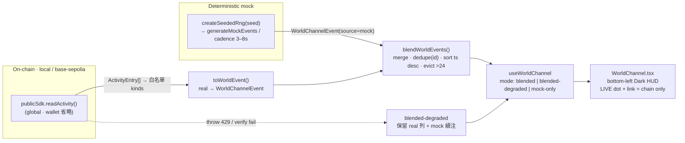

# World Channel 開發計畫（World Channel Plan）

> 分支 `feat/world-channel` ｜ 品質模式 standard (85) ｜ Depth L2 Standard ｜ Round 1 ｜ `model_used`: Claude Opus 4.8
> For the executing engineer: 逐一 task 執行、**每個 task 完成即 commit**（見 §6）。動工前先讀 `AGENTS.md`、`apps/web/AGENTS.md`、`docs/agents/implementation.md`、`docs/agents/testing.md`、`CONTEXT.md`，以及本計畫 READ-FIRST 來源檔。**只可新增/修改 `apps/web/**` 與一份 doc**；不得改 `contracts/**`（Solidity）、不得改變 `packages/chain` 的行為（只消費既有 `readActivity`）。

**Goal:** 在 hub 左下角新增一個線上遊戲風格的 **World Channel** 面板——一條會滾動的「世界動態」feed，顯示其他玩家的 attacks / boss defeats / NFT claims / redeems / achievements。資料源為**真實鏈上** `readActivity`（全域，省略 `wallet`），並混入一個**確定性 mock 產生器**模擬多玩家；當非 live / RPC 被節流 / 歷史鏈時**優雅退化為 mock-only**，面板永不空白。

**Architecture:** 沿用既有 `BattleActivityLog.tsx` 已驗證的「5s 輪詢 + `mergeBattleAttacks` 合併不變式」骨架，但**泛化**為多事件型別 + mock 混入，並改採 hub 的 **Dark HUD 主題**。純邏輯（型別、formatter、blend、mock 產生器）落在 `apps/web/src/lib/worldChannel.ts`（可單元測試），UI 落在 `apps/web/src/components/WorldChannel.tsx`，狀態由 `apps/web/src/lib/useWorldChannel.ts` hook 管理。與遊戲狀態**完全 read-only**。

**Tech stack:** Next.js App Router、React、TypeScript、Tailwind（Dark HUD tokens）、既有 `@boss-pool/chain` SDK（`publicSdk.readActivity`）、`bun test`。無新依賴、無新合約、無 `packages/chain` 行為變更。

---

## 0. READ-FIRST 來源檔（已逐檔實讀，非快取；證據狀態 LOCATOR-ONLY）

| 檔案 | 用途 | 本計畫已驗證的關鍵事實 |
| --- | --- | --- |
| [.edison/research/world-channel-discovery.md](../../../.edison/research/world-channel-discovery.md) | DISCOVER 全文 | 映射表、版位、風格、進度盤點 |
| [packages/chain/src/activity.ts](../../../packages/chain/src/activity.ts) | `readActivity` + `ActivityEntry` union | 省略 `wallet`＝全域；`blockTimestamp` 於 L316 補齊；Robinhood 46630 會 throw（L184）|
| [apps/web/src/components/battle/BattleActivityLog.tsx](../../../apps/web/src/components/battle/BattleActivityLog.tsx) | feed 原型 | `head=getBlockNumber({cacheTime:0})`、`fromBlock=max(head-999n, deployedAtBlock)`、`readActivity({fromBlock,toBlock:head,maxBlocks:1000})`、`role="log" aria-live="polite"`、try/catch→error |
| [apps/web/src/lib/battle.ts](../../../apps/web/src/lib/battle.ts) | `mergeBattleAttacks` | `belongsToBoss`（chainId+deploymentTxHash+router 位址）、rescanned-range 覆蓋防重複、`id` 去重、block desc 排序 |
| [apps/web/src/components/GameShell.tsx](../../../apps/web/src/components/GameShell.tsx) | 掛載縫合點 | overlay `pointer-events-none absolute inset-0 z-10 flex flex-col gap-3`；modal 在其後 `z-20`；`mt-auto` 為 bottom-center 提示；bottom-left 空白；`arena.deployment.kind==="live"` |
| [apps/web/src/lib/useBossPool.ts](../../../apps/web/src/lib/useBossPool.ts) | `DeploymentState` / `VerifiedContext` | live 攜帶 `context.{publicSdk, publicClient, manifest}`、`round`、`readAt` |
| [apps/web/src/app/globals.css](../../../apps/web/src/app/globals.css) | 風格 tokens | Dark HUD：`ink/panel/fog/muted/dim/accent/live/live-soft/danger`、`--ease-out-strong`、`eyebrow`、reduced-motion 慣例 |
| [packages/chain/src/index.ts](../../../packages/chain/src/index.ts) | 匯出面 | `ROBINHOOD_TESTNET_CHAIN_ID`（46630）、`BASE_SEPOLIA_CHAIN_ID`、`LOCAL_CHAIN_ID`、`ActivityEntry/ActivityPage/ReadActivityOptions` 皆已匯出 |

---

## 1. Scope & Done Contract

### 1.1 使用者可見行為（User-visible behavior）

- Hub 左下角常駐一個 **World Channel** 面板（Dark HUD 風格），顯示滾動的世界事件 feed。
- 事件型別涵蓋：其他玩家 **attack**、**boss defeated**、**stage cleared**、**Victory NFT claim**、**reward redeem**，以及 **achievement / milestone** 廣播。
- 真實鏈上事件（`publicSdk.readActivity`，全域、省略 `wallet`）與**確定性 mock**（模擬多玩家）**依時間交錯混合**。
- **可信度分層**：real 鏈上列 → 綠色 `LIVE` 圓點 + explorer tx 連結；mock 列 → 無連結、`text-dim` 呈現的 ambient 背景。
- **永不空白**：非 live / Robinhood 46630 / `readActivity` throw（含 RPC 429）時 → **mock-only** 或 **blended-degraded**（保留已顯示的 real 列 + 降級文案），面板仍生動。
- 面板可 **collapse / expand**；mobile（`<768px`）收合為**單行 ticker**。
- 與遊戲狀態完全 read-only：不寫入 `arena`、不觸發交易、不改 round/hub 狀態。

### 1.2 Done Contract（驗收）

| # | 驗收條件 |
| --- | --- |
| DC1 | 左下角出現 World Channel；不與 bottom-center 移動提示、top-left 標題、top-right pills 重疊 |
| DC2 | live 部署（local 或 base-sepolia）時，real attack/defeat/nft/reward/clear 事件會出現、附綠點 + explorer 連結 |
| DC3 | mock 事件持續注入（cadence 3–8s），交錯於 real 之間，**無** explorer 連結、**非** 0x 位址 handle |
| DC4 | `deployment.kind!=="live"` 或 chainId===46630 或 `readActivity` throw 時 → 面板不空白（mock-only / blended-degraded）並顯示對應文案 |
| DC5 | mock 產生器對相同 seed 產出**完全相同**序列（單元測試通過）|
| DC6 | `role="log" aria-live="polite"`；`prefers-reduced-motion` 時關閉 slide 動畫 |
| DC7 | `bun run typecheck`、`bun run web:build`、`bun test`（含新測試）全綠 |
| DC8 | `contracts/**`、`packages/chain` 行為零變更；`docs/delivery-plan.md` 過時句已更新 |

### 1.3 明確 OUT OF SCOPE（L2 MVP，勿鍍金）

- ❌ 新 indexer / websocket / 跨多 boss 聚合（`readActivity` 只掃**目前選定** deployment 的合約 → MVP「world」＝該 boss 全體參與者，見 §9 假設）。
- ❌ 雙向 chat / 輸入框（World Channel 是**單向廣播** feed）。
- ❌ 拖曳、per-player 持久化設定、LLM 產生內容。
- ❌ 任何 `contracts/**` 或 `packages/chain` 行為改動。

---

## 2. Data model

### 2.1 `WorldChannelEvent`（統一列型別）

```ts
// apps/web/src/lib/worldChannel.ts
export type WorldChannelKind =
  | "attack"        // real 可、mock 可
  | "victory-nft"   // real 可、mock 可
  | "reward"        // real 可、mock 可
  | "boss-defeated" // 僅 real（lifecycle）
  | "stage-cleared" // 僅 real（lifecycle）
  | "achievement"   // 僅 mock
  | "milestone"     // 僅 mock
  | "join";         // 僅 mock（ambient 上線）

export type WorldChannelEvent = {
  id: string;                       // 去重鍵：real=ActivityEntry.id；mock=`mock:${seed}:${index}`
  kind: WorldChannelKind;
  actor: string;                    // real=0x 截斷（`0xAB…12`）或 "—"（lifecycle）；mock=可讀 pseudo-handle
  message: string;                  // 已格式化的顯示句
  timestamp: number;                // ms epoch。real=Number(blockTimestamp)*1000；mock=注入當下 Date.now()
  source: "chain" | "mock";         // 可信度分層依據
  explorerUrl?: string;             // 僅 real：`${explorer}/tx/${transactionHash}`；mock 永不帶
};
```

> **設計取捨：** `kind` 為語意型別、`source` 標記可信度。同一 `attack` 可來自 real 或 mock；但 `boss-defeated`/`stage-cleared` **只允許 real**（見 §3.4 一致性不變式）。此設計避免為每個來源做平行 union（anti-overengineering）。

### 2.2 Real `ActivityEntry` → `WorldChannelEvent` 映射（formatter）

`toWorldEvent(entry, ctx)`，`ctx = { explorer?: string; hpDecimals: number; hpSymbol: string }`（`hpDecimals/hpSymbol` 取自 `deployment.round.hpToken`，`explorer` 取自 `publicClient.chain?.blockExplorers?.default.url`）。金額格式化**重用** `@/lib/format` 的 `displayEstimate` / `displayAmount`。

| `ActivityEntry.kind` | 是否 surface | `WorldChannelKind` | `actor` | `message` 範例 |
| --- | :---: | --- | --- | --- |
| `attack` | ✅ | `attack` | `truncate(player)` | `struck · ≈{displayEstimate(bossHPReceived,hpDecimals)} {hpSymbol}` |
| `boss-defeated` | ✅ | `boss-defeated` | `"—"` | `The boss has fallen!` |
| `stage-cleared` | ✅ | `stage-cleared` | `"—"` | `Stage {stage + 1} cleared!` |
| `victory-nft-claimed` | ✅ | `victory-nft` | `truncate(player)` | `claimed a Victory NFT` |
| `reward-claimed` | ✅ | `reward` | `truncate(player)` | `redeemed ≈{displayEstimate(bossHPIn,hpDecimals)} {hpSymbol}` |
| `attack-recorded` | ❌ DROP | — | — | 與 `attack` 重複計數（corroborating-only），排除 |
| `stage-refilled` / `round-activated` / `stage-activated` / `supply-pool-seeded` | ❌ DROP（MVP） | — | — | lifecycle 雜訊，MVP 不 surface（可留 TODO） |
| `token-transfer` / `token-approval` / `nft-transfer` / `nft-approval*` / `prize-funded` / `expired-prize-refunded` / `ownership-transferred` / `round-expired` | ❌ DROP | — | — | 內部/雜訊，一律排除 |

- `truncate(addr) = `${addr.slice(0,6)}…${addr.slice(-4)}``（與 GameShell `shortAddress` / BattleActivityLog 一致）。
- **surfaced real kinds 白名單常數**：`SURFACED = new Set(["attack","boss-defeated","stage-cleared","victory-nft-claimed","reward-claimed"])`。

### 2.3 Mock 事件型錄（catalog）+ 確定性產生器契約

**Handle 池（pseudo-handles，可讀、非 0x、非真實位址）**：
`["pixel_roy","garden_ghost","stage3_slayer","royraider","hodl_knight","mockwhale","sprite_hunter","chain_cat","boss_bane","leek_lord","usdc_samurai","block_wraith"]`

**Mock 型錄（templateId → kind / 句型）**：

| templateId | `kind` | `message` 範例 | 說明 |
| --- | --- | --- | --- |
| `m-attack` | `attack` | `{handle} struck · ≈{n} HP` | ambient 戰鬥（n 為 seed 導出的擬真小數）|
| `m-victory` | `victory-nft` | `{handle} claimed a Victory NFT` | ambient |
| `m-reward` | `reward` | `{handle} redeemed ≈{n} HP` | ambient |
| `m-join` | `join` | `{handle} joined the hunt` | 上線廣播 |
| `a-streak` | `achievement` | `{handle} is on a {k}-attack streak!` | 成就（無鏈上事件 → 恆 mock）|
| `a-firststrike` | `achievement` | `{handle} landed the first strike of the hour` | 成就 |
| `a-bighit` | `achievement` | `{handle} dealt a massive {n} HP blow` | 成就 |
| `m-ladder` | `milestone` | `{handle} climbed to #{rank} on the ladder` | 里程碑 |

**確定性產生器契約（seedable, rate-limited）**：

```ts
// mulberry32：純函數 PRNG（供測試決定論）
export function createSeededRng(seed: number): () => number {
  let a = seed >>> 0;
  return () => {
    a = (a + 0x6d2b79f5) | 0;
    let t = Math.imul(a ^ (a >>> 15), 1 | a);
    t = (t + Math.imul(t ^ (t >>> 7), 61 | t)) ^ t;
    return ((t ^ (t >>> 14)) >>> 0) / 4294967296;
  };
}

// 純函數：同 seed → 同序列（供單元測試）
export function generateMockEvents(seed: number, count: number): WorldChannelEvent[];

// cadence：intervalMs = 3000 + floor(rng()*5000) ∈ [3000, 8000)
export function mockIntervalMs(rng: () => number): number;
```

- **契約**：`generateMockEvents(seed, n)` 對相同 `(seed, n)` 回傳**內容相同**的陣列（id、kind、actor、message 全等）；不同 seed → 不同序列；每筆 `source:"mock"`、無 `explorerUrl`；`id = `mock:${seed}:${index}``。
- **誠信邊界（強制）**：mock **不得**產生 `boss-defeated` / `stage-cleared` / lifecycle kind、**不得**帶 explorer 連結、**不得**用 0x 位址樣式 handle。
- runtime 由 hook 以 timer 依 `mockIntervalMs` 注入，但**內容由 seed 決定**故可重現。seed 建議取 `manifest.deployedAtBlock` 或固定常數，讓同一 demo session 可重播。

---

## 3. Real + Mock blend 規則

### 3.1 Real 讀取（泛化 BattleActivityLog 骨架）

- 每 `5_000ms`：`head = publicClient.getBlockNumber({ cacheTime: 0 })` → `fromBlock = max(head - 999n, BigInt(manifest.deployedAtBlock))` → `page = publicSdk.readActivity({ fromBlock, toBlock: head, maxBlocks: 1000 })`（**省略 `wallet` ＝ 全域**）。
- `page.entries` 逐筆經 §2.2 白名單過濾與 formatter → `WorldChannelEvent[]`（source `"chain"`）。

### 3.2 合併/去重/淘汰（`blendWorldEvents`，純函數）

沿用 `mergeBattleAttacks` 的不變式，泛化為多 kind：

```
belongsToBoss(entry) = entry.chainId === manifest.chainId
  && entry.deploymentTxHash === manifest.deploymentTxHash（lowercase 比對）
merge：
  1) 以 id 為鍵建 Map；先放入 current 中「落在本次 rescanned 區間外」的列（避免重掃重複）
  2) 放入本頁 surfaced 的 real 列（覆蓋同 id）
  3) 併入 mock 列（mock 不受 rescanned 區間影響）
  4) 依 timestamp 由新到舊排序（desc）；同 timestamp 時 chain 優先於 mock
  5) 去重：同 id 只留一筆
  6) 淘汰：超過 MAX_ROWS(=24) 者，捨棄最舊
```

- `LIVE` 綠點與 explorer 連結**只**出現在 `source==="chain"` 的列。
- **可見列**：expanded 顯示最新 6–8 列；collapsed / mobile 顯示最新 1 列（ticker）。

### 3.3 Mock rate-limit（避免淹沒 real）

- Mock 以 `mockIntervalMs` 定時注入一筆。
- **降噪守衛**：若「最近一次 real poll 帶來 ≥3 筆新 real 列」，則**略過下一個 mock beat**，確保 real 高峰時不被 mock 埋掉。（MVP 簡化策略，足夠。）

### 3.4 一致性不變式（credibility / consistency guard）

> **mock 只能發 player/ambient/achievement/milestone/join；永不發 lifecycle（boss-defeated / stage-cleared / round）。** 否則會與 hub 其他處顯示的**真實 round 狀態**（RoundStatePanel、sage 敘事）矛盾，破壞可信度。此為 DR-D4/DR-D5 硬性規則，非美化選項。

### 3.5 Fallback 選擇（精確狀態機）

```
mode =
  deployment.kind !== "live"                         → "mock-only"     // loading / not-deployed / error
  manifest.chainId === ROBINHOOD_TESTNET_CHAIN_ID    → "mock-only"     // 46630：readActivity 必 throw，預先短路不呼叫
  otherwise                                          → "blended"
     └─ 若 readActivity throw（含 Base RPC 429）      → "blended-degraded"
        // 保留已顯示的 real 列、realError=true、mock 繼續注入、顯示 "UPDATES UNAVAILABLE · ambient only"
        // 不清空既有 real 列；下次 poll 成功則自動回 "blended"
```

- `ROBINHOOD_TESTNET_CHAIN_ID` 由 `@boss-pool/chain` 匯出，直接 import 使用（已驗證，index.ts L14）。
- GameShell 目前 network 選單只提供 local(31337) / base-sepolia(84532)，Robinhood 短路為防禦性守衛。

---

## 4. UI/UX 規格

### 4.1 元件樹與新檔

```
apps/web/src/lib/worldChannel.ts        （新）純邏輯：型別、toWorldEvent、blendWorldEvents、mock catalog、createSeededRng、generateMockEvents、mockIntervalMs、fallback selectMode
apps/web/src/lib/worldChannel.test.ts    （新）單元測試（§7）
apps/web/src/lib/useWorldChannel.ts      （新）hook：real 5s 輪詢 + mock timer + mode 狀態機；回傳 { events, mode, realError, expanded, toggle }
apps/web/src/components/WorldChannel.tsx  （新）Dark HUD UI：collapsed/expanded/ticker、a11y、reduced-motion
apps/web/src/components/GameShell.tsx     （改）於 z-10 overlay 內掛載 <WorldChannel />
```

- `useWorldChannel(deployment)` 接受 `arena.deployment`（`DeploymentState`）；內部自行 narrow `kind==="live"` 取 `context.{publicSdk,publicClient,manifest}` 與 `round.hpToken`。
- **金額格式化重用** `@/lib/format`；**位址截斷**與現有 `shortAddress` 對齊。

### 4.2 版位與 z-index

- 掛載於 GameShell overlay（`pointer-events-none ... z-10`）**內**，作為新子元素；**面板本身加 `pointer-events-auto`**（容器是 none）。
- 版位：**bottom-left**。`className` 錨定範例：`absolute bottom-3 left-3 sm:bottom-4 sm:left-4 z-10 w-[min(20rem,calc(100vw-1.5rem))]`。
- **不得**與 bottom-center `mt-auto` 移動提示重疊（提示為置中 flow，World Channel 為左下 absolute）；**不得**進入 top-left/top-right。
- modal（`showChain` 等）為 `z-20`，會正常蓋在 World Channel 之上——符合預期（開 modal 時 feed 退居背景）。

### 4.3 狀態：collapsed / expanded / mobile ticker

| 狀態 | 呈現 |
| --- | --- |
| expanded（桌機預設）| 標題列（`eyebrow` `WORLD CHANNEL` + `LIVE` 綠點/`AMBIENT` 灰點）+ 最新 6–8 列 `<ol>`；可捲動 `overflow-y-auto overscroll-contain` |
| collapsed | 只留標題列 pill + 最新 1 列；點標題切換 expanded |
| mobile（`<768px`，`sm:` 以下）| 單行 ticker：只顯示最新 1 列 + 標題 pill；`pointer-events-auto` 只在該 pill |

### 4.4 風格 tokens（Dark HUD 主題 A）

- 面板容器：`rounded-lg border border-white/12 bg-ink/70 px-3 py-2 font-mono text-[10px] tracking-[0.14em] text-dim backdrop-blur-[2px]`（與 GameShell HUD pill 同語彙）。
- 標題：`eyebrow`（`font-mono text-[10px] tracking-[0.12em] text-[#9aaccd]`）。
- **LIVE 綠點**（僅 blended 且有 real）：`inline-block h-1.5 w-1.5 rounded-full bg-live shadow-[0_0_12px_rgba(79,218,165,0.55)]`；degraded/mock-only 用 `bg-dim`（無光暈）。
- real 列文字：`text-live-soft`；mock 列文字：`text-dim`（可信度分層）。
- explorer 連結（僅 real）：`<a class="hover:underline focus-visible:outline-2">` + `<span class="sr-only"> · View confirmed transaction</span>`（沿用 BattleActivityLog 寫法）。
- 時間：`<time dateTime={iso}>` 顯示 `HH:mm`（24h）。
- slide-in 動畫用 `--ease-out-strong`；`@media (prefers-reduced-motion: reduce)` 只保留 opacity、移除位移（沿用 globals.css 慣例）。

### 4.5 a11y

- 列表容器：`role="log" aria-live="polite" aria-relevant="additions" tabIndex={0}`（沿用 BattleActivityLog）。
- 折疊切換用真正的 `<button>`（`aria-expanded`）。
- 降級/mock-only 文案以可讀文字呈現，不只靠顏色。

---

## 5. Integration seams

- **掛載點**：`GameShell.tsx` 的 `<div className="pointer-events-none absolute inset-0 z-10 ...">` overlay 內，於 `<div className="mt-auto ...">`（bottom-center 區）**之外**、overlay 收尾處新增 `<WorldChannel deployment={deployment} />`（`deployment` 來自 `const { deployment } = arena`）。
- **資料**：hook 內 `deployment.kind==="live"` → `deployment.context.publicSdk.readActivity(...)`、`deployment.context.publicClient.getBlockNumber(...)`、explorer 取 `deployment.context.publicClient.chain?.blockExplorers?.default.url`、`manifest = deployment.context.manifest`（或 `deployment.manifest`）、`hpToken = deployment.round.hpToken`。
- **read-only 保證**：World Channel **不**呼叫 `arena` 的任何 write（`connect`/`attack`/`resumePending`…）、**不**送 `bridge` 事件、**不** setState 到遊戲。它只讀 `deployment` 並自持本地 feed 狀態。
- **`packages/chain`**：零改動——只消費既有 `publicSdk.readActivity`。若日後要 surface `BossLaunched`（新 boss 誕生）需另讀 factory logs，**不在本 MVP**。

### 資料流 Mermaid



---

## 6. 檔案級任務拆解 — Hackathon Commit Plan（小步提交）

> 每個 task ＝ 一個邏輯單元 ＝ 一次 commit。開發者**每完成一個 task 即 commit**，不要攢成一大包。

| # | Commit 訊息（建議）| 檔案 | 內容 | 完成判準 |
| --- | --- | --- | --- | --- |
| 1 | `feat(web): add WorldChannelEvent type + real formatter` | `lib/worldChannel.ts`（新）| §2.1 型別、§2.2 `toWorldEvent` + `SURFACED` 白名單 + `truncate`、`selectMode` fallback 選擇器 | `typecheck` 綠 |
| 2 | `feat(web): add deterministic mock catalog + PRNG` | `lib/worldChannel.ts` | §2.3 handle 池、mock 型錄、`createSeededRng`、`generateMockEvents`、`mockIntervalMs`；強制無 explorerUrl / 非 0x / 無 lifecycle | `typecheck` 綠 |
| 3 | `feat(web): add blendWorldEvents merge/evict/dedupe` | `lib/worldChannel.ts` | §3.2 `blendWorldEvents`（belongsToBoss、rescanned 覆蓋、id 去重、ts desc、MAX_ROWS 淘汰）| `typecheck` 綠 |
| 4 | `test(web): cover mock determinism, formatter, blend, fallback` | `lib/worldChannel.test.ts`（新）| §7 全部單元測試 | `bun test` 綠 |
| 5 | `feat(web): add useWorldChannel hook` | `lib/useWorldChannel.ts`（新）| real 5s 輪詢（泛化 BattleActivityLog）+ mock timer + mode 狀態機 + §3.5 降級 + 卸載清 timer | `typecheck` 綠 |
| 6 | `feat(web): add WorldChannel Dark HUD panel` | `components/WorldChannel.tsx`（新）| §4 UI：collapsed/expanded/ticker、綠點/連結分層、a11y、reduced-motion | `web:build` 綠 |
| 7 | `feat(web): mount World Channel in hub overlay` | `components/GameShell.tsx`（改）| §5 於 z-10 overlay 掛 `<WorldChannel deployment={deployment} />`；驗證不重疊 | `web:build` 綠、手測不重疊 |
| 8 | `docs: refresh delivery-plan status + add World Channel progress` | `docs/delivery-plan.md`（改）| §8 更新過時句 + 進度快照表 + World Channel 條目 | diff 檢視一致 |

> 任務 1–3 可視情況拆更細（例如 formatter 與 fallback 分開）；但**不得**把 5–7 併為單一 commit。

---

## 7. 測試計畫（`bun test`，co-located `*.test.ts`）

檔案：`apps/web/src/lib/worldChannel.test.ts`（遵循 repo 慣例，co-located、聚焦核心、勿逐函數鋪測）。

| 測試 | 對象 | 斷言 |
| --- | --- | --- |
| T-det-1 | mock 決定論 | `generateMockEvents(42, 8)` 兩次呼叫**深度相等**；`seed=42` ≠ `seed=7`；每筆 `source==="mock"`、無 `explorerUrl`、actor 非 `/^0x/` |
| T-det-2 | cadence | 對固定 seed 連續取 `mockIntervalMs`，全部 ∈ `[3000, 8000)` |
| T-fmt-1 | real formatter | 餵入各 `ActivityEntry`（attack/boss-defeated/stage-cleared/victory-nft-claimed/reward-claimed）→ 正確 `kind/actor/message`；attack/reward 金額用 `displayEstimate` 且帶 `hpSymbol`；stage-cleared 顯示 `stage+1` |
| T-fmt-2 | 白名單 | `attack-recorded` 與 token/nft/approval/lifecycle 噪音 → **被 DROP**（回傳 null / 不入列）|
| T-blend-1 | merge/dedupe | 同 `id` 重複入列只留一筆；跨 poll 的 rescanned 區間覆蓋不產生重複 |
| T-blend-2 | evict/sort | 超過 `MAX_ROWS` 淘汰最舊；輸出 `timestamp` desc；同 ts 時 chain 先於 mock |
| T-blend-3 | 可信度 | real 列保留 `explorerUrl`、mock 列必無；`LIVE` 判定只看 `source==="chain"` |
| T-fb-1 | fallback 選擇 | `selectMode`：非 live→`mock-only`；chainId 46630→`mock-only`；live 正常→`blended`；throw→`blended-degraded` 且不清空既有 real 列 |

- 純函數優先（formatter/blend/mock/selectMode 皆為 pure，易測、無需 mock viem）。
- hook/component 不強制 render 測試（MVP）；以純邏輯測試 + 手動瀏覽器驗收（DC1–DC6）覆蓋。
- 執行：`bun test apps/web/src/lib/worldChannel.test.ts`；連同 `bun run typecheck`、`bun run web:build` 收尾。

---

## 8. 進度表更新任務（Progress-table update）

**目標檔：`docs/delivery-plan.md`（只動下列兩處，勿改寫無關內容）。**

### 8.1 修正過時句（首段）

- **現況（STALE）**：首段第 4 句「Base Sepolia RPC access is verified, but **there is no Boss Pool deployment there**.」——此句已過時。
- **事實 delta（來自 DISCOVER RQ1.4 / RQ5，證據已驗證）**：
  - base-sepolia 現有 **factory 部署的 live boss**（[apps/web/public/deployments/base-sepolia.json](../../../apps/web/public/deployments/base-sepolia.json)，`deployedAtBlock 47332745`，`bossOrigin.kind="factory"`）。
  - 驗證證據 [docs/evidence/base-sepolia-boss-factory-current.json](../../evidence/base-sepolia-boss-factory-current.json)：`status success`、`creationTransactionMatchesCompiledArtifact / sdkBuildCompatible / manifestWiringVerified` 全 `true`。
  - ⚠️ 已知風險：公共 `sepolia.base.org` RPC 有 **429 節流**；demo 前建議換 keyed RPC。
- **改寫建議**：將該句改為「Base Sepolia now hosts a **factory-deployed live boss** (`base-sepolia.json`, block 47332745), verified in `docs/evidence/base-sepolia-boss-factory-current.json`. Public `sepolia.base.org` RPC is rate-limited (429); swap to a keyed RPC before the demo.」

### 8.2 新增「進度快照」表 + World Channel 條目

在首段後（或適當章節）新增一張精簡進度快照表（factual delta 來自 RQ5）：

| 層 | 狀態 | 備註 |
| --- | --- | --- |
| Contracts / SDK | ✅ | no-burn 直攻、Hook、Factory、NFT、`readActivity`（已驗證）|
| Web / wallet | ✅ | `useBossPool` 5s 輪詢、direct attack、receipt recovery |
| Phaser hub | ✅ | roster hub 12 門 + sage + ROO FSM（已 merge main）|
| Battle | ✅ | battle v2、by-hook 路由、swap 5x/10x、`BattleActivityLog`（confirmed attacks feed）|
| Testnet | 🟡 LIVE（有風險）| base-sepolia factory boss LIVE；公共 RPC 429，demo 前換 keyed RPC |
| **World Channel** | ⬜ 開發中（本計畫）| 左下角全域動態 feed，real `readActivity` + 確定性 mock 混合 |

> **限制**：只更新上述句子與新增表格 / World Channel 條目；**不得**改寫 delivery-plan 其他章節（ownership、build sequence、accounting 等）。

---

## 9. Constraints & Forbidden Zones

- ⛔ **禁止**改動 `contracts/**`（任何 Solidity）。
- ⛔ **禁止**改變 `packages/chain` 的行為；只可 `import` 既有匯出（`readActivity` via `publicSdk`、`ROBINHOOD_TESTNET_CHAIN_ID`、型別）。若真需 chain 變更，僅限 additive/read-only 並先回報——本 MVP 預期**零** chain 變更。
- ✅ 只在 `apps/web/**` 新增 3 檔 + 改 `GameShell.tsx`，另改 1 份 doc（`docs/delivery-plan.md`）。
- ✅ 風格對齊既有 Dark HUD pill / `globals.css` tokens；不得引入新依賴、新動畫庫、新 state 管理。
- ✅ **頻繁小 commit**（§6，每 task 一 commit）。
- ✅ **L2 MVP 範圍**：不鍍金（無 indexer / websocket / 拖曳 / 持久化設定 / LLM）。
- ✅ read-only：不寫遊戲狀態、不發交易、不送 bridge 事件。
- ✅ **誠信邊界**：mock 不得偽裝可驗證鏈上事實（無假 explorer 連結、非真實/0x 位址 handle、不發 lifecycle kind）。

---

## 10. Document-Review Mirror Scorecard（Phase 4b 自審）

| 維度 | 分數 | 說明 |
| --- | :---: | --- |
| DR-D1 完整性 | 19/20 | scope/data/blend/UI/seam/tasks/tests/docs/constraints 齊備；OUT-OF-SCOPE 明列 |
| DR-D2 準確性 vs Codebase | 20/20 | 所有路徑/型別/匯出/行為皆逐檔實讀驗證（activity.ts、BattleActivityLog、battle.ts、GameShell、useBossPool、globals.css、index.ts）|
| DR-D3 可行性 | 18/20 | pure-lib-first、重用已驗證 poll+merge、additive-only、commit 依賴順序正確 |
| DR-D4 一致性 | 14/15 | 命名對齊 `lib/battle` 拆分；mock-never-lifecycle 防矛盾；術語一致 |
| DR-D5 風險覆蓋 | 14/15 | 429/Robinhood/空 feed/可信度/z-index/a11y/perf 均有對策 |
| DR-D6 業界最佳實踐 & Pattern 紀律 | 9/10 | killfeed 角落 dock + 可信度分層；**明確聲明不需 GoF pattern**；PRNG 由測試決定論證成 |
| **總分** | **≈ 94/100** | ≥ handoff 門檻（90）|

- **Self-Audit trigger**：`none`（score ≥ 90，無 unresolved High）。
- **Intentionally kept simple（anti-overengineering trace）**：不引入 Strategy/Factory/Observer/Repository——單一 feed、單一 formatter map、單一 timer；唯一「模式」為測試用 mulberry32 PRNG（signal＝determinism 測試需求；alternative＝`Math.random`（不可測，否決）；cost＝~8 行純函數）。
- **Repair Eligibility**：`REPAIRABLE`（任何 review finding 皆為 bounded UI/文案級）。
- **Paired review route**：`edison-document-review-audit`（`audit_and_route_repair`）。
