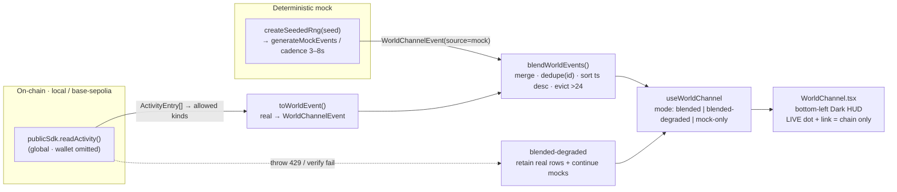

# World Channel development plan

> Branch `feat/world-channel`; quality standard85; depth L2 Standard; Round 1; model_used Claude Opus4.8.
> Executing engineer: complete tasks individually and commit each completed task, §6. First read root/web AGENTS, implementation/testing guides, CONTEXT, and READ-FIRST sources. Modify only apps/web and one document; no Solidity changes or packages/chain behavior changes. Consume existing readActivity only.

Goal: add a lower-left online-game World Channel feed to the hub, showing other players' attacks, defeats, NFT claims, redemptions, achievements, and milestones. Combine global real-chain readActivity without wallet filtering with deterministic mock players. Non-live, rate-limited, or historical-chain contexts fall back to mock-only; the panel never stays empty.

Architecture: reuse BattleActivityLog's five-second polling and mergeBattleAttacks invariants, extending to multiple kinds and mock blending with the Dark HUD theme. Pure types/formatters/blending/mock generation live in worldChannel.ts; UI in WorldChannel.tsx; local state in useWorldChannel.ts. Game state stays read-only.

Stack: Next.js App Router, React, TypeScript, Tailwind Dark HUD tokens, existing @boss-pool/chain, and bun test. No new dependency, contract, or chain-package behavior.

## 0. READ-FIRST sources

These were inspected directly without cache; evidence status LOCATOR-ONLY.

| Source | Purpose | Verified planning facts |
| --- | --- | --- |
| `.edison/research/world-channel-discovery.md`, historical discovery note | DISCOVER report | Mapping, placement, style, progress inventory |
| [activity.ts](../../../packages/chain/src/activity.ts) | readActivity/ActivityEntry | Omitted wallet means global; blockTimestamp added at 316; chain46630 throws at 184 |
| [BattleActivityLog.tsx](../../../apps/web/src/components/battle/BattleActivityLog.tsx) | Feed prototype | Head with cacheTime0; range max(head-999,deployedAtBlock); maxBlocks1000; log/polite live region; catch errors |
| [battle.ts](../../../apps/web/src/lib/battle.ts) | Merge invariants | Match chain/deployment hash/router, replace rescanned ranges, deduplicate IDs, descending block order |
| [GameShell.tsx](../../../apps/web/src/components/GameShell.tsx) | Mount point | Pointer-events-none z10 overlay, later z20 modal, centered mt-auto prompt, lower-left space, live deployment check |
| [useBossPool.ts](../../../apps/web/src/lib/useBossPool.ts) | DeploymentState/VerifiedContext | Live context supplies SDK/client/manifest, round, readAt |
| [globals.css](../../../apps/web/src/app/globals.css) | Style tokens | ink/panel/fog/muted/dim/accent/live/live-soft/danger, ease-out-strong, eyebrow, reduced motion |
| [index.ts](../../../packages/chain/src/index.ts) | Exports | Robinhood 46630, Base, Local IDs and ActivityEntry/ActivityPage/ReadActivityOptions |

## 1. Scope and done contract

### 1.1 User-visible behavior

- Persistent lower-left Dark HUD panel with scrolling events.
- Kinds: other-player attacks, boss defeat, stage clearance, victory NFT, reward redemption, achievements, milestones.
- Interleave real global events and deterministic mock events by time.
- Real rows have green LIVE dots and explorer links. Mock rows have dim ambient styling and no links.
- Non-live/Robinhood/error429 contexts use mock-only or blended-degraded, retaining previous real rows with degraded copy.
- Expand/collapse controls; below 768 px use a one-line ticker.
- No arena writes, transactions, or round/hub mutations.

### 1.2 Acceptance

| ID | Condition |
| --- | --- |
| DC1 | Lower-left panel avoids centered movement prompt and upper HUD |
| DC2 | Live local/Base events show real attack/defeat/NFT/reward/clear rows with green dot and explorer link |
| DC3 | Mocks arrive every 3–8s among real rows, without links or 0x handles |
| DC4 | Non-live, 46630, or read errors retain a nonempty feed and matching fallback copy |
| DC5 | Identical seed produces identical mock sequence under tests |
| DC6 | Log/polite live region; reduced motion disables sliding |
| DC7 | Typecheck, build, and bun tests pass |
| DC8 | No contract or chain-package behavior changes; stale delivery-plan statement updated |

### 1.3 Out of scope

No indexer, websocket, multi-Boss aggregation, chat/input, drag, persistent player settings, LLM content, contract changes, or chain behavior changes. MVP "world" means all participants in the currently selected deployment, since readActivity scans that Boss only; see §9.

## 2. Data model

### 2.1 Unified row type

```ts
// apps/web/src/lib/worldChannel.ts
export type WorldChannelKind =
  | "attack"        // Chain or mock
  | "victory-nft"   // Chain or mock
  | "reward"        // Chain or mock
  | "boss-defeated" // Chain lifecycle only
  | "stage-cleared" // Chain lifecycle only
  | "achievement"   // Mock only
  | "milestone"     // Mock only
  | "join";         // Mock ambient presence only

export type WorldChannelEvent = {
  id: string; // Chain: ActivityEntry.id; mock: mock:${seed}:${index}
  kind: WorldChannelKind;
  actor: string; // Truncated chain address or lifecycle dash; mock readable handle
  message: string; // Formatted display sentence
  timestamp: number; // Epoch ms: chain blockTimestamp ×1000; mock injection Date.now()
  source: "chain" | "mock"; // Credibility classification
  explorerUrl?: string; // Chain transaction link only; never mock
};
```

Kind describes meaning; source describes credibility. Attacks may be either source, but lifecycle defeat/clear must be real, §3.4. Avoid separate parallel unions per source.

### 2.2 Real-event formatter

`toWorldEvent(entry, ctx)` takes explorer, hpDecimals, and hpSymbol from the live round/token and client's default block explorer. Reuse displayEstimate/displayAmount from @/lib/format.

| Activity kind | Display | World kind | Actor | Message |
| --- | --- | --- | --- | --- |
| attack | Yes | attack | Truncated player | struck · ≈{displayEstimate(bossHPReceived,hpDecimals)} {hpSymbol} |
| boss-defeated | Yes | boss-defeated | Dash | The boss has fallen! |
| stage-cleared | Yes | stage-cleared | Dash | Stage {stage+1} cleared! |
| victory-nft-claimed | Yes | victory-nft | Player | claimed a Victory NFT |
| reward-claimed | Yes | reward | Player | redeemed ≈{displayEstimate(bossHPIn,hpDecimals)} {hpSymbol} |
| attack-recorded | Drop | None | None | Corroborates attack; avoid double counting |
| stage-refilled/round-activated/stage-activated/supply-pool-seeded | Drop for MVP | None | None | Lifecycle noise, optionally TODO |
| token-transfer/token-approval/nft-transfer/nft-approval*/prize-funded/expired-prize-refunded/ownership-transferred/round-expired | Drop | None | None | Internal/noisy events |

Truncate with address.slice(0, 6), ellipsis, and address.slice(-4), matching existing shortAddress. SURFACED includes only the five displayed kinds.

### 2.3 Mock catalog and deterministic generator

Readable, non-address handles:

```text
pixel_roy, garden_ghost, stage3_slayer, royraider, hodl_knight, mockwhale,
sprite_hunter, chain_cat, boss_bane, leek_lord, usdc_samurai, block_wraith
```

| Template | Kind | Message | Note |
| --- | --- | --- | --- |
| m-attack | attack | {handle} struck · ≈{n} HP | Seed-derived plausible decimal, ambient |
| m-victory | victory-nft | {handle} claimed a Victory NFT | Ambient |
| m-reward | reward | {handle} redeemed ≈{n} HP | Ambient |
| m-join | join | {handle} joined the hunt | Presence announcement |
| a-streak | achievement | {handle} is on a {k}-attack streak! | No chain event, always mock |
| a-firststrike | achievement | {handle} landed the first strike of the hour | Achievement |
| a-bighit | achievement | {handle} dealt a massive {n} HP blow | Achievement |
| m-ladder | milestone | {handle} climbed to #{rank} on the ladder | Milestone |

```ts
// mulberry32 PRNG for deterministic tests.
export function createSeededRng(seed: number): () => number {
  let a = seed >>> 0;
  return () => {
    a = (a + 0x6d2b79f5) | 0;
    let t = Math.imul(a ^ (a >>> 15), 1 | a);
    t = (t + Math.imul(t ^ (t >>> 7), 61 | t)) ^ t;
    return ((t ^ (t >>> 14)) >>> 0) / 4294967296;
  };
}

// Equal seeds/counts produce equal content for tests.
export function generateMockEvents(seed: number, count: number): WorldChannelEvent[];

// 3000 + floor(rng()*5000), within [3000,8000).
export function mockIntervalMs(rng: () => number): number;
```

Equal seed/count means equal IDs/kinds/actors/messages; distinct seeds differ. Every mock has source mock, no explorerUrl, and ID mock:${seed}:${index}. Never emit defeat/clear/other lifecycle kinds, explorer links, or 0x handles. Runtime timers inject seed-determined content; use manifest.deployedAtBlock or a constant for replayable demo sessions.

## 3. Blending real and mock events

### 3.1 Real reads

Every5000 ms, read uncached head, start at max(head-999,deployment block), and request global readActivity through head with maxBlocks1000. Filter and format page.entries into chain events.

### 3.2 Merge, deduplication, and eviction

Generalize mergeBattleAttacks:

```text
belongsToBoss compares chainId and lowercase deploymentTxHash.
1. Start an ID-keyed Map with current rows outside the rescanned range.
2. Insert this page's displayed real rows, replacing matching IDs.
3. Insert mocks, unaffected by rescan ranges.
4. Sort descending timestamp, preferring chain for equal timestamps.
5. Keep one row per ID.
6. Discard oldest rows beyond MAX_ROWS=24.
```

Only chain rows get LIVE and links. Expanded displays newest6–8; collapsed/mobile shows newest one.

### 3.3 Avoid mock flooding

Inject one mock per mockIntervalMs. If the latest real poll adds at least three new rows, skip the next mock beat so chain activity stays visible.

### 3.4 Credibility invariant

Mocks can report ambient/player/achievement/milestone/join events, never Boss/stage/round lifecycle. Otherwise they contradict actual RoundStatePanel and sage state. This is a mandatory DR-D4/DR-D5 rule.

### 3.5 Fallback state machine

```text
Non-live deployment -> mock-only.
Robinhood46630 -> mock-only; skip readActivity because it throws.
Otherwise -> blended.
Read error, including Base429 -> blended-degraded:
retain existing real rows, set realError, continue mock injection,
show "UPDATES UNAVAILABLE · ambient only".
Next successful poll -> blended again.
```

Import ROBINHOOD_TESTNET_CHAIN_ID from the SDK. Current menus offer Local 31337/Base 84532 only; the historical-chain check is defensive.

## 4. UI specification

### 4.1 Files and component tree

- New lib/worldChannel.ts: types, formatter, blend, catalog, seeded RNG, generation, cadence, selectMode.
- New lib/worldChannel.test.ts: §7 tests.
- New lib/useWorldChannel.ts: polling/timers/modes; returns events, mode, realError, expanded, toggle.
- New components/WorldChannel.tsx: Dark HUD, collapse/expand/ticker, accessibility, reduced motion.
- Modify components/GameShell.tsx to mount in its z10 overlay.

useWorldChannel accepts arena.deployment, narrows live state, and reads context SDK/client/manifest and round.hpToken. Reuse amount and address formatting.

### 4.2 Placement

Mount inside GameShell's pointer-events-none overlay; panel itself uses pointer-events-auto. Lower-left reference class:

```text
absolute bottom-3 left-3 sm:bottom-4 sm:left-4 z-10 w-[min(20rem,calc(100vw-1.5rem))]
```

Do not overlap the centered mt-auto movement prompt or upper HUD. Z20 modals cover the z10 feed, as intended.

### 4.3 Display states

| State | Presentation |
| --- | --- |
| Expanded, desktop default | WORLD CHANNEL eyebrow, LIVE green or AMBIENT gray dot, latest6–8 rows in scrollable ol with overscroll containment |
| Collapsed | Header pill and latest row; header toggles expansion |
| Mobile below 768 px, described with sm styling | One-line latest-row ticker and pill; pointer events only on pill |

### 4.4 Dark HUD tokens

- Container: rounded-lg, border-white/12, bg-ink/70, px3/py2, mono10 px, tracking0.14em, text-dim, backdrop-blur2 px.
- Eyebrow: mono10 px, tracking0.12em, #9aaccd.
- LIVE dot only with blended real data: h1.5/w1.5 rounded bg-live with 12 px rgba(79, 218, 165, 0.55) glow. Degraded/mock-only uses dim without glow.
- Real text live-soft; mocks dim.
- Real links use hover underline, focus-visible outline2, and screen-reader "View confirmed transaction," following BattleActivityLog.
- Time uses a time element with ISO dateTime and 24-hour HH:mm.
- Slide uses ease-out-strong; reduced motion removes translation while retaining opacity.

### 4.5 Accessibility

List uses log role, polite live region, additions relevance, and tabIndex0. Toggle is a native button with aria-expanded. Fallback copy conveys status in words, not color only.

## 5. Integration boundaries

- Mount WorldChannel deployment={deployment} at the end of the z10 GameShell overlay, outside the centered mt-auto group. Deployment comes from arena.
- Live data uses context.publicSdk.readActivity, publicClient.getBlockNumber/explorer, context or deployment manifest, and round.hpToken.
- Never call arena writes, connect, attack, or resumePending; send no bridge event and mutate no game state. Only local feed state changes.
- No packages/chain changes. Future BossLaunched announcements would require Factory logs and remain outside MVP.

### Data-flow diagram



## 6. Hackathon commit plan

One task is one logical unit and one commit. Commit after each task rather than accumulating one large change.

| # | Suggested message | File | Content | Done |
| --- | --- | --- | --- | --- |
| 1 | feat(web): add WorldChannelEvent type + real formatter | New lib/worldChannel.ts | Types, formatter, SURFACED, truncation, selectMode | Typecheck |
| 2 | feat(web): add deterministic mock catalog + PRNG | Same | Handles/templates/RNG/generator/cadence with credibility guards | Typecheck |
| 3 | feat(web): add blendWorldEvents merge/evict/dedupe | Same | Boss matching, rescans, deduplication, sorting, MAX_ROWS | Typecheck |
| 4 | test(web): cover mock determinism, formatter, blend, fallback | New colocated test | §7 checks | bun test |
| 5 | feat(web): add useWorldChannel hook | New hook | Five-second polling, mock timer, fallback, cleanup | Typecheck |
| 6 | feat(web): add WorldChannel Dark HUD panel | New component | Display states, credibility styling, accessibility, motion | Build |
| 7 | feat(web): mount World Channel in hub overlay | GameShell.tsx | §5 mount and overlap check | Build/manual check |
| 8 | docs: refresh delivery-plan status + add World Channel progress | delivery-plan.md | §8 stale sentence and progress table | Diff review |

Tasks1–3 may split further; never combine5–7 into one commit.

## 7. Focused tests

Use colocated apps/web/src/lib/worldChannel.test.ts; test core behavior rather than every function.

| Test | Subject | Assertions |
| --- | --- | --- |
| T-det-1 | Determinism | Two generateMockEvents(42, 8) results deeply equal; seed 7 differs; source mock, no URL, no /^0x/ actor |
| T-det-2 | Cadence | Fixed-seed intervals all within[3000, 8000) |
| T-fmt-1 | Formatter | Five supported kinds produce correct kind/actor/message; estimates include symbol; stage is one-based |
| T-fmt-2 | Allowed kinds | Corroborating attacks and internal/noisy events return null or stay out of rows |
| T-blend-1 | Merge | Duplicate IDs collapse; rescans replace without duplication |
| T-blend-2 | Sort/evict | Oldest dropped beyond MAX_ROWS, descending timestamps, chain before mock on ties |
| T-blend-3 | Credibility | Real URLs retained; mock URLs absent; LIVE depends only on source chain |
| T-fb-1 | Fallback | Non-live/46630 mock-only; healthy live blended; error degraded without clearing real rows |

Prefer pure functions without viem mocks. Hook/component render tests are optional; pure tests and manual DC1–DC6 checks cover MVP. Run focused bun test, typecheck, and build.

## 8. Delivery-plan update

Change only the specified sentence and progress table in docs/delivery-plan.md.

### 8.1 Stale opening sentence

The old "Base Sepolia RPC access is verified, but there is no Boss Pool deployment there" is outdated. At this plan's research point:

- [Manifest](../../../apps/web/public/deployments/base-sepolia.json) records a Factory-origin live Boss at block 47332745.
- [Factory evidence](../../evidence/base-sepolia-boss-factory-current.json) reports success and true creationTransactionMatchesCompiledArtifact/sdkBuildCompatible/manifestWiringVerified.
- Public sepolia.base.org returned429 throttling; use keyed RPC before demo.

Suggested copy: "Base Sepolia now hosts a factory-deployed live boss (base-sepolia.json, block 47332745), verified in docs/evidence/base-sepolia-boss-factory-current.json. Public sepolia.base.org RPC is rate-limited (429); swap to a keyed RPC before the demo."

### 8.2 Progress snapshot

Add a concise table after the opening, based on RQ5:

| Layer | Status at planning time | Notes |
| --- | --- | --- |
| Contracts/SDK | Complete | Verified no-burn direct attacks, Hook, Factory, NFT, readActivity |
| Web/wallet | Complete | Five-second polling, direct attack, recovery |
| Phaser hub | Complete | Twelve gates, sage, ROO FSM merged to main |
| Battle | Complete | V2, Hook routes, 5×/10× attacks, confirmed feed |
| Testnet | Live with risk | Base Factory Boss; public429; keyed RPC before demo |
| World Channel | In development under this plan | Global selected-Boss feed with real and deterministic mock rows |

Do not rewrite ownership, build sequence, accounting, or other delivery-plan sections.

## 9. Constraints

- No Solidity changes.
- No chain-package behavior changes; import existing APIs/types only. Any necessary future chain change must be additive/read-only and reported first; MVP expects none.
- Original constraint lists three new web files plus GameShell and one delivery-plan document; §4.1 separately lists the colocated test file.
- Match existing HUD/globals tokens; no dependency, animation library, or state manager.
- Small commits per task.
- No indexer, websocket, dragging, settings persistence, or LLM.
- No game writes, transactions, or bridge events.
- Mock credibility guards: no fake explorer links, real-address handles, or lifecycle events.

## 10. Historical document-review scorecard

| Dimension | Score | Rationale |
| --- | --- | --- |
| DR-D1 Completeness |19/20| Scope/data/blend/UI/boundaries/tasks/tests/docs/constraints and explicit exclusions |
| DR-D2 Code accuracy |20/20| Paths/types/exports/behavior verified by direct source reads |
| DR-D3 Feasibility |18/20| Pure library first, reused polling/merge, additive work, ordered commits |
| DR-D4 Consistency |14/15| Battle naming, mock lifecycle exclusion, consistent terms |
| DR-D5 Risk coverage |14/15|429, historical chain, empty feed, credibility, layering, accessibility, performance |
| DR-D6 Practices/pattern restraint |9/10| Corner feed, credibility layers, no GoF abstraction, seeded RNG justified by tests |
| Total |≈94/100| Above handoff threshold 90 |

Self-audit trigger none: score at least 90, no unresolved High. No Strategy/Factory/Observer/Repository abstractions: one feed, formatter map, timer. Mulberry32 is roughly eight pure lines justified by deterministic tests; Math.random was rejected as unsuitable for reproducibility. Repair eligibility REPAIRABLE for bounded UI/copy findings. Paired review route: edison-document-review-audit, audit_and_route_repair.
