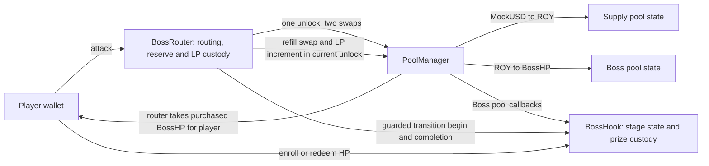

# Boss Pool technical specification

Status: BP01 implements local no-burn contracts, transferable HP redemption and the shared real-v4 fixture. Four focused cases pass: the full HP0 round/claims path, an HP1 normalized-price/refill regression, deadline setup rejection and expiry. The workspace/local read shell is separate from the still-unimplemented full game UI. Base Sepolia is the active target chain; no Base deployment exists yet. Earlier Robinhood target-chain work is historical and remains unverified.

## Architecture



The two pools are states inside one PoolManager, not separate pool contracts. ROY is a payment asset. Purchased BossHP goes to the player and its actual output counts as damage. One attack uses at most one supply-pool swap and one player Boss-pool swap. A clearing attack may additionally trigger the controller-only reverse refill, which earns no contribution.

Use two custom core contracts: BossHook and BossRouter. BossRouter combines the attack route with the stage reserve/controller responsibility. It initiates swaps and liquidity changes so the hook remains a distinct callback recipient. The pinned v4 implementation suppresses callbacks when the initiating caller is the hook itself; keeping those roles separate makes the intended checks explicit. Reuse upstream settlement and liquidity math rather than writing a new AMM or liquidity manager.

BossHook is attached to the ROY/BossHP pool. The MockUSD/ROY supply pool can use ordinary v4 behavior without a game hook. Locks on the game's supply LP allocation are enforced by its controlled position owner, not by restricting the entire supply market.

### Proposed contract boundaries

These boundaries guide the implementation. Actual BP01 source uses `BossHP`, `RoyToken`, `MockUSD` and `BossCollectibles` under `contracts/src`; generated ABI is authoritative. There is no LP/treasury/fee recovery path in this foundation, so those assets remain locked. Recovery, complete game UI and production NFT metadata remain downstream work.

| Contract | Responsibilities and custody | Main interface |
| --- | --- | --- |
| `BossHook` | Canonical pool and stage rules, sold counters, enrollment, frozen eligible supply, prize/entry ledgers, starter ROY, permanently surrendered HP, and reward/NFT eligibility | `activate`, `enroll`, `claimReward(hpAmount)`, `claimVictoryNFT`, `expire`, expired-prize recovery; authenticated v4 callbacks and router-only transition methods |
| `BossRouter` | User attack context, two-hop settlement, stage HP reserve, game-owned LP positions, recovered ROY, bounded refills and LP top-ups | `attackWithMockUSD`, PoolManager-only `unlockCallback`, hook-authorized setup; optional held-ROY route later |
| `BossHPToken` | Standard fixed-supply ERC-20; initial allocation to the controlled reserve, ordinary player transfers, no public mint or burn extension | Standard ERC-20 interface |
| `RoyToken` | Standard fixed-supply ERC-20 for LP and starter allocations | Standard ERC-20 interface |
| `RoyCollectibles` | Entry and victory NFTs in one standard ERC-721 collection; minting authorized only by BossHook | Restricted entry/victory mint methods |
| `MockUSD` | Test-only ERC-20 faucet asset | Standard ERC-20 and test faucet |

Reuse OpenZeppelin token implementations, SafeERC20, full-precision math, and a standard reentrancy guard. Reuse the pinned v4 hook interface/base and liquidity/settlement helpers. PoolManager is an existing protocol component. The two pools are records in it, not two new game contracts. No separate StageManager or reward-vault contract is required for this single-round MVP.

BossHook is the sole source of stage state. BossRouter has a bounded execution mode and authenticated active-player context, not another independent HP ledger. The game configuration fixes both pool keys, the trusted router/manager, three stage liquidity plans, fee/range parameters, prize amount, and deadline before activation. Ordinary administration cannot edit them during the fight.

Hook state includes `status`, `currentStage`, `stageSold[3]`, registered position data, `originalPrize`, `finalEligibleHP`, and `redeemedHP`. Keep `enrolled`, `hasAttacked`, and `victoryClaimed` only for the entry/NFT rules. Token payouts do not need a per-wallet damage amount or once-per-wallet token claim flag.

Use zero-based `currentStage` values 0, 1 and 2 in the contract ABI and `expectedStage`; the UI displays stage 1, 2 and 3. Keep the final index at 2 after defeat. Human stage labels in diagrams and historical prototype results are not array indices. BP01 freezes generated view/event shapes with this convention.

The router's transition sequence is a private implementation step, not an arbitrary public stage-release command. Its calls into the hook are restricted to the configured router and current transition context. The hook verifies the registered price/liquidity result before advancing the stage exactly once. A failed verification reverts the entire attack transaction.

Prize MockUSD and entry proceeds can share the hook address while maintaining separate ledgers. The prize ledger funds victory claims or the maker's expired-round refund. Attack/LP funds never borrow from it. Surrendered HP is never approved to the router or exposed through a generic recovery function. Reserve/LP HP stays under router control until the reward restrictions allow release.

### Monorepo and ownership

Use a small Bun workspace monorepo. Both teammates change one versioned set of contracts, generated ABIs, deployment metadata, and UI. Separate repositories would add version handoffs without a current independent release requirement.

| Responsibility | Planned location | Owner |
| --- | --- | --- |
| Solidity, Foundry tests, deployment and local contract artifacts | `contracts/` | A: contracts + backend |
| Generated ABIs, public chain/deployment manifest, viem helpers and types | `packages/chain/` | A, interface reviewed with B |
| Seed, liquidity scenario, smoke, and shared E2E orchestration | `scripts/` | A |
| Arena, wallet flows, game UI | `apps/web/` | B: UI + interface + gaming |

BP01 establishes this layout. Root `package.json` is private and defines workspaces for `apps/*` and `packages/*`, with one root `bun.lock`. The shared private `@boss-pool/chain` package is consumed through `workspace:*`. Root TypeScript scripts and the web app use the same package.

Foundry owns the Solidity toolchain under `contracts/`; it does not need a JavaScript workspace just to compile Solidity. Use root Bun scripts to invoke the selected Forge commands. Generated client ABIs flow from compiled contracts into the shared package. Never maintain a second handwritten ABI in the frontend.

The shared package exports only public chain definitions, verified deployment addresses/blocks, generated ABI/types, and reusable viem operations. Keep React/UI code in `apps/web`. Deployer keys and server secrets must never enter a package imported by the browser. A real deployment, not a compile, supplies addresses to the manifest.

When a contract interface changes, update its generated ABI and affected consumers in the same PR. Commit the generated client ABI so B can run the UI without deploying contracts. The root build/verification flow detects stale generation using the same export command rather than another test framework.

The root package now exposes contract build/test, ABI export/check, web dev/build, typecheck, local node/seed and read smoke commands. See the README for the current runnable sequence. Keep commands discoverable in package manifests rather than duplicating them across agent documents.

Start with direct viem reads/writes. A's backend work is contracts, deployment, scripts, and shared integration. Add a read-only service under `apps/` only when BP09 demonstrates an RPC or shared-activity need. No Turbo, Nx, database, queue, shared UI library, or extra package split is required for the core demo. [Bun workspaces](https://bun.com/docs/pm/workspaces)

The selected stack is Solidity with Foundry and Next.js App Router with React, TypeScript, Tailwind CSS, and direct viem wallet/contract access. The user selected Next.js, viem, and Tailwind CSS on 26 September 2026, and later that day selected Base Sepolia (chain ID 84532) as the active testnet target for wallet and deployment work. Chain constants derive from viem's installed `baseSepolia` definition in `packages/chain`. The current BP01 web shell still uses Vite; its migration remains implementation work. Pin compatible versions under the [implementation rules](agents/implementation.md).

### Frontend architecture

Keep the Next.js application in `apps/web`. Use `src/app/layout.tsx` for the document shell and `src/app/page.tsx` for the arena route. Put interactive arena and wallet state behind a Client Component boundary. Access injected wallet providers in browser effects or event handlers, never during module initialization or server rendering. The server does not sign player transactions or own game state. [Next.js server and client components](https://nextjs.org/docs/app/getting-started/server-and-client-components)

Use Tailwind CSS through `@tailwindcss/postcss`, with the Tailwind import and shared theme tokens in the app's global stylesheet. Use utilities for layout, responsive behavior, and interaction states. Keep custom CSS for game artwork and keyframes where needed. A component kit is optional and is not part of the selected baseline. [Tailwind CSS for Next.js](https://tailwindcss.com/docs/installation/framework-guides/nextjs)

Use a viem public client with the configured HTTP RPC for reads, simulations, and receipts. Use a viem wallet client with `custom(provider)` for the selected injected EIP-1193 provider. The browser wallet holds keys and approves requests. Keep generated ABIs, chain configuration, and reusable viem operations in `packages/chain`; keep wallet discovery, React state, and UI in `apps/web`. Start with direct viem and React state; wagmi, RainbowKit, and TanStack Query are not baseline dependencies. [Viem wallet client](https://viem.sh/docs/clients/wallet), [custom transport](https://viem.sh/docs/clients/transports/custom)

The wallet flow must handle account permission, network switching, rejection, `accountsChanged`, `chainChanged`, and disconnect events. Remove provider listeners on cleanup and discard stale player reads and quotes after an account or chain change. Recheck the selected account, chain, and expected stage before a write. Keep public round reads available without a connected wallet. [EIP-1193 provider API](https://eips.ethereum.org/EIPS/eip-1193)

Preserve the existing approval, simulation, receipt, and stale-stage rules. Enrollment approves MockUSD to BossHook; attacks approve MockUSD to BossRouter; redemption approves BossHP to BossHook. Keep victory-NFT claims separate. Derive damage and stage transitions from confirmed receipts and refreshed canonical state.

## Deployment and proof gate

Target Base Sepolia, chain ID 84532. The initial public RPC is `https://sepolia.base.org`; it is rate-limited and must be configurable before production use. Deployment requires fresh Base bytecode, deployment receipts, PoolManager/periphery provenance on Base Sepolia, selected EVM/compiler compatibility, and real transaction checks. A local proof is not testnet evidence.

Historical: the earlier target was Robinhood testnet chain ID 46630, whose documented RPC returned HTTP 403 from this environment. That evidence is retained for the record and does not prove a Base deployment.

BP01 adapts the existing compact real-v4 scenario: both swaps, ordinary BossHP delivery, cumulative purchase accounting, current-stage completion, and the reserve-funded refill/LP addition with all deltas settled. Reuse existing upstream fixtures and settlement helpers. Then verify the real target-chain route after deployment.

Choose the LP ranges, inventory buffers, paired ROY requirements, reserve budgets, fee values, and attack bounds from that scenario. They are not inherited from the discarded ROY/MROY plan. Use real token sorting and 6-decimal MockUSD / 18-decimal ROY and BossHP.

The manifest records both pool keys/IDs, addresses, provenance, deployment block, compiler/source pins, hook flags, initial price, each stage's HP quota and bounded LP plan, prefunded asset balances, unlock times, attack limits, and actual transaction evidence. Do not commit keys or imaginary addresses.

## Contracts and permissions

Use standard fixed-supply ERC-20 implementations for ROY and BossHP. Prefund BossHP and any paired ROY before activation. Stage release moves these existing assets into positions; it does not grant an unrestricted mint role. MockUSD is a test-only faucet asset.

RoyCollectibles provides the entry and victory NFTs. Enrollment and historical attack eligibility live independently of token holdings. A boolean `hasAttacked` is sufficient if the victory NFT requires prior participation; no per-wallet damage amount is needed for token payouts. Preserve once-per-wallet enrollment and independent NFT reward claims.

BossHook owns current stage, `stageSold`, frozen eligible supply, redeemed HP totals, NFT claim flags, and prize accounting. Proposed callbacks are `beforeInitialize`, `beforeAddLiquidity`, `beforeRemoveLiquidity`, `beforeSwap`, and `afterSwap`. Damage accounting returns a zero hook delta and requires no `afterSwapReturnDelta` permission. Determine and mine the final permission mask before deployment.

Every BossHook callback verifies the configured PoolManager and complete canonical Boss PoolId. The following table distinguishes game-controlled supply allocations from the hook-gated Boss pool; it does not require attaching BossHook to the supply pool:

| Operation | Supply pool | Boss pool |
| --- | --- | --- |
| Initialization | Fixed ROY/MockUSD key and seed settings | Fixed ROY/BossHP key and stage-plan settings |
| Add liquidity | Normal setup rules | Only authenticated setup/stage release matching the frozen plan |
| Remove principal | Locked from activation through deadline | Same; stage progression defaults to add-only |
| Buy | Ordinary purchase; no damage | Registered attack path, enrolled player, expected active stage |
| Reverse trade | Ordinary trade | Only the controller's bounded reserve-funded refill during transition; player sell-backs rejected |
| afterSwap | No damage or reward issuance | Actual authorized player BossHP output increments `stageSold` and enters eligible circulation; maintenance excluded |

Start with fixed 0.30% fees for the candidate math fixture. Dynamic stage fees are deferred; changing fees requires recalculating reserve and clearing costs. The refill uses the configured fee and the frozen price limit.

The hook callback sender is a router or liquidity manager, not automatically the player. BossRouter derives the player from msg.sender and maintains a bounded, non-reentrant request context. Never trust a free-form hookData player address or tx.origin. Authenticate callbacks by PoolManager, full canonical PoolId, initiating router, and the active operation mode. Apply public-entry reentrancy protection without blocking expected authenticated v4 callbacks.

Whitelisting the shared PositionManager address alone does not authenticate a stage release: other users can call it too. Validate an active release context tied to the trusted reserve/controller, canonical key, stage, position action, asset maxima, and expected owner. Reject arbitrary external LP additions to the Boss pool that bypass this plan.

## One atomic attack

Primary inputs are MockUSD input cap, minimum ROY output, minimum BossHP output/damage, expected stage, and deadline. No burn cap or physical/magic selector remains. An approval transaction may precede Attack.

1. BossRouter authenticates the wallet, validates bounds, and calls PoolManager.unlock once.
2. In unlockCallback, execute an exact-input MockUSD-to-ROY swap in the supply pool. The resulting ROY credit is intermediate payment, not damage.
3. Execute an exact-input ROY-to-BossHP swap in the Boss pool, limited to the ROY available from step 2 and the authorized request.
4. beforeSwap verifies player/context, expected stage, HP-buying direction, and the current stage's terminal price limit. No future stage is made available by this check.
5. afterSwap reads actual positive BossHP output from the swap delta, using the canonical token ordering. Enforce the player's minimum output and add the output to `stageSold[currentStage]`. Preserve participation evidence for the victory NFT. The hook takes no tokens and returns zero hook delta.
6. Validate registered-position integrity and remaining sellable HP. If exhausted, record bounded rounding residue without contribution, then mark StageCleared or final Defeated. Do not credit a zero-output call.
7. After the swap returns, settle the player's input debt, deliver purchased BossHP through the router's ordinary `take` settlement, and return unused inputs. Finish player accounting before maintenance so reserve ROY cannot cancel or refund the player's trade debt.
8. For a cleared nonfinal stage, enter guarded Transition. Reverse-swap prefunded BossHP to the lower price, take recovered ROY into reserve custody, then add the next stage's incremental LP position in the same unlock. Maintenance is excluded from all player counters.
9. Settle every actor/currency delta. LP and refill costs come solely from the frozen reserve. Open the next stage only after successful funding; no second player attack can occur within this request.
10. Close unlock successfully. Any swap, delivery, release, or settlement failure reverts the whole attack, including its counters and events.

ROY input remains in LP assets until an authorized refill exchanges reserve HP for it. BossHP supply does not decrease. Transfers do not alter stage damage, but eligible BossHP carries reward rights in the worked transferable model. Held BossHP has no direct damage action; redemption is available only after victory.

This path uses ordinary v4 output settlement and a state-only `afterSwap`, without custom output accounting. See the pinned [hook dispatch](https://github.com/Uniswap/v4-core/blob/46c6834698c48bc4a463a86d8420f4eb1d7f3b75/src/libraries/Hooks.sol) and [flash accounting](https://developers.uniswap.org/docs/protocols/v4/concepts/flash-accounting).

## Actual stage liquidity release

Stage 1 positions are funded at activation. Stage 2 and 3 assets remain in the gated reserve until their predecessors clear. Token transfers to PoolManager or a frontend stage animation do not constitute an LP release.

Use bounded explicit liquidity actions. The upstream PositionManager exposes modifyLiquiditiesWithoutUnlock for callers already inside an unlock. Do not call another unlock-opening entry point from the attack callback. Avoid deprecated from-deltas actions; prefer explicit amounts with existing slippage controls.

A position generally needs both assets when the current price lies inside its range. The same-range plan first resets to the HP-side boundary, then adds only the incremental liquidity needed for the next stage. Resetting 300 HP restores that capacity; reaching 600 requires another 300, not another 600. The same applies from 600 to 900. Hook immutable bounds are `[0,1920]` for HP0 and `[-1920,0]` for HP1, preserving the normalized price band across token ordering. HP1 refill funding includes separate input/fee rounding at tick -60. See [refill math](refill-math.md).

Release each stage allocation once. Check the pending stage, old-stage completion, reserve balances, position owner, token amounts, and expected pool. Mark the release in progress before external calls and reject reentrant attacks or repeated activation. A public caller cannot skip directly to a future stage.

Keep additions separate from LP withdrawals. Old positions stay in place through the deadline. Controller refills are explicitly permitted swaps during Transition, with frozen price limits and reserve input bounds. Each top-up uses a fresh position salt in the same range, leaving old LP fees uncollected as assumed by the funding model. Collecting or reinvesting fees requires a revised ledger.

The existing callback guard must not block its own intended authenticated LP addition. Conversely, v4 hook self-call suppression must not provide an unrestricted bypass. Preserve PoolManager authentication and the narrow release context rather than a blanket callback reentrancy guard that prevents the legitimate nested liquidity callback.

## HP quotas and liveness

Stage HP is [300, 600, 900] in BossHP base-unit equivalents. At a successful attack:

```text
hpOut = actual authorized BossHP output
stageSold[currentStage] += hpOut
at final defeat: finalEligibleHP = sum(stageSold)
```

The sum of actual player purchase outputs becomes the frozen eligible reward supply. Counters exclude reserve refills, transfers, donations, and LP actions. Nominal allocations sum to 1,800 HP; integer output may be slightly lower. Reward rights follow eligible tokens, independently of historical attack records.

Use the demonstrated finite-range strategy so the last sellable HP is reachable at a finite price. Clearing requires an activated, intact registered allocation with positive recorded sales, valid price movement, zero remaining sellable HP, and bounded inventory-versus-sales residue. Neither singleton balances nor zero active liquidity establishes a victory.

Do not require `stageSold == nominalStageHP`: rounding can leave an unsellable base-unit residue. Record it without crediting a player. Freeze a justified bound from the pinned math and permitted operation shape rather than using an arbitrary percentage threshold. Player reverse sales are prohibited, and old BossHP cannot be submitted to score again.

Each request pins expectedStage. A transaction that arrives after another player advances the stage reverts and requires a new quote. Within a clearing attack, pending-next-stage state prevents damage spilling into the next allocation.

## Funds and lifecycle

Keep these balances and authorities separate:

- MockUSD prize escrow, used only for final victory claims or the defined expired-round refund.
- Entry proceeds and starter ROY reserve.
- LP assets already committed to the two pools.
- Stage reserve of BossHP and any paired ROY required during play.
- Unallocated treasury, time-locked until at least the round deadline.

Future-stage reserve must not be trapped behind the end-of-round treasury timelock. Only the game gate may spend the staged amounts. After victory, unissued BossHP and HP fee/residue holdings cannot leave controlled custody while `redeemedHP < finalEligibleHP`, even after the deadline. LP ownership, fee collection, and recovery methods must preserve this restriction. Blocking protocol addresses from calling claim alone is insufficient because leaked HP could be transferred to another wallet. A defeated round's prize remains claimable indefinitely; this may keep unsold HP locked indefinitely too.

Ordinary LP principal withdrawals are blocked from activation through the fixed deadline, even after an early victory. During play, only the frozen controller refill can move LP ROY into reserve custody. Keep LP fees uncollected for the current math model. Recovered ROY remains game-controlled through the deadline and cannot be spent as a player refund or prize.

Enrollment and attacks stop at the deadline. If the boss survives, anyone can expire the round and the maker can reclaim the unawarded prize once. If stage 3 was defeated earlier, there is no prize refund to the maker. Entry payments and attack purchases are not refundable through expiry.

## Rewards and client interface

Use integer base units, bigint in TypeScript, and decimal strings in JSON. Freeze `originalPrize` and `finalEligibleHP = sum(stageSold)` at final defeat. The worked default is `claimReward(hpAmount)`: atomically take that many eligible BossHP into permanent claim custody and pay `floor(originalPrize * hpAmount / finalEligibleHP)` with full-precision multiplication/division. Reuse SafeERC20, guard reentrancy, update redeemed/paid totals before external calls, and revert the entire operation on any failure. Require a positive payout and cumulative redeemed HP no greater than the frozen eligible supply. Do not return, lend, approve, or withdraw redeemed HP back into circulation.

Transfers of unredeemed HP transfer reward rights. A wallet can claim again only with additional unredeemed tokens it holds; there is no once-per-wallet token claim flag. Never compute rewards from a live balance while leaving those same tokens transferable after payment. Do not shrink the denominator or use the remaining prize for later claims. Direct donations to claim custody do not count as redemptions. Integer reward dust remains locked. NFT eligibility and its once-per-wallet claim flag remain separate. The [reward calculation](refill-math.md#rewards-follow-eligible-bosshp) states the custody assumptions and the frozen-balance alternative.

Proposed actions are activate, enroll, attackWithMockUSD, activatePendingStage for the trusted router, claimReward, claimVictoryNFT, expire, and the specific post-deadline recovery methods. Optional attackWithRoy skips the supply-pool swap. There is no direct held-BossHP damage action.

Publish views for stage HP/status, `stageSold`, frozen eligible supply, redeemed HP, NFT eligibility/claim flags, pending/released stage allocations, reserve balances, LP positions, and deployment configuration. Derive token reward previews from holder balance and the frozen rate after victory; use attack events for historical damage. Emit AttackApplied with both hop amounts and actual BossHP output, followed by StageCleared and then StageLiquidityActivated/StageStarted only when the actual addition succeeds.

Use the shared chain package for all consumers. Ordinary quote and actual authenticated-attack simulation are different operations. The Boss pool cannot accept a fake quoter as BossRouter. BP01 must choose a supported route preview/full-router eth_call method that preserves authentication, then re-simulate after approval when state changed. Treat no-liquidity, out-of-range, stage-changed, and reserve errors as failures rather than fake damage.

No backend service has authority over game state. Start with direct views, receipts, and bounded event replay. The optional activity service remains outside the critical path.

## Focused verification

Use one reusable two-wallet core/E2E fixture with real v4 core. Adapt the existing refill fixture to ordinary BossHP delivery and purchase counters, then extend it through both swaps, all three stages, and both rewards.

Assert unchanged BossHP supply, output delivery equal to eligible issuance, transfers moving reward rights without new damage, one-time surrender of each redeemed token amount, locked protocol HP including after the deadline, rejection of player sell-backs, no premature future liquidity, no same-attack stage spill, reserve/player fund separation, single release per stage, and zero unsettled deltas. Extend the shared claim journey with a token transfer and redemption rather than adding a separate suite. Keep the failed-release rollback and focused access-control/expiry checks where the browser cannot reliably exercise them.

Do not add a separate simulator, exhaustive test matrix, or broad fuzz suite. Reuse focused evidence until relevant code changes. The current `BossPoolCoreTest` fixture exercises the local no-burn path; it does not establish production audit coverage or a Base Sepolia deployment.
