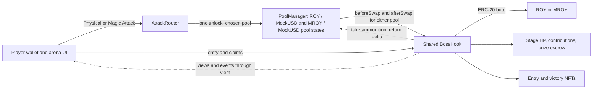

# Boss Pool technical specification

Status: proposed implementation contract, 25 September 2026. [Requirements](requirements.md) records confirmed choices; [economy](economy.md) owns candidate allocations and liquidity assumptions. The project remains unimplemented. An isolated local v4 proof passed eight core-mechanism checks, but did not verify the full application, production authentication/custody, 6/18-decimal setup, or Robinhood deployment.

## Architecture



Deploy one round, one shared hook, and two canonical pools. Each attack chooses one pool. There is no cross-pool route in the core build. A fresh deployment starts the next rehearsal.

### Monorepo and ownership

Use a small Bun workspace monorepo. Both teammates change one versioned set of contracts, generated ABIs, deployment metadata, and UI. Separate repositories would add version handoffs without a current independent release requirement.

| Responsibility | Planned location | Owner |
| --- | --- | --- |
| Solidity, Foundry tests, deployment and local contract artifacts | `contracts/` | A: contracts + backend |
| Generated ABIs, public chain/deployment manifest, viem helpers and types | `packages/chain/` | A, interface reviewed with B |
| Seed, liquidity scenario, smoke, and shared E2E orchestration | `scripts/` | A |
| Arena, wallet flows, game UI | `apps/web/` | B: UI + interface + gaming |

This is a planned layout, not an existing scaffold. Root `package.json` is private and defines workspaces for `apps/*` and `packages/*`. Keep one root `bun.lock`. Name the shared package `@boss-pool/chain`, keep it private, and consume it through `workspace:*`. Root TypeScript scripts and the web app use the same package.

Foundry owns the Solidity toolchain under `contracts/`; it does not need a JavaScript workspace just to compile Solidity. Use root Bun scripts to invoke the selected Forge commands. Generated client ABIs flow from compiled contracts into the shared package. Never maintain a second handwritten ABI in the frontend.

The shared package exports only public chain definitions, verified deployment addresses/blocks, generated ABI/types, and reusable viem operations. Keep React/UI code in `apps/web`. Deployer keys and server secrets must never enter a package imported by the browser. A real deployment, not a compile, supplies addresses to the manifest.

When a contract interface changes, update its generated ABI and affected consumers in the same PR. Commit the generated client ABI so B can run the UI without deploying contracts. The root build/verification flow detects stale generation using the same export command rather than another test framework.

BP01 adds the minimal install, contract-build/ABI-export, web-dev/build, typecheck, and targeted E2E commands. These command names are not available yet. Keep scripts discoverable in package manifests rather than duplicating them across agent documents.

Start with direct viem reads/writes. A's backend work is contracts, deployment, scripts, and shared integration. Add a read-only service under `apps/` only when BP09 demonstrates an RPC or shared-activity need. No Turbo, Nx, database, queue, shared UI library, or extra package split is required for the core demo. [Bun workspaces](https://bun.com/docs/pm/workspaces)

Solidity with Foundry and React with Vite remain the implementation defaults. Pin versions and reuse compatible official templates/libraries under the [implementation rules](agents/implementation.md).

## Deployment gate

Target chain ID is `46630`. Check the returned chain ID before sending any transaction. Native ETH pays gas, independently of game assets.

Before treating a deployment as usable:

1. Obtain an RPC that supports chain reads, logs, simulation, receipts, and transaction submission.
2. Establish PoolManager provenance. Match source/compiler information and deployed bytecode, and verify behavior.
3. If no suitable testnet deployment is found, deploy pinned v4 core on Robinhood testnet. Record that it is a team deployment. Confirm sponsor expectations for this fallback.
4. Verify the selected EVM/compiler target supports the selected v4 core, including transient storage where required.
5. Mine and deploy BossHook at an address whose flags match its callback permissions. Recompute CREATE2 salt if bytecode or constructor arguments change.
6. Initialize both sorted token pairs with dynamic-fee capability and valid tick spacing. Calculate prices with 18-decimal ammunition and 6-decimal MockUSD. Seed active liquidity independently for both pools.
7. Reuse a local real-v4 fixture to prove output-burn settlement before entry/NFT integration. Run the [liquidity scenario](economy.md) with actual decimals, ranges, fees, and attack bounds.
8. Freeze the successful candidate configuration and execute actual swaps through both testnet pools. Record callbacks and settled currency deltas. Local evidence does not replace the remote checks.

The deployment manifest contains chain ID, deployment block, explorer, PoolManager provenance, all addresses, both PoolKeys and PoolIds, decimals, actual LP ranges/allocations, attack input bounds, treasury unlock time, liquidity-removal policy, scenario results, configuration, compiler settings, source commits, bytecode hashes, and deployment transaction hashes. Keep secrets outside source control and browser bundles.

Local Anvil is the first verification environment and a labeled fallback. It does not close the Robinhood deployment requirement. The planning environment received HTTP 403 from the documented testnet RPC and verified no remote contract. See [sources](sources.md).

## Components and trust boundaries

### Ammunition and MockUSD

ROY and MROY are standard fixed-supply ERC-20 tokens with 18 decimals and a real supply-decreasing burn function. Mint the fixed initial supply at setup and reconcile LP, starter, and locked treasury allocations. No public faucet or active-round mint authority remains on either ammunition token. Stage changes release no new supply.

BossHook burns tokens it owns. The optional held-ammunition path uses a player allowance and cannot destroy arbitrary wallet balances. `PoolManager.burn` burns ERC-6909 accounting claims, not the ammunition ERC-20 supply.

MockUSD has 6 decimals and a test-only faucet. These tokens do not rebase, charge transfer fees, or invoke arbitrary receiver callbacks.

### RoyCollectibles

Use one ERC-721 collection with immutable entry/victory kind per token. Only BossHook mints. Each wallet gets at most one entry token and one victory token in this round. The demo makes both non-transferable.

BossHook stores enrollment and claim records independently of token ownership. Safe mint failure reverts the enclosing call. Keep token and NFT claims separate so an NFT receiver failure cannot prevent token redemption.

### BossHook

BossHook owns configuration, enrollment, stage, current-stage HP, per-token burn totals, weighted contributions, prize custody, and claim flags. No database computes authoritative rewards.

Proposed permissions are `beforeInitialize`, `beforeRemoveLiquidity`, `beforeSwap`, `afterSwap`, and `afterSwapReturnDelta`. Match the exact flags to the pinned v4 version and hook address. Disable unused callbacks.

- `beforeInitialize` accepts only the configured ammunition / MockUSD pairs, dynamic-fee setting, and tick spacing.
- `beforeRemoveLiquidity` rejects negative liquidity changes in either canonical pool from activation until the frozen round deadline. Zero-liquidity fee collection is allowed. The guard includes early defeat and does not depend on someone calling `expire`.
- `beforeSwap` checks authenticated attack mode when present and selects the shared stage fee.
- `afterSwap` measures volume, consumes the allowed output token, burns it, and updates boss state for an authenticated attack.
- Enrollment, terminal-state actions, and claims operate on the same hook-owned records.

Every callback authenticates PoolManager. Validate the full PoolKey / PoolId, not just token addresses. The same pair with a different fee or tick spacing is not a game pool. A swap through another pool earns no damage.

AttackRouter, collectible, token, and manager addresses are immutable or set once before activation. No administrator can edit HP, weights, stage budgets, contributions, deadlines, or reward amount after activation.

### AttackRouter

Use a dedicated attack entry point with a fixed manager and two allowed pools. First evaluate existing v4 router and settlement implementations, then adapt the smallest suitable one. Custom code must cover only the missing game-specific behavior. The public attack function derives the player from `msg.sender`, selects a pool from an enum, and records one authenticated in-flight context. Protect the request against reentrancy.

Only PoolManager may enter `unlockCallback`, and only during an active request. Exclude arbitrary external calls, arbitrary currencies, arbitrary recipients, relayers, and delegated attack beneficiaries.

The hook callback's `sender` is the router, not the player. Validate the router identity and compare attack metadata with the router's active context. Never use `tx.origin`. Never credit a frontend-supplied address without authenticated context. Use a separate router rather than making the hook initiate its own swap, because hook self-calls can skip callbacks.

For ordinary trading, support a clearly separate mode that produces no contribution. A third-party router can make an ordinary swap, but cannot forge attack-mode credit.

### Treasury and LP restrictions

Reuse a standard treasury asset timelock, such as OpenZeppelin `VestingWallet` with zero duration. Its fixed release time must be at least the round deadline. Activation verifies the intended allocations and unlock time. There is no early-unlock or upgrade path that can release that treasury ammunition during the round. A gradual vesting schedule is not required.

LP is protected separately by the `beforeRemoveLiquidity` rule above. It applies to every position in the two game pools during the lock interval, not just the maker. Disclose that withdrawal condition before accepting LP. Principal withdrawals before activation or at/after the deadline remain possible. Adding liquidity and collecting already-earned fees do not grant permission to remove locked principal.

Seed and manage positions through a separate position manager/router. BossHook must not own an unrestricted self-call path to `modifyLiquidity`, because v4 may skip hook callbacks for hook-initiated operations. Reuse the pinned v4 hook interface and helpers; the round-specific removal check is the small product rule to add. Include its permission bit before mining the final hook address.

A token timelock cannot lock an LP NFT. These controls constrain token availability and liquidity removal; neither prevents price movement or liquidity becoming inactive outside its range.

## Lifecycle and custody

```mermaid
stateDiagram-v2
    [*] --> Created
    Created --> Active1: exact prize and entry reserve funded, both pools ready
    Active1 --> Active2: stage 1 cleared; HP becomes 600
    Active2 --> Active3: stage 2 cleared; HP becomes 900
    Active3 --> Defeated: stage 3 cleared
    Active1 --> Expired: deadline reached
    Active2 --> Expired: deadline reached
    Active3 --> Expired: deadline reached
    Defeated --> Defeated: player claims
    Expired --> Expired: maker withdraws unawarded prize once
```



Store stage index, current-stage HP, three immutable HP budgets, two immutable damage multipliers, contribution totals, per-player contribution, actual burn totals by ammunition kind, deadline, and prize/claim records.

Activation validates funded prize, entry reserve, nonzero ordered configuration, positive HP budgets, allowed fee values, deadline, and both pool configurations. Initialization must use a deployment-controlled path or validate the expected initialization price to prevent front-running the seed price. Do not activate until the actual liquidity scenario passes, current seed liquidity is present, treasury allocations are locked through the deadline, and the liquidity-removal permission/guard is enabled.

Track these balances separately even when the same contract holds them:

- Original prize and outstanding reward liability.
- Entry proceeds withdrawable by the maker only after terminal state.
- Remaining physical starter-token reserve.
- PoolManager liquidity, which is not prize escrow.

Require the maker's received prize amount to equal the declared amount. Direct donations do not change the reward formula. Active-round prize withdrawal is impossible.

Entry and attacks require `block.timestamp < roundDeadline`. At or after the deadline, anyone can expire a surviving round. The maker can then withdraw the original unawarded prize once. Entry fees and burned tokens are not refunded. Show these terms before enrollment.

Defeat before the deadline stays claimable afterwards. There is no claim expiry or administrator sweep of unclaimed rewards. Withdrawals of entry proceeds or leftover starter reserves cannot consume reward liabilities.

## Damage math and stage transitions

Use 18-decimal damage base units, compatible with both ammunition tokens. A physical base unit causes one damage base unit. A magic base unit causes three. Use `bigint` in TypeScript and decimal strings in JSON.

For an exact-input attack:

```text
weight = physical ? 1 : 3
neededToClear = ceilDiv(currentStageHp, weight)
actualBurn = min(grossAmmoOutput, playerBurnCap, neededToClear)
effectiveDamage = min(actualBurn * weight, currentStageHp)
currentStageHp -= effectiveDamage
contribution[player] += effectiveDamage
totalContribution += effectiveDamage
burnedByKind[kind] += actualBurn
leftoverAmmo = grossAmmoOutput - actualBurn
```

Reject zero burn, zero damage, and damage below the player's `minDamage`. Validate multiplication and signed-delta conversion bounds. Ceil division avoids a magic attack being unable to finish a final one- or two-base-unit HP remainder. The last token base unit may supply up to two excess damage base units. Credit only effective damage. This precision effect is at most two units of 10^-18 damage, not a whole-token overcharge.

If current-stage HP reaches zero, emit StageCleared. For stages 1 and 2, increment the stage once, set the next stage's full HP, and emit StageStarted. Do not loop through stages. For stage 3, enter Defeated and freeze the contribution denominator. Unused purchased tokens return to the wallet.

Every attack includes `expectedStage`. If a competing attack advanced the stage, revert the entire transaction and ask for a fresh quote. If the stage is unchanged but remaining HP shrank, cap the burn and enforce `minDamage`. Transactions are ordered by the chain; no frontend state can reserve a hit.

Example: stage 1 has 10 damage units left. A magic attack buys 5 MROY. Burn `ceil(10e18 / 3)` MROY base units, credit exactly 10e18 damage, return the remaining MROY, and start stage 2 at 600e18 HP. No damage is applied to stage 2.

### Accounting invariants

- `totalContribution + currentStageHp + sum(futureStageBudgets) == 1800e18` while active or expired. After defeat, total contribution is 1800e18 and remaining HP is zero.
- Sum of player contributions equals total contribution.
- Each attack reduces the selected token's total supply by exactly its `actualBurn`.
- Credited damage is the burn multiplied by its weight, capped at current-stage HP. It is not raw token volume or the nominal market value of the burn.
- No stage advances twice from one attack. Stage cannot decrease.
- No contribution changes after defeat or expiry.
- Ordinary swaps, direct token transfers, and unrelated token burns create zero contribution.

## Atomic Attack flow

The primary action is an exact-input **MockUSD to selected ammunition** swap. Attack mode rejects exact-output requests and the reverse direction. ROY or MROY is therefore the unspecified output currency.

Proposed inputs are `kind`, `quoteAmountIn`, `maxAmmoToBurn`, `minGrossAmmoOut`, `minDamage`, `expectedStage`, and `deadline`. The wallet may first need to approve MockUSD to the router. Describe that approval honestly; one attack transaction does not mean a first-time user sees only one wallet prompt.

1. Router validates the request and sets player, kind, pool, stage, and bounds in its authenticated context.
2. Router enters `PoolManager.unlock` and executes a real exact-input swap through the selected pool.
3. Hook `beforeSwap` checks round, enrollment, caller/context, direction, and expected stage, then returns the current stage's fee override.
4. Hook `afterSwap` reads actual gross ammunition output from the correctly oriented BalanceDelta. Check gross-output protection and calculate accepted burn and effective damage.
5. Hook calls `PoolManager.take(ammunition, hook, actualBurn)`, destroys its actual ERC-20 ammunition, applies damage, and returns a **positive** unspecified-currency delta equal to actualBurn. Return a correctly bounded `int128` value.
6. Router receives the adjusted swap delta, settles actual MockUSD debt, and takes the remaining ammunition for the player. If prefunded input is not fully used, return the difference. Charge actual debt rather than the input cap.
7. Unlock must end with zero currency deltas. Slippage, invalid context, insufficient damage, transfer failure, or settlement failure reverts the trade, burn, stage changes, contribution, and logs together.

Prove this against real v4 core before extending the UI. Cover the actual deployed currency orientation for each ammunition pool; reuse a parameterized check if the implementation supports both orientations. A mocked manager or a simulated quote alone cannot establish correct settlement.

`minGrossAmmoOut` bounds purchased output before burn. It is different from the leftover amount the wallet receives. The UI must not present gross output as a net wallet transfer. A quote includes both.

The hook cannot access an untrusted arbitrary token. Kind selects one of two fixed tokens and its fixed multiplier. Validate the entire active context, not just a boolean attack flag. Clear context when the request ends and guard replay/reentrancy.

### Optional held-ammunition attack

A separately labeled `burnHeldAmmo` action can spend starter or leftover tokens using an allowance to BossHook. Apply the same expected-stage, deadline, burn cap, minimum-damage, and contribution rules. Insufficient balance/allowance reverts. Do not silently reduce the request to the player's balance.

This is a direct hook-contract call, **not** a swap callback. It is P1 and does not replace either primary auto-buy attack. Claims and core tests must remain valid without it.

## Shared fees and pool volume

Both pool keys are dynamic-fee pools from creation. `beforeSwap` reads the same shared stage and returns the proposed fee in v4 units: 3000, 6000, or 10000, with the required override flag. These are 0.30%, 0.60%, and 1.00%.

An attack that clears a stage pays the fee of the stage before the attack. The next swap in **either** pool pays the next stage's fee. Before activation and after defeat or expiry, ordinary trades use the base fee. Treat a reached round deadline as inactive even before anyone calls expire. Attack mode remains disabled outside the active interval.

`afterSwap` records the absolute MockUSD leg once for the canonical pool. Maintain volume by pool and optionally sum those same-currency values. Do not add ROY units to MROY or MockUSD units. Do not count the burn as another swap. Volume is manipulable and gives no reward weight.

Ordinary buys and sells can execute without enrollment and without contribution. A normal trade returns zero game-related hook delta. Malformed attack metadata cannot be treated as authenticated credit.

## Reward math

At final defeat, freeze the original prize and final contribution denominator. Payout is:

```text
payout[player] = floor(originalPrize * contribution[player] / finalTotalContribution)
shareBps[player] = floor(contribution[player] * 10_000 / finalTotalContribution)
```

Use full-precision integer multiply/divide with floor rounding. The UI can display basis points, but never calculate the actual payout from a rounded percentage.

With 1,000 MockUSD and damage contributions 800, 600, and 400, payouts are 444.444444, 333.333333, and 222.222222 MockUSD. One MockUSD base unit remains locked. There is no last-hit bonus.

Each player claims to their own wallet. Set the token-claim marker before transfer and protect the entry point against reentrancy. A separate victory claim checks positive contribution and mints one NFT. No current NFT holding check can move or erase earned rewards. A contributor with a zero-rounded token payout can still mint the NFT.

Required custody invariants are `sum(claims) <= originalPrize` and balance covering outstanding prize plus unwithdrawn entry proceeds. Claim order cannot change another player's entitlement.

## Teammate interface contract

The first slice freezes concrete ABI/types and sample event payloads. These names are proposals, not existing APIs.

| Operation | Inputs | Result |
| --- | --- | --- |
| `activate` | Validated configuration and exact funding | Stage 1, funded prize, frozen rules |
| `enroll` | Wallet call after fee approval | Entry NFT, 100 physical ROY, enrollment |
| `attack` | Kind, input cap, burn cap, minimum gross output, minimum damage, expected stage, request deadline | Atomic buy/burn, damage, possible stage clear, leftovers |
| `swap` | Kind/pool, direction, input amount, minimum output, deadline | Ordinary trade, zero contribution |
| `burnHeldAmmo` | Kind, amount cap, minimum damage, expected stage, deadline | Optional inventory burn |
| `claimReward` | Wallet call | MockUSD entitlement once |
| `claimVictoryNFT` | Wallet call | Victory NFT once |
| `expire` | Permissionless after round deadline | Expired state if not defeated |
| `withdrawExpiredPrize` | Maker call | One refund of the unawarded prize |
| `getBossState` | Read, preferably at a specified block | Status, stage, stage budgets/HP, fees, totals, prize, deadline |
| `getPlayerState` | Player address | Enrollment, contribution, claimable token amount, both claim flags |

Client errors distinguish wrong network, missing entry, low allowance/balance, changed stage, expired request, inactive round, wrong pool/router, slippage, insufficient damage, duplicate claim, and unauthorized withdrawal.

### Events

Scope all logs by chain ID and hook address. No separate round registry is needed for a one-round deployment.

| Event | Required fields |
| --- | --- |
| `BossActivated` | Maker, exact prize, stage HP budgets, deadline, configuration hash |
| `PlayerEnrolled` | Player, entry token ID, paid amount, physical starter allocation |
| `AttackApplied` | Player, kind, mode, stage before, actual burn, effective damage, stage HP after damage, player/total contribution |
| `StageCleared` | Cleared stage, player, total contribution |
| `StageStarted` | New stage, its full HP budget |
| `BossDefeated` | Final contribution, funded prize |
| `RewardClaimed` | Player, exact amount |
| `VictoryNFTClaimed` | Player, token ID |
| `BossExpired` | Current stage, remaining HP, timestamp |
| `ExpiredPrizeWithdrawn` | Maker, amount |
| `SwapObserved` | Pool ID, ammunition kind, actual MockUSD volume, gross ammunition amount, action mode |

For a stage-clearing attack, emit AttackApplied with zero HP for the completed stage, then StageCleared, then StageStarted or BossDefeated. Contract views immediately show the new stage. The UI queues the transition without inventing extra hits.

## Client and optional backend

Use viem public and wallet clients, a checked chain definition, generated ABIs, integer unit parsing, simulation, signed writes, and receipt confirmation. Handle replaced/cancelled transactions and wallet/chain changes. Prevent duplicate submissions from the same visible action while its result is unknown.

A preview does not reserve the stage or price. Use an ordinary, zero-contribution quote path to estimate gross output and derive expected burn/damage from a consistent state snapshot. A standard quoter is not the authenticated AttackRouter; do not weaken attack authentication to make it work. After allowance exists, simulate the real attack request and return a typed summary of spend, gross output, burn, damage, and leftovers. Re-simulate after approval if state changed, then enforce onchain bounds. Decode confirmed receipt logs before updating canonical HP. Pending effects must not alter claim calculations.

Core UI reads views and bounded log ranges directly through `@boss-pool/chain`. No backend service is part of the core scaffold. Bun supplies workspace tooling, viem scripts, and fixtures. If BP09 demonstrates the need, an optional read-only Bun process can build recent activity and a global leaderboard. It has no signing key, write endpoint, or authority over rewards.

For this small demo, an in-memory projection replayable from the deployment block is enough. Do not add Redis, a queue, or an external database by default. Responses identify chain, hook address, indexed block/hash, and stale status. Integers serialize as decimal strings. Re-read claimable amounts from the contract before a claim.

Deduplicate by chain, block hash, transaction hash, and log index. Apply events in block/transaction/log order. Backfill bounded ranges and rescan overlap. Detect replaced block hashes, roll back affected projections, and replay. Document confirmation depth and verify its meaning on Robinhood testnet.

An RPC failure displays stale data, not zero HP or cleared claim flags. A backend outage falls back to direct reads. The browser never accepts arbitrary metadata as HTML.

## Required verification

Follow the [testing rules](agents/testing.md). The main evidence is one reusable two-wallet E2E journey through funding, entry, both attacks, all three stages, and token/NFT claims against real v4 core.

Assert receipts, actual token supply/balance changes, returned ammunition, weighted contribution, shared stage fees, and payouts within that journey. Use a compact contract integration scenario for the core failures that the browser journey cannot reliably exercise: settlement rollback, unauthorized damage, a stage race, duplicate or premature claims, treasury/LP withdrawal before and after the deadline, and expiry/refund accounting. Reuse that fixture for the few liquidity scenario configurations rather than building another suite.

Reuse fixtures and evidence across issues. Cover the actual deployed token order and 6/18-decimal amounts; add alternate orders or a small fuzz check when needed to resolve a concrete arithmetic or settlement risk. A broad fuzz suite and separate tests for every helper, UI state, or upstream library behavior are not default requirements.

Ordinary trades, direct token transfers, and token burns outside the game must never create contribution. These correctness rules remain required even when several are verified in one scenario. Attach the tested commit and meaningful E2E/core evidence when closing an implementation issue. No project implementation test has run yet.
