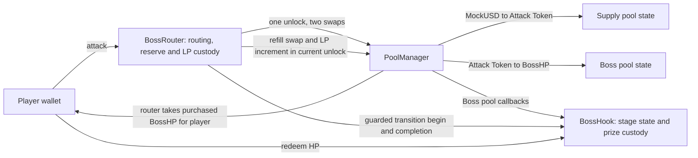

# Boss Pool technical specification

Status (26 September 2026): The no-burn, no-entry contracts, transferable HP redemption, and public real-v4 fixture are implemented. Five focused Foundry cases pass, including direct fresh-wallet attacks and quote non-persistence. The Next.js player UI and shared viem SDK support direct attacks. The current local SDK journey passed with 14 successful transactions at commit `3450be7`. The earlier local 18-transaction journey and Robinhood 16+2 receipts used enrollment-era source and are historical evidence only. A team-owned non-production fixture is now verified on Base Sepolia `84532` at block `47325823`; its manifest is `apps/web/public/deployments/base-sepolia.json`. The fixture deploys its own pinned v4-core PoolManager, and no Base Sepolia player E2E has been verified. See the [contract usage guide](contract-usage.md), [SDK verification record](sdk-verification.md), and [historical foundation report](testnet-verification.md).

## Architecture



The two pools are states inside one PoolManager, not separate pool contracts. Attack Token is a payment asset. Purchased BossHP goes to the player and its actual output counts as damage. One attack uses at most one supply-pool swap and one player Boss-pool swap. A clearing attack may additionally trigger the controller-only reverse refill, which earns no contribution.

Use two custom core contracts: BossHook and BossRouter. BossRouter combines the attack route with the stage reserve/controller responsibility. It initiates swaps and liquidity changes so the hook remains a distinct callback recipient. The pinned v4 implementation suppresses callbacks when the initiating caller is the hook itself; keeping those roles separate makes the intended checks explicit. Reuse upstream settlement and liquidity math rather than writing a new AMM or liquidity manager.

BossHook is attached to the Attack Token/BossHP pool. The MockUSD/Attack Token supply pool can use ordinary v4 behavior without a game hook. Locks on the game's supply LP allocation are enforced by its controlled position owner, not by restricting the entire supply market.

### Proposed contract boundaries

Actual source uses `BossHP`, `RoyToken`, `MockUSD`, and `BossCollectibles` under `contracts/src`; the generated ABI is authoritative. There is no LP, treasury, or fee recovery path, so those assets remain locked. Production NFT metadata remains unimplemented.

| Contract | Responsibilities and custody | Main interface |
| --- | --- | --- |
| `BossHook` | Canonical pool and stage rules, sold counters, frozen eligible supply, prize ledger, permanently surrendered HP, and optional victory-NFT eligibility | `activate`, `claimReward(hpAmount)`, `claimVictoryNFT`, `expire`, expired-prize recovery; authenticated v4 callbacks and router-only transition methods |
| `BossRouter` | User attack context, two-hop settlement, stage HP reserve, game-owned LP positions, recovered Attack Token, bounded refills and LP top-ups | Public `quoteAttackWithMockUSD`, authenticated `attackWithMockUSD`, PoolManager-only `unlockCallback`, hook-authorized setup; optional held-Attack Token route later |
| `BossHP` | Standard fixed-supply ERC-20; initial allocation to the controlled reserve, ordinary player transfers, no public mint or burn extension | Standard ERC-20 interface |
| `RoyToken` | Standard fixed-supply ERC-20 for LP and locked Router reserve | Standard ERC-20 interface |
| `BossCollectibles` | Optional victory NFTs in one standard ERC-721 collection; minting authorized only by BossHook | Restricted victory mint method |
| `MockUSD` | Test-only ERC-20 faucet asset | Standard ERC-20 and test faucet |

Reuse OpenZeppelin token implementations, SafeERC20, full-precision math, and a standard reentrancy guard. Reuse the pinned v4 hook interface/base and liquidity/settlement helpers. PoolManager is an existing protocol component. The two pools are records in it, not two new game contracts. No separate StageManager or reward-vault contract is required for this single-round MVP.

BossHook is the sole source of stage state. BossRouter has a bounded execution mode and authenticated active-player context, not another independent HP ledger. The game configuration fixes both pool keys, the trusted router/manager, three stage liquidity plans, fee/range parameters, prize amount, and deadline before activation. Ordinary administration cannot edit them during the fight.

Hook state includes `status`, `currentStage`, `stageSold[3]`, registered position data, `originalPrize`, `finalEligibleHP`, and `redeemedHP`. Keep `hasAttacked` and `victoryClaimed` for optional victory-NFT eligibility only. Token payouts do not need a per-wallet damage amount or once-per-wallet token claim flag.

Use zero-based `currentStage` values 0, 1 and 2 in the contract ABI and `expectedStage`; the UI displays stage 1, 2 and 3. Keep the final index at 2 after defeat. Human stage labels in diagrams and historical prototype results are not array indices. BP01 freezes generated view/event shapes with this convention.

The router's transition sequence is a private implementation step, not an arbitrary public stage-release command. Its calls into the hook are restricted to the configured router and current transition context. The hook verifies the registered price/liquidity result before advancing the stage exactly once. A failed verification reverts the entire attack transaction.

The Hook holds the prize MockUSD. The prize ledger funds victory claims or the maker's expired-round refund. Attack and LP funds never borrow from it. Surrendered HP is never approved to the Router or exposed through a generic recovery function. Reserve and LP HP stay under Router control.

### Monorepo and ownership

Use a small Bun workspace monorepo. Both teammates change one versioned set of contracts, generated ABIs, deployment metadata, and UI. Separate repositories would add version handoffs without a current independent release requirement.

| Responsibility | Planned location | Owner |
| --- | --- | --- |
| Solidity, Foundry tests, deployment and local contract artifacts | `contracts/` | A: contracts + backend |
| Generated ABIs, public chain/deployment manifest, viem helpers and types | `packages/chain/` | A, interface reviewed with B |
| Seed, liquidity scenario, smoke, and shared E2E orchestration | `scripts/` | A |
| Arena, wallet flows, game UI | `apps/web/` | B: UI + interface + gaming |

BP01 establishes this layout. Root `package.json` is private and defines workspaces for `apps/*` and `packages/*`, with one root `bun.lock`. The shared private `@boss-pool/chain` package is consumed through `workspace:*`. Root TypeScript scripts and the web app use the same package.

Foundry owns the Solidity toolchain under `contracts/`; it does not need a JavaScript workspace just to compile Solidity. Use root Bun scripts to invoke the selected Forge commands. Generated client ABIs flow from compiled contracts into the shared package. Never maintain a second handwritten ABI in the frontend.

The shared package exports only public chain definitions, verified deployment addresses/blocks, generated ABI/types, and reusable viem operations. Keep React/UI code in `apps/web`. Deployer keys and server secrets must never enter a package imported by the browser. A real deployment, not a compile, supplies addresses to the manifest.

When a contract interface changes, update its generated ABI and affected consumers in the same PR. Commit the generated client ABI so B can run the UI without deploying contracts. The root build/verification flow detects stale generation using the same export command rather than another test framework.

The root package now exposes contract build/test, ABI export/check, web dev/build, typecheck, local node/seed and read smoke commands. See the README for the current runnable sequence. Keep commands discoverable in package manifests rather than duplicating them across agent documents.

Start with direct viem reads/writes. A's backend work is contracts, deployment, scripts, and shared integration. Add a read-only service under `apps/` only when BP09 demonstrates an RPC or shared-activity need. No Turbo, Nx, database, queue, shared UI library, or extra package split is required for the core demo. [Bun workspaces](https://bun.com/docs/pm/workspaces)

The implemented stack is Solidity with Foundry and Next.js App Router with React, TypeScript, Tailwind CSS, Phaser, and direct viem wallet/contract access. The app reads without a wallet and offers a public attack quote before wallet connection or approval. Fresh wallets can attack after Router approval. Pin dependency versions under the [implementation rules](agents/implementation.md).

### Frontend architecture

Keep the Next.js application in `apps/web`. Use `src/app/layout.tsx` for the document shell and `src/app/page.tsx` for the arena route. Put interactive arena and wallet state behind a Client Component boundary. Access injected wallet providers in browser effects or event handlers, never during module initialization or server rendering. The server does not sign player transactions or own game state. [Next.js server and client components](https://nextjs.org/docs/app/getting-started/server-and-client-components)

Use Tailwind CSS through `@tailwindcss/postcss`, with the Tailwind import and shared theme tokens in the app's global stylesheet. Use utilities for layout, responsive behavior, and interaction states. Keep custom CSS for game artwork and keyframes where needed. A component kit is optional and is not part of the selected baseline. [Tailwind CSS for Next.js](https://tailwindcss.com/docs/installation/framework-guides/nextjs)

Use a viem public client with the configured HTTP RPC for reads, simulations, and receipts. Use a viem wallet client with `custom(provider)` for the selected injected EIP-1193 provider. The browser wallet holds keys and approves requests. Keep generated ABIs, chain configuration, and reusable viem operations in `packages/chain`; keep wallet discovery, React state, and UI in `apps/web`. Start with direct viem and React state; wagmi, RainbowKit, and TanStack Query are not baseline dependencies. [Viem wallet client](https://viem.sh/docs/clients/wallet), [custom transport](https://viem.sh/docs/clients/transports/custom)

The wallet flow requests accounts, detects account and chain changes, offers a chain switch, and clears stale player state and quotes after changes. Each write checks the selected account, chain, deployment, and expected stage. Public round reads and quotes remain available without a wallet. Manual browser-wallet popup acceptance remains open; see the [SDK verification checklist](sdk-verification.md#manual-browser-wallet-checklist). [EIP-1193 provider API](https://eips.ethereum.org/EIPS/eip-1193)

Preserve the existing approval, simulation, receipt, and stale-stage rules. Attacks approve MockUSD to BossRouter; redemption approves BossHP to BossHook. Keep optional victory-NFT claims separate. Derive damage and stage transitions from confirmed receipts and refreshed canonical state.

### Live battle page context

`/mock-battle` now consumes the live SDK while retaining its existing URL. [Live battle page requirements](requirements.md#live-battle-page) owns the user flow. The route uses the selected verified deployment and has no simulated-damage fallback.

The page represents one shared, deployed Boss Pool round. The lake arena, player sprite, Attack Token boss forms, pixel windows, command menu, and dialog describe that encounter. Attack Token in the nameplate is the boss identity; its displayed level follows the stage. The nameplate is not the connected wallet's identity or a separate player progression system. On-chain stage indices are zero-based; labels and artwork use stages 1 through 3.

The existing integration code provides the starting points:

| File | Current responsibility | Role in the live page |
| --- | --- | --- |
| [`mock-battle/page.tsx`](../apps/web/src/app/mock-battle/page.tsx) | Reads the selected network from route parameters and renders `BattlePage`; exit navigates to `/`. | Route entry for the live battle controller. |
| [`BattleView.tsx`](../apps/web/src/components/battle/BattleView.tsx) | `BattlePage` selects the route's network. `BattleView` renders the arena, controls, native action dialog, and confirmed effects. | Round and player state come from the shared provider and SDK. |
| [`BossPoolProvider.tsx`](../apps/web/src/components/BossPoolProvider.tsx) | Owns one `useBossPool` instance in the root layout. | Wallet prompts, the write lock, and receipt recovery survive route navigation. |
| [`useBossPool.ts`](../apps/web/src/lib/useBossPool.ts) | Verifies deployments, manages the injected wallet, polls every five seconds, and saves pending requests. | Existing owner of SDK access, refresh, `runPending`, and `resumePending`. |
| [`BossActions.tsx`](../apps/web/src/components/BossActions.tsx) | Implements the fixed 1 MockUSD cap, quote freshness, approval, attack, reward, NFT, faucet, and receipt recovery actions. | The hub and battle use the same component. |
| [`GameShell.tsx`](../apps/web/src/components/GameShell.tsx) and [`BossEntryPanel.tsx`](../apps/web/src/components/BossEntryPanel.tsx) | The hub uses the shared arena and links to the battle with the selected network. | The shared `confirmedBattleAttack` helper scopes receipt effects in both views. |
| [`reads.ts`](../packages/chain/src/reads.ts) and [`sdk.ts`](../packages/chain/src/sdk.ts) | Export `RoundSnapshot`, `PlayerSnapshot`, quotes, writes, decoded receipt events, and recovery. | Authoritative application interface through `@boss-pool/chain`. |

`layout.tsx` supplies one `BossPoolProvider` to both routes. Leaving the battle during an open wallet prompt does not unmount the transaction controller or release its write lock. Once the wallet supplies a hash, the same controller saves and follows the receipt even when the hub is visible. A full browser refresh recovers submitted requests from storage. Presentation components receive the shared arena state and keep no independent on-chain HP ledger.

The screen data maps as follows:

| Screen element | Live source | Meaning and limits |
| --- | --- | --- |
| Boss HP | `round.remainingSellableHP`, `round.stageCapacity[round.currentStage]` | Remaining purchasable HP against the current nominal capacity. Rounded display values do not determine stage completion. |
| Stage dots, Attack Token level, boss form | `round.currentStage` and `round.status` | One shared round with three forms. The existing art order is form-b, form-a, then form-c. |
| Round deadline | `round.deadline`, `round.blockTimestamp`, snapshot receipt time | Countdown derived from the chain deadline. Elapsed local time can animate the countdown between reads; it cannot reset the deadline or authorize an attack. |
| Player HP during the fight | `player.bossHPBalance` | Current reward-bearing holdings, labeled YOUR HP until defeat. Disconnected wallets show a connect prompt or unavailable value. |
| Reward share after defeat | `player.bossHPBalance / round.finalEligibleHP` | Share of the original prize represented by current unredeemed holdings. The denominator stays fixed after claims. No percentage is calculated with a zero denominator. |
| Reward preview | `sdk.previewReward(hpAmount, account)` | Payout for the selected redemption amount, with SDK claimability checks. MockUSD uses six decimals; Attack Token and BossHP use eighteen. |
| Hit message and hit animation | Confirmed `AttackResult.bossHPOut` or the matching decoded `AttackRecorded` event | Actual output of that attack. A quote supplies a preview only. |
| Historical contribution | Confirmed `AttackRecorded` events for the wallet and deployment | `PlayerSnapshot` contains `hasAttacked`, not a historical damage total. A full history requires bounded event replay; session receipts alone cannot supply lifetime contribution. |
| Network and read status | `arena.network`, `arena.deployment`, snapshot block | The selected network and actual availability replace mock labels. `Uniswap v4` alone does not identify the network or establish a live read. |

The mock's `sum(stageSold) / MOCK_FINAL_ELIGIBLE_HP` bar measures shared progress and cannot become a wallet reward share. Its victory card also assumes one player owns every eligible token. Those assumptions disappear in the live mapping. A contribution field can remain unavailable until event history is available; a wallet balance cannot fill that gap.

An external purchase or transfer of the same round's BossHP changes `player.bossHPBalance`, which the existing state poll refreshes. It does not change `stageSold`, `finalEligibleHP`, or attack history. Reward claims use the current holder's surrendered amount, with `payout = floor(originalPrize * hpAmount / finalEligibleHP)`. Only the denominator freezes at defeat; wallet balances remain transferable. The price paid in an external market does not enter this calculation.

For an illustrative final supply of 1,800 eligible BossHP and a 1,000 MockUSD prize, a buyer who acquires and redeems 180 BossHP receives 100 MockUSD. The seller gives up those same reward rights. Redemption moves the 180 BossHP into permanent custody, preventing another sale and claim of those tokens. This works for a buyer with no attack history; the optional victory NFT still requires that wallet's own attack participation.

BossHP is a fungible ERC-20 without per-token provenance. The eligibility rule relies on unsold reserve and fee HP staying in controlled custody, as specified in [reward accounting](refill-math.md#rewards-follow-eligible-bosshp). If those tokens leaked into public circulation, the claim function could not distinguish them from player-issued HP. The page and SDK use the verified deployment's BossHP address; a token with the same name from another contract has no claim rights in this round.

The action flow reuses these SDK operations:

| Player step | Existing operation | Page result |
| --- | --- | --- |
| Open battle | `arena.deployment` from `sdk.readState(account?)` | Public round state renders before wallet connection. |
| Review attack | `sdk.quoteAttack({ maxMockUSD: 1_000_000n, stage, account, slippageBps })` | Uses the agreed 1 MockUSD cap in six-decimal base units. Shows `AttackQuote` spend, intermediate Attack Token, refunds, BossHP output, output floors, expiry, and predicted stage result. |
| Connect or switch network | `arena.connect()` or `arena.switchToSelectedNetwork()` | Refreshes wallet data and invalidates quotes bound to an earlier account or network. |
| Check attack allowance | `sdk.getApproval({ kind: "attack", maxMockUSD }, account)` | Shows whether MockUSD approval to BossRouter is required. |
| Approve MockUSD | `arena.runPending(label, () => sdk.approve(action))` | Separate wallet action. The SDK currently requests an unlimited allowance; the UI identifies the token, spender, and scope. |
| Confirm attack | `arena.runPending("Attack", () => sdk.attack(quote))` | The SDK simulates the authenticated call, then submits the accepted bounds. A confirmed result supplies the actual attack amounts. |
| Recover receipt | `arena.resumePending()` | Checks the saved request against its original deployment without resubmitting the attack. |
| Redeem reward | `previewReward`, claim `getApproval` and `approve`, then `claimReward(hpAmount)` through `runPending` | Surrenders selected BossHP to permanent custody and pays the proportional MockUSD reward. |
| Claim optional NFT | `sdk.claimVictoryNFT()` through `runPending` | Separate action subject to `hasAttacked` and `victoryClaimed`. Holding transferred BossHP alone does not establish NFT eligibility. |
| Obtain test funds when needed | `sdk.faucetMockUSD(amount)` through `runPending` | Existing test-only funding action. Its current UI amount is 100 MockUSD; its location in the battle flow remains a UI choice. |

The live page and hub use a fixed cap of 1 MockUSD per attack, with no amount editor or preset selector. Its SDK value is `1_000_000n`, because MockUSD uses six decimals. Shared action logic uses 100 basis points of slippage, and the SDK defaults to a five-minute quote lifetime bounded by the round deadline. The player's MockUSD balance must cover the cap. Actual spend can be lower when a stage clears, and unused MockUSD and intermediate Attack Token are returned. A fixed cap does not produce fixed damage.

Quote freshness follows the existing checks in `BossActions`. Configured cap, account, wallet chain, selected deployment, stage, observed stage sales or boss price, and elapsed quote lifetime can invalidate the preview. `sdk.attack` then enforces the accepted output floors with a fresh authenticated simulation. A changed quote requires another review; a failed simulation never authorizes looser output floors automatically.

Transaction progress drives the dialog. Local timers can dismiss a hit message or animate a confirmed stage change, but they do not create confirmation or mutate round state:

| State | Page behavior |
| --- | --- |
| Deployment loading, missing, or RPC error | Shows the actual availability state and a retry or network action. No mock HP, deadline, or damage fills failed reads. |
| Setup or stage transition | Shows the confirmed status; new attacks are unavailable until the round is Active. |
| Quote loading or ready | Shows preview feedback with no damage applied. |
| Wallet action in progress | Identifies approval, attack, or claim. Existing `WriteState.prompting` covers preparation and the wallet prompt together; it is not evidence that the wallet dialog is already open. |
| Submitted or unresolved | Shows the transaction hash and receipt status. The saved request blocks duplicate writes. A timeout means unresolved, not reverted. |
| Confirmed attack | Shows actual damage and refreshes canonical state. Effects belong to the matching deployment and account and deduplicate by transaction hash and log index. |
| Rejected, reverted, replaced, or failed | Explains the result and offers the appropriate retry or receipt action. No new hit is invented. |
| Requote required | Invalidates the accepted preview and returns to quote review. |
| Defeated | Shows confirmed victory and wallet-specific reward actions, including a visit after someone else delivered the final hit. Defeat takes precedence over countdown expiry; reward claims remain available after the deadline. |
| Deadline reached or Expired | Stops new attacks, retains pending receipt recovery, and shows the round outcome. Local countdown expiry does not itself submit `expire` or change contract status. |

One confirmed attack can clear a stage and activate the next stage atomically. Polling may see stage 1 followed directly by stage 2 without ever observing status 2. `StageCleared`, `StageActivated`, and `BossDefeated` events in the receipt provide the animation sequence. The attack's `stage` identifies where its damage belongs; a refreshed `currentStage` may already refer to the next form. The controller never applies damage twice or spills it into the next stage. Fresh snapshots also reflect attacks from other wallets, without claiming that the local player caused them.

Leaving the page changes navigation only. Once a hash is saved, the existing pending record supports receipt recovery after refresh or return. Escape closes an inner quote or claim panel before closing the battle. Focus returns to the initiating control, transaction results use accessible live messages, and the countdown does not announce every second. Existing reduced-motion handling applies to battle effects.

The mock reducer, timer-driven attack hook, and mock badge are removed. [`battle.ts`](../apps/web/src/lib/battle.ts) contains the shared receipt-effect filter and deadline calculation. Confirmed receipts keep their original stage and exact damage, even when the refreshed round has already advanced. Quote, signature, and receipt timing follows the actual SDK operations. Repeated reads of an unchanged block timestamp retain their clock anchor so the countdown continues between polls.

The SDK exposes both configured pool fee rates in `RoundSnapshot` and `AttackQuote`, read from the Router's pool keys at the snapshot block. Quote review shows both rates. The newly available paginated `readActivity` API can supply historical contribution, but the battle's current HUD displays wallet holdings and rewards only. It does not sum an incomplete session history or count transfer events as attacks.

Base Sepolia is the default target, and the published deployment manifest is included. Local Anvil remains available for integration with a real deployed fixture; historical Robinhood is read-only. Missing manifests and failed verification still produce unavailable states. Browser and local-chain verification are recorded separately in the PR; this integration does not broadcast transactions to Base Sepolia.

## Deployment and proof gate

The target is Base Sepolia chain ID `84532` at `https://sepolia.base.org`. The verified team deployment is recorded in `apps/web/public/deployments/base-sepolia.json` at block `47325823`. It uses its own PoolManager built from pinned v4-core source; it is not an official Base PoolManager. The team-deployed Robinhood fixture remains historical evidence and does not represent an official Robinhood manager.

BP01 adapts the existing compact real-v4 scenario: both swaps, ordinary BossHP delivery, cumulative purchase accounting, current-stage completion, and the reserve-funded refill/LP addition with all deltas settled. Reuse existing upstream fixtures and settlement helpers. Then verify the real target-chain route after deployment.

Choose the LP ranges, inventory buffers, paired Attack Token requirements, reserve budgets, fee values, and attack bounds from that scenario. They are not inherited from the discarded Attack Token/MROY plan. Use real token sorting and 6-decimal MockUSD / 18-decimal Attack Token and BossHP.

The manifest records both pool keys/IDs, addresses, provenance, deployment block, compiler/source pins, hook flags, initial price, each stage's HP quota and bounded LP plan, prefunded asset balances, unlock times, attack limits, and actual transaction evidence. Do not commit keys or imaginary addresses.

## Contracts and permissions

Use standard fixed-supply ERC-20 implementations for Attack Token and BossHP. Prefund BossHP and any paired Attack Token before activation. Stage release moves these existing assets into positions; it does not grant an unrestricted mint role. MockUSD is a test-only faucet asset.

BossCollectibles provides optional victory NFTs. Historical attack eligibility lives independently of token holdings. A boolean `hasAttacked` is sufficient when victory-NFT eligibility requires prior participation; no per-wallet damage amount is needed for token payouts.

BossHook owns current stage, `stageSold`, frozen eligible supply, redeemed HP totals, NFT claim flags, and prize accounting. Proposed callbacks are `beforeInitialize`, `beforeAddLiquidity`, `beforeRemoveLiquidity`, `beforeSwap`, and `afterSwap`. Damage accounting returns a zero hook delta and requires no `afterSwapReturnDelta` permission. Determine and mine the final permission mask before deployment.

Every BossHook callback verifies the configured PoolManager and complete canonical Boss PoolId. The following table distinguishes game-controlled supply allocations from the hook-gated Boss pool; it does not require attaching BossHook to the supply pool:

| Operation | Supply pool | Boss pool |
| --- | --- | --- |
| Initialization | Fixed Attack Token/MockUSD key and seed settings | Fixed Attack Token/BossHP key and stage-plan settings |
| Add liquidity | Normal setup rules | Only authenticated setup/stage release matching the frozen plan |
| Remove principal | Locked from activation through deadline | Same; stage progression defaults to add-only |
| Buy | Ordinary purchase; no damage | Registered attack path, fresh wallet, expected active stage |
| Reverse trade | Ordinary trade | Only the controller's bounded reserve-funded refill during transition; player sell-backs rejected |
| afterSwap | No damage or reward issuance | Actual authorized player BossHP output increments `stageSold` and enters eligible circulation; maintenance excluded |

Start with fixed 0.30% fees for the candidate math fixture. Dynamic stage fees are deferred; changing fees requires recalculating reserve and clearing costs. The refill uses the configured fee and the frozen price limit.

The hook callback sender is a router or liquidity manager, not automatically the player. BossRouter derives the player from msg.sender and maintains a bounded, non-reentrant request context. Never trust a free-form hookData player address or tx.origin. Authenticate callbacks by PoolManager, full canonical PoolId, initiating router, and the active operation mode. Apply public-entry reentrancy protection without blocking expected authenticated v4 callbacks.

Whitelisting the shared PositionManager address alone does not authenticate a stage release: other users can call it too. Validate an active release context tied to the trusted reserve/controller, canonical key, stage, position action, asset maxima, and expected owner. Reject arbitrary external LP additions to the Boss pool that bypass this plan.

## One atomic attack

Primary inputs are MockUSD input cap, minimum Attack Token output, minimum BossHP output/damage, expected stage, and deadline. No burn cap or physical/magic selector remains. An approval transaction may precede Attack.

1. BossRouter authenticates the wallet, validates bounds, and calls PoolManager.unlock once.
2. In unlockCallback, execute an exact-input MockUSD-to-Attack Token swap in the supply pool. The resulting Attack Token credit is intermediate payment, not damage.
3. Execute an exact-input Attack Token-to-BossHP swap in the Boss pool, limited to the Attack Token available from step 2 and the authorized request.
4. beforeSwap verifies player/context, expected stage, HP-buying direction, and the current stage's terminal price limit. No future stage is made available by this check.
5. afterSwap reads actual positive BossHP output from the swap delta, using the canonical token ordering. Enforce the player's minimum output and add the output to `stageSold[currentStage]`. Preserve participation evidence for the victory NFT. The hook takes no tokens and returns zero hook delta.
6. Validate registered-position integrity and remaining sellable HP. If exhausted, record bounded rounding residue without contribution, then mark StageCleared or final Defeated. Do not credit a zero-output call.
7. After the swap returns, settle the player's input debt, deliver purchased BossHP through the router's ordinary `take` settlement, and return unused inputs. Finish player accounting before maintenance so reserve Attack Token cannot cancel or refund the player's trade debt.
8. For a cleared nonfinal stage, enter guarded Transition. Reverse-swap prefunded BossHP to the lower price, take recovered Attack Token into reserve custody, then add the next stage's incremental LP position in the same unlock. Maintenance is excluded from all player counters.
9. Settle every actor/currency delta. LP and refill costs come solely from the frozen reserve. Open the next stage only after successful funding; no second player attack can occur within this request.
10. Close unlock successfully. Any swap, delivery, release, or settlement failure reverts the whole attack, including its counters and events.

Attack Token input remains in LP assets until an authorized refill exchanges reserve HP for it. BossHP supply does not decrease. Transfers do not alter stage damage, but eligible BossHP carries reward rights in the worked transferable model. Held BossHP has no direct damage action; redemption is available only after victory.

This path uses ordinary v4 output settlement and a state-only `afterSwap`, without custom output accounting. See the pinned [hook dispatch](https://github.com/Uniswap/v4-core/blob/46c6834698c48bc4a463a86d8420f4eb1d7f3b75/src/libraries/Hooks.sol) and [flash accounting](https://developers.uniswap.org/docs/protocols/v4/concepts/flash-accounting).

## Actual stage liquidity release

Stage 1 positions are funded at activation. Stage 2 and 3 assets remain in the gated reserve until their predecessors clear. Token transfers to PoolManager or a frontend stage animation do not constitute an LP release.

Use bounded explicit liquidity actions. The upstream PositionManager exposes modifyLiquiditiesWithoutUnlock for callers already inside an unlock. Do not call another unlock-opening entry point from the attack callback. Avoid deprecated from-deltas actions; prefer explicit amounts with existing slippage controls.

A position generally needs both assets when the current price lies inside its range. The same-range plan first resets to the HP-side boundary, then adds only the incremental liquidity needed for the next stage. Resetting 300 HP restores that capacity; reaching 600 requires another 300, not another 600. The same applies from 600 to 900. Hook immutable bounds are `[0,1920]` for HP0 and `[-1920,0]` for HP1, preserving the normalized price band across token ordering. HP1 refill funding includes separate input/fee rounding at tick -60. See [refill math](refill-math.md).

Release each stage allocation once. Check the pending stage, old-stage completion, reserve balances, position owner, token amounts, and expected pool. Mark the release in progress before external calls and reject reentrant attacks or repeated activation. A public caller cannot skip directly to a future stage.

Keep additions separate from LP withdrawals. Old positions stay in place through the deadline. Controller refills are explicitly permitted swaps during Transition, with frozen price limits and reserve input bounds. Each top-up uses a fresh position salt in the same range, leaving old LP fees uncollected as assumed by the funding model. Collecting or reinvesting fees requires a revised ledger.

The existing callback guard must not block its own intended authenticated LP addition. Conversely, v4 hook self-call suppression must not provide an unrestricted bypass. Preserve PoolManager authentication and the narrow release context rather than a blanket callback reentrancy guard that prevents the legitimate nested liquidity callback.

## HP quotas and liveness

Stage HP is [300, 600, 900] in BossHP base-unit equivalents. At a successful attack:

```text
hpOut = actual authorized BossHP output
stageSold[currentStage] += hpOut
at final defeat: finalEligibleHP = sum(stageSold)
```

The sum of actual player purchase outputs becomes the frozen eligible reward supply. Counters exclude reserve refills, transfers, donations, and LP actions. Nominal allocations sum to 1,800 HP; integer output may be slightly lower. Reward rights follow eligible tokens, independently of historical attack records.

Use the demonstrated finite-range strategy so the last sellable HP is reachable at a finite price. Clearing requires an activated, intact registered allocation with positive recorded sales, valid price movement, zero remaining sellable HP, and bounded inventory-versus-sales residue. Neither singleton balances nor zero active liquidity establishes a victory.

Do not require `stageSold == nominalStageHP`: rounding can leave an unsellable base-unit residue. Record it without crediting a player. Freeze a justified bound from the pinned math and permitted operation shape rather than using an arbitrary percentage threshold. Player reverse sales are prohibited, and old BossHP cannot be submitted to score again.

Each request pins expectedStage. A transaction that arrives after another player advances the stage reverts and requires a new quote. Within a clearing attack, pending-next-stage state prevents damage spilling into the next allocation.

## Funds and lifecycle

Keep these balances and authorities separate:

- MockUSD prize escrow, used only for final victory claims or the defined expired-round refund.
- No entry proceeds or starter Attack Token allocation.
- LP assets already committed to the two pools.
- Stage reserve of BossHP and any paired Attack Token required during play.
- Unallocated treasury, time-locked until at least the round deadline.

Future-stage reserve must not be trapped behind the end-of-round treasury timelock. Only the game gate may spend the staged amounts. After victory, unissued BossHP and HP fee/residue holdings cannot leave controlled custody while `redeemedHP < finalEligibleHP`, even after the deadline. LP ownership, fee collection, and recovery methods must preserve this restriction. Blocking protocol addresses from calling claim alone is insufficient because leaked HP could be transferred to another wallet. A defeated round's prize remains claimable indefinitely; this may keep unsold HP locked indefinitely too.

Ordinary LP principal withdrawals are blocked from activation through the fixed deadline, even after an early victory. During play, only the frozen controller refill can move LP Attack Token into reserve custody. Keep LP fees uncollected for the current math model. Recovered Attack Token remains game-controlled through the deadline and cannot be spent as a player refund or prize.

Attacks stop at the deadline. If the boss survives, anyone can expire the round and the maker can reclaim the unawarded prize once. If stage 3 was defeated earlier, there is no prize refund to the maker. Attack purchases are not refundable through expiry.

## Rewards and client interface

Use integer base units, bigint in TypeScript, and decimal strings in JSON. Freeze `originalPrize` and `finalEligibleHP = sum(stageSold)` at final defeat. The worked default is `claimReward(hpAmount)`: atomically take that many eligible BossHP into permanent claim custody and pay `floor(originalPrize * hpAmount / finalEligibleHP)` with full-precision multiplication/division. Reuse SafeERC20, guard reentrancy, update redeemed/paid totals before external calls, and revert the entire operation on any failure. Require a positive payout and cumulative redeemed HP no greater than the frozen eligible supply. Do not return, lend, approve, or withdraw redeemed HP back into circulation.

Transfers of unredeemed HP transfer reward rights. A wallet can claim again only with additional unredeemed tokens it holds; there is no once-per-wallet token claim flag. Never compute rewards from a live balance while leaving those same tokens transferable after payment. Do not shrink the denominator or use the remaining prize for later claims. Direct donations to claim custody do not count as redemptions. Integer reward dust remains locked. NFT eligibility and its once-per-wallet claim flag remain separate. The [reward calculation](refill-math.md#rewards-follow-eligible-bosshp) states the custody assumptions and the frozen-balance alternative.

Actions are activate, attackWithMockUSD, activatePendingStage for the trusted Router, claimReward, optional claimVictoryNFT, expire, and the specific post-deadline recovery methods. Optional attackWithRoy skips the supply-pool swap. There is no direct held-BossHP damage action.

Publish views for stage HP/status, `stageSold`, frozen eligible supply, redeemed HP, NFT eligibility/claim flags, pending/released stage allocations, reserve balances, LP positions, and deployment configuration. Derive token reward previews from holder balance and the frozen rate after victory; use attack events for historical damage. Emit AttackApplied with both hop amounts and actual BossHP output, followed by StageCleared and then StageLiquidityActivated/StageStarted only when the actual addition succeeds.

Use the shared chain package for all consumers. `BossRouter.quoteAttackWithMockUSD(uint256 maxMockUSD,uint8 attackStage)` runs the two-hop route and any required refill inside an always-reverting frame. Its `eth_call` result supplies a public quote without an account, allowance, player balance, or state mutation. `sdk.quoteAttack` exposes this quote before wallet connection or approval. After approval, the SDK simulates the authenticated `attackWithMockUSD` call with the player's accepted output floors. A changed stage, account, deployment, expiry, or insufficient output requires a fresh quote. Treat no-liquidity, out-of-range, and reserve errors as failures rather than fake damage.

No backend service has authority over game state. Start with direct views, receipts, and bounded event replay. The optional activity service remains outside the critical path.

## Focused verification

Use one reusable two-wallet core/E2E fixture with real v4 core. Adapt the existing refill fixture to ordinary BossHP delivery and purchase counters, then extend it through both swaps, all three stages, and both rewards.

Assert unchanged BossHP supply, output delivery equal to eligible issuance, transfers moving reward rights without new damage, one-time surrender of each redeemed token amount, locked protocol HP including after the deadline, rejection of player sell-backs, no premature future liquidity, no same-attack stage spill, reserve/player fund separation, single release per stage, and zero unsettled deltas. Extend the shared claim journey with a token transfer and redemption rather than adding a separate suite. Keep the failed-release rollback and focused access-control/expiry checks where the browser cannot reliably exercise them.

Do not add a separate simulator, exhaustive test matrix, or broad fuzz suite. Reuse focused evidence until relevant code changes. The `BossPoolCoreTest` fixture exercises the local no-burn path. Neither local nor team testnet evidence establishes production audit coverage or an official Base PoolManager integration.
