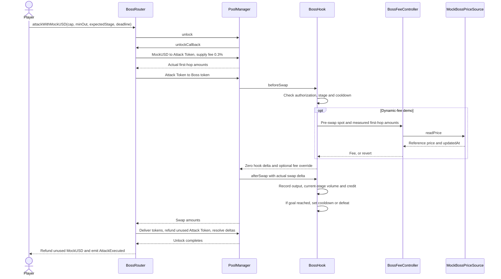

# Why Boss BoostPad uses Uniswap v4 hooks

This explanation follows [PR #72](https://github.com/0xroylee/eth-global-2026-tokyo/pull/72), head `d0ad8d87ca5bab80c927e7412bd2a200a75549c5`, checked on 27 September 2026. It describes the current Factory contracts and local mock demo. The Base Sepolia launch Factory now matches the continuous-liquidity build with fixed 0.3% fees, as recorded in PR #75. No Boss was created during that migration. The default Boss retains its earlier contract rules; source updates do not upgrade existing encounters. The [Factory reference](boss-factory.md#base-sepolia-deployment) records that distinction.

## The problem at the swap boundary

A normal AMM executes trades, but does not know which purchase is an attack, which boss stage it belongs to, or who earned a funded prize. A browser can animate a hit or disable an attack button for 60 seconds. Another client can ignore those controls and call contracts directly. The game therefore needs rules that run when the canonical Boss pool actually swaps.

Uniswap v4 provides pool lifecycle callbacks. The pool key fixes its Hook at creation, and the Hook address encodes the callbacks PoolManager invokes. Boss BoostPad uses that boundary to reject unauthorized operations before execution and record actual results afterward. See the official [hooks overview](https://developers.uniswap.org/docs/protocols/v4/concepts/hooks).

The Hook extends the existing concentrated-liquidity AMM. It does not replace the price curve, manufacture swap output, or take purchased tokens as a hook charge. A separate BossRouter initiates swaps and settles them. This also avoids v4's suppression of callbacks for actions initiated by the Hook itself, as defined in the pinned [Hooks.sol](https://github.com/Uniswap/v4-core/blob/46c6834698c48bc4a463a86d8420f4eb1d7f3b75/src/libraries/Hooks.sol).

## What the callbacks enforce

BossHook enables five callbacks, with permission mask `0x2ac0`. Return-delta permissions are disabled.

| Callback | Current Factory responsibility |
| --- | --- |
| `beforeInitialize` | Accept only the configured Router in setup mode, the canonical currencies, fee mode, tick spacing, and Hook. Initialize this Boss pool once. |
| `beforeAddLiquidity` | Accept the exact initial position during setup, or the owner's separate position at the canonical ticks with salt `4`. |
| `beforeRemoveLiquidity` | Allow removal only from that separate owner position. Keep the initial position with salt `1` intact. |
| `beforeSwap` | Verify PoolManager, full pool ID, initiating Router, exact-input purchase direction, active player, expected stage, registered position, and `nextAttackAt`. Read the pre-swap price and return the optional dynamic fee. |
| `afterSwap` | Read actual Boss-token output and Attack Token input from the swap delta. Check the measured supply conversion and stage volume bound. Record output, reward credit, and eligible volume, then clear at most the starting stage. |

The Router takes player identity from `msg.sender` and holds it in a bounded, non-reentrant operation context. The Hook does not accept a player supplied in arbitrary `hookData` or use `tx.origin`. Calling PoolManager through another router fails the Hook's sender/context checks. Calling a Hook callback directly fails PoolManager authentication. Player sell-backs into this Boss pool are rejected. Transfers and trades in another pool remain possible but earn no game progress or Factory credit.

Both hops execute inside one `PoolManager.unlock`. Intermediate Attack Token credit pays for the second hop; the Router delivers the purchased token and returns unused inputs. A failed cooldown, fee check, output floor, token delivery, volume bound, or settlement reverts both swaps and all accounting. The official [flash accounting explanation](https://developers.uniswap.org/docs/protocols/v4/concepts/flash-accounting) describes v4's requirement to resolve currency deltas before unlock completes.



## Continuous sales, volume stages, and shared cooldowns

All sale liquidity is active at launch in one initial position. Purchases move along the normal AMM curve across all three stages. The prize is separate. Custody rounding residue can remain in the Router, but it is not a future sale bucket. There is no percentage token bucket, proportional token release, stage refill, or stage price reset in the current Factory path.

For a target `V`, the additional stage goals are `floor(V / 6)`, `floor(V / 3)`, and the remainder. The 1:2:3 ratio allocates eligible MockUSD volume, not tokens. A 60 MockUSD target means 10, 20, and 30 additional MockUSD. Token output varies with AMM price, fees, trade size, and depth.

The Hook credits:

```text
eligibleMockUSD = floor(actualMockUSDSpent × actualAttackTokenSpent / actualAttackTokenBought)
```

Returned Attack Token earns no volume. Normally, a purchase may credit at most the current stage's remaining goal plus one MockUSD base unit, which is `0.000001 MockUSD` for the six-decimal test token. A larger terminal purchase is accepted only when its output is exactly one Boss-token base unit, whose displayed size depends on that token's decimals. This exception handles indivisible tokens and swap-fee rounding. It is not a general allowance for large attacks. All actual credited volume stays in the starting stage, including any terminal overshoot, and never reduces a later stage's goal.

Clearing stage one immediately advances the stage index and sets `nextAttackAt = block.timestamp + 60`. Stage two sets a 120-second cooldown. The round stays `Active` during these pauses, but `beforeSwap` rejects quotes and attacks until the chain timestamp reaches `nextAttackAt`. No keeper or activation transaction is needed. Final defeat freezes actual purchased output for prize claims.

These shared pauses make stage changes observable and give players time to review the next quote. Together with the volume bound, they prevent one purchase from finishing several stages. They do not guarantee equal participation, prevent bots or multiple wallets, or stop external markets from trading during the pause.

## What the Mock Token Oracle changes

The UI's Mock Token Oracle uses `MockBossPriceSource`. Its owner sets a positive reference price in MockUSD per Boss token; on-chain values use Q128 raw units. Each update records `block.timestamp`, and `setInitialPrice` also stores a one-time reset reference. Presets, custom prices, reset, and same-price refresh are demo controls. The source owner need not be the creator of every boss.

A Factory with a nonzero `feeController` accepts only its configured Boss token. Its pair-bound controller and reference source are shared by those bosses. A source update can therefore change the next attack fee in each such pool. A Factory without a controller supports the ordinary fixed 0.3% Boss fee. This optional demo configuration is distinct from an external market-feed integration.

For a dynamic Boss pool, `beforeSwap` supplies `BossFeeController.feeForSwap` with the Boss pool's pre-swap spot and measured first-hop amounts. The controller converts Attack Token per Boss token into MockUSD per Boss token using `MockUSDSpent / AttackTokenBought`. That measured conversion includes the supply fee and finite-trade price impact. It compares the resulting `poolPrice` with the mock `referencePrice`:

```text
feeMillionths = max(0, 1,000,000 - floor(997,000 × poolPrice / referencePrice))
```

| Pool price / reference price | Boss LP fee, ignoring price-conversion rounding |
| --- | --- |
| 0.25 | 75.075% |
| 1 | 0.3% |
| 4 | 0% |
| 0.1 | Required 90.03%, so the demo rejects the attack |

A lower pool price raises the fee component of buying the Boss token relative to the selected reference. A sufficiently higher pool price removes the Boss LP fee, at a ratio of about `1.003009` or above. This is a price-relative fee policy, not a fee schedule determined by stage number. Even a zero-fee Boss purchase still pays the supply pool's 0.3% fee and gas.

The Hook returns `fee | LPFeeLibrary.OVERRIDE_FEE_FLAG` for this swap. The PoolKey uses `DYNAMIC_FEE_FLAG`, which is a mode flag rather than a percentage. These are v4 LP fees, not a separate game toll or prize contribution. See the official [dynamic fee mechanism](https://developers.uniswap.org/docs/protocols/v4/concepts/dynamic-fees) and pinned [LPFeeLibrary.sol](https://github.com/Uniswap/v4-core/blob/46c6834698c48bc4a463a86d8420f4eb1d7f3b75/src/libraries/LPFeeLibrary.sol).

| Control | Meaning in the demo |
| --- | --- |
| Mock source | An owner-chosen testnet reference, labelled `TESTNET MOCK PRICE`. It is not live USD data or a verified external token valuation. |
| `updatedAt` | When the owner last changed or refreshed the reference. A same-price refresh makes the data fresh without changing its value. |
| `maxAge = 600` seconds | Data older than 600 seconds rejects attacks and quotes. Missing, zero, or future-dated data also rejects them. Claims and owner LP changes remain available. |
| `maxFee = 900,000` | A required fee above 90% rejects execution rather than silently capping the fee. Both limits are controller constructor values; these are the deployment script's demo defaults. |
| `maxRoyPerMockUSDX128` | A separate frozen upper bound on measured Attack Token received per MockUSD, derived at launch with 10% spot headroom. It is not the mock Boss price. |
| `minRoyOut`, `minBossHPOut`, cap and deadline | The player's execution bounds. They constrain output and spend if pool state or the reference changes after a quote. They do not guarantee a market price. |

SDK quotes simulate the same route and compute the displayed Boss fee at the same block as the quoted amounts. Mock price updates invalidate the UI quote. Later execution still uses current chain state, so a changed fee or pool depth can cause the player's output floors to fail.

The controller changes transaction cost. It does not move liquidity, rewrite ticks, reset AMM price, or trade toward the reference. A refreshed mock may still be economically wrong, and an owner can deliberately choose it. This mechanism cannot guarantee removal of arbitrage, adverse selection, impermanent loss, or market losses. Real external feeds, manipulation-resistant conversion, deviation policies, and handling unsupported assets remain [future work](../README.md#price-oracle-integration-and-volatility-controls).

## Owner liquidity and separate accounting

The owner can add or remove a proportional position at the canonical ticks with salt `4`. The initial position with salt `1` and liquidity `L` stays locked. Removing the extra position cannot reduce that initial position; it does not let the owner recover the initial capital or its accrued fees.

Owner token debts settle directly from the owner to PoolManager, and credits go directly to the owner. The Router checks principal slippage after subtracting accrued fees from v4's net position delta. The Hook's prize escrow and player reward credit are separate. Owner LP changes earn neither damage nor volume and cannot withdraw prize funds. They remain available during cooldowns, stale references, and after victory.

Adding liquidity at the current price mainly changes depth and the price impact of later trades. Removing extra liquidity can increase that impact. Neither action automatically sets the price, and locked `L` is a position-size floor, not a token-price floor or a promise that liquidity remains active outside its finite range.

## Benefits and limits

| Reader | Concrete benefit | Limit |
| --- | --- | --- |
| Player | A confirmed purchase delivers tokens and records actual output as per-boss prize credit. Shared cooldowns and execution bounds apply to every client. | Fees, AMM price impact, gas, and owner LP/reference changes affect cost. Credit pays only after victory, and the perpetual boss might never be defeated. |
| Creator | An existing token can fund an event with continuous sale liquidity, a fixed volume objective, and a committed prize. Extra LP can change depth without touching that prize. | Initial capital and initial fees stay committed. Volume is in this Boss pool, not an unrelated token market, and does not establish organic demand or token value. |
| Reviewer | Contract state, measured deltas, and events expose purchases, stage volume, cooldown timestamps, LP changes, mock updates, and claims. | Verifiable rules do not make an owner-supplied reference trustworthy or prove production security. Local execution evidence does not prove a newer public deployment. |

## Code reading map

Use these symbols in the [pinned PR source tree](https://github.com/0xroylee/eth-global-2026-tokyo/tree/d0ad8d87ca5bab80c927e7412bd2a200a75549c5). The relative links open the current checkout.

| Behavior | Source and symbols |
| --- | --- |
| Full sale budget, launch price, funding and optional controller binding | [BossFactory.sol](../contracts/src/BossFactory.sol): `quoteLaunch`, `launchBoss`, `_hookArgs` |
| Single initial position, authenticated route, delivery and refunds | [BossRouter.sol](../contracts/src/BossRouter.sol): `_activateCallback`, `attackWithMockUSD`, `unlockCallback`, `_executeTwoHop` |
| Callback permissions, stage bounds, cooldown and reward accounting | [BossHook.sol](../contracts/src/BossHook.sol): constructor, `beforeSwap`, `afterSwap`, `_clearVolumeStage`, `claimReward` |
| Owner-only separate LP and principal checks | [BossRouter.sol](../contracts/src/BossRouter.sol): `modifyOwnerLiquidity`, `_liquidityCallback`, `_settleOwnerCurrency`; [BossHook.sol](../contracts/src/BossHook.sol): `beforeAddLiquidity`, `beforeRemoveLiquidity`, `_assertRegisteredPositions` |
| Price comparison, freshness, fee maximum and zero-fee region | [BossFeeController.sol](../contracts/src/BossFeeController.sol): constructor, `feeForSwap` |
| Owner updates and chain timestamps | [MockBossPriceSource.sol](../contracts/src/MockBossPriceSource.sol): `setInitialPrice`, `setPrice`, `readPrice` |
| Demo defaults | [DeployBossFactory.s.sol](../contracts/script/DeployBossFactory.s.sol): `run` |
| Quote simulation, block-pinned fee reads and demo controls | [sdk.ts](../packages/chain/src/sdk.ts): `quoteAttack`, `quoteMockInitialPrice`, `setMockPrice`; [reads.ts](../packages/chain/src/reads.ts): `readRound` |

For exact interface and custody rules, continue with [Boss Factory](boss-factory.md), [technical specification](technical-spec.md#factory-hook-callbacks), and [economy](economy.md).
